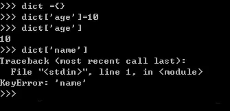
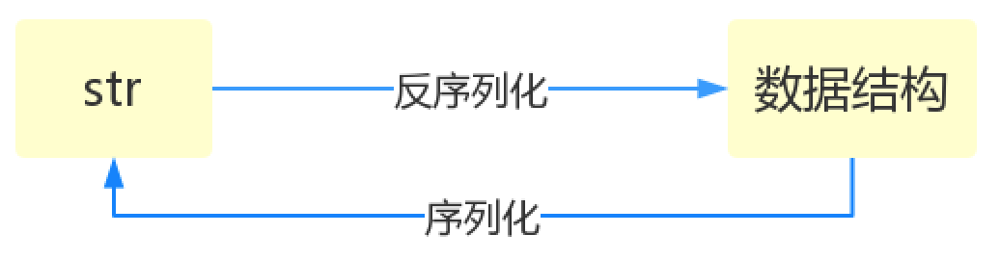

# Python逆向爬虫之模块

在Python中，一个py文件就是一个模块，文件名为xxx.py模块名则是xxx,导入模块可以引用模块中已经写好的功能。如果把开发程序比喻成制造一台电脑，编写模块就像是在制造电脑的零部件，准备好零部件后，剩下的工作就是按照逻辑把它们组装到一起。

将程序模块化会使得程序的组织结构清晰，维护起来更加方便。比起直接开发一个完整的程序，单独开发一个小的模块也会更加简单，并且程序中的模块与电脑中的零部件稍微不同的是：程序中的模块可以被重复使用。所以总结下来，使用模块既保证了代码的重用性，又增强了程序的结构性和可维护性。另外除了自定义模块外，我们还可以导入使用内置或第三方模块提供的现成功能，这种“拿来主义”极大地提高了程序员的开发效率。

## 一、模块的使用

### 1.1 import语句

有如下示范文件

```python
#文件名：foo.py
x=1
def get():
    print(x)
def change():
    global x
    x=0
class Foo:
    def func(self):
       print('from the func')
```

要想在另外一个py文件中引用foo.py中的功能，需要使用import foo，首次导入模块会做三件事：

1. 执行源文件代码
2. 产生一个新的名称空间用于存放源文件执行过程中产生的名字
3. 在当前执行文件所在的名称空间中得到一个名字foo，该名字指向新创建的模块名称空间，若要引用模块名称空间中的名字，需要加上该前缀，如下

```python
import foo #导入模块foo
a=foo.x #引用模块foo中变量x的值赋值给当前名称空间中的名字a
foo.get() #调用模块foo的get函数
foo.change() #调用模块foo中的change函数
obj=foo.Foo() #使用模块foo的类Foo来实例化，进一步可以执行obj.func()
```

加上foo.作为前缀就相当于指名道姓地说明要引用foo名称空间中的名字，所以肯定不会与当前执行文件所在名称空间中的名字相冲突，并且若当前执行文件的名称空间中存在x，执行foo.get()或foo.change()操作的都是源文件中的全局变量x。

需要强调一点是，第一次导入模块已经将其加载到内存空间了，之后的重复导入会直接引用内存中已存在的模块，不会重复执行文件，通过import sys，打印sys.modules的值可以看到内存中已经加载的模块名。提示： 

```python
#1、在Python中模块也属于第一类对象，可以进行赋值、以数据形式传递以及作为容器类型的元素等操作。
#2、模块名应该遵循小写形式，标准库从python2过渡到python3做出了很多这类调整，比如ConfigParser、Queue、SocketServer全更新为纯小写形式。
```

用import语句导入多个模块，可以写多行import语句

```python
import module1
import module2
    ...
import moduleN
```

还可以在一行导入，用逗号分隔开不同的模块

```python
import module1,module2,...,moduleN
```

但其实第一种形式更为规范，可读性更强，推荐使用，而且我们导入的模块中可能包含有python内置的模块、第三方的模块、自定义的模块，为了便于明显地区分它们，我们通常在文件的开头导入模块，并且分类导入，一类模块的导入与另外一类的导入用空行隔开，不同类别的导入顺序如下：

```python
#1. python内置模块
#2. 第三方模块
#3. 程序员自定义模块
```

当然，我们也可以在函数内导入模块，对比在文件开头导入模块属于全局作用域，在函数内导入的模块则属于局部的作用域。

### 1.2 from-import 语句

from...import...与import语句基本一致，唯一不同的是：使用import foo导入模块后，引用模块中的名字都需要加上foo.作为前缀，而使用from foo import x,get,change,Foo则可以在当前执行文件中直接引用模块foo中的名字，如下

```python
from foo import x,get,change #将模块foo中的x和get导入到当前名称空间
a=x #直接使用模块foo中的x赋值给a
get() #直接执行foo中的get函数
change() #即便是当前有重名的x，修改的仍然是源文件中的x
```

无需加前缀的好处是使得我们的代码更加简洁，坏处则是容易与当前名称空间中的名字冲突，如果当前名称空间存在相同的名字，则后定义的名字会覆盖之前定义的名字。

另外from语句支持from foo import *语法，*代表将foo中所有的名字都导入到当前位置 

```python
from foo import * #把foo中所有的名字都导入到当前执行文件的名称空间中，在当前位置直接可以使用这些名字

a=x
get()
change()
obj=Foo() 
```

如果我们需要引用模块中的名字过多的话，可以采用上述的导入形式来达到节省代码量的效果，但是需要强调的一点是：只能在模块最顶层使用*的方式导入，在函数内则非法，并且*的方式会带来一种副作用，即我们无法搞清楚究竟从源文件中导入了哪些名字到当前位置，这极有可能与当前位置的名字产生冲突。模块的编写者可以在自己的文件中定义__all__变量用来控制*代表的意思

```python
#foo.py
__all__=['x','get'] #该列表中所有的元素必须是字符串类型，每个元素对应foo.py中的一个名字
x=1
def get():
    print(x)
def change():
    global x
    x=0
class Foo:
    def func(self):
       print('from the func')
```

这样我们在另外一个文件中使用*导入时，就只能导入__all__定义的名字了

```python
from foo import * #此时的*只代表x和get

x #可用
get() #可用
change() #不可用
Foo() #不可用
```

### 1.3 其他导入语法(as)

我们还可以在当前位置为导入的模块起一个别名

```python
import foo as f #为导入的模块foo在当前位置起别名f，以后再使用时就用这个别名f
f.x
f.get()
```

还可以为导入的一个名字起别名

```python
from foo import get as get_x
get_x()
```

通常在被导入的名字过长时采用起别名的方式来精简代码，另外为被导入的名字起别名可以很好地避免与当前名字发生冲突，还有很重要的一点就是：可以保持调用方式的一致性，例如我们有两个模块json和pickle同时实现了load方法，作用是从一个打开的文件中解析出结构化的数据，但解析的格式不同，可以用下述代码有选择性地加载不同的模块 

```python
if data_format == 'json':
    import json as serialize #如果数据格式是json，那么导入json模块并命名为serialize
elif data_format == 'pickle':
    import pickle as serialize #如果数据格式是pickle，那么导入pickle模块并命名为serialize
    
data=serialize.load(fn) #最终调用的方式是一致的
```

## 二、什么是模块

**什么是模块？**

  常见的场景：一个模块就是一个包含了python定义和声明的文件，文件名就是模块名字加上.py的后缀。

  但其实import加载的模块分为四个通用类别：　

1. 使用python编写的代码（.py文件）
2. 已被编译为共享库或DLL的C或C++扩展
3. 包好一组模块的包
4. 使用C编写并链接到python解释器的内置模块

**为何要使用模块？**

  如果你退出python解释器然后重新进入，那么你之前定义的函数或者变量都将丢失，因此我们通常将程序写到文件中以便永久保存下来，需要时就通过python test.py方式去执行，此时test.py被称为脚本script。

  随着程序的发展，功能越来越多，为了方便管理，我们通常将程序分成一个个的文件，这样做程序的结构更清晰，方便管理。这时我们不仅仅可以把这些文件当做脚本去执行，还可以把他们当做模块来导入到其他的模块中，实现了功能的重复利用，

## 三、常用模块

### 3.1 collections模块

在内置数据类型（dict、list、set、tuple）的基础上，collections模块还提供了几个额外的数据类型：Counter、deque、defaultdict、namedtuple和OrderedDict等。

1. namedtuple: 生成可以使用名字来访问元素内容的tuple
2. deque: 双端队列，可以快速的从另外一侧追加和推出对象
3. Counter: 计数器，主要用来计数
4. OrderedDict: 有序字典
5. defaultdict: 带有默认值的字典

#### 3.1.1 namedtuple

我们知道`tuple`可以表示不变集合，例如，一个点的二维坐标就可以表示成：

```python
>>> p = (1, 2)
```

但是，看到(1, 2)，很难看出这个tuple是用来表示一个坐标的。

这时，`namedtuple`就派上了用场：

```python
>>> from collections import namedtuple
>>> Point = namedtuple('Point', ['x', 'y'])
>>> p = Point(1, 2)
>>> p.x
1
>>> p.y
2
```

类似的，如果要用坐标和半径表示一个圆，也可以用`namedtuple`定义：

```python
#namedtuple('名称', [属性list]):
Circle = namedtuple('Circle', ['x', 'y', 'r'])
```

#### 3.1.2 deque

使用list存储数据时，按索引访问元素很快，但是插入和删除元素就很慢了，因为list是线性存储，数据量大的时候，插入和删除效率很低。

deque是为了高效实现插入和删除操作的双向列表，适合用于队列和栈：

```python
>>> from collections import deque
>>> q = deque(['a', 'b', 'c'])
>>> q.append('x')
>>> q.appendleft('y')
>>> q
deque(['y', 'a', 'b', 'c', 'x'])
```

deque除了实现list的`append()`和`pop()`外，还支持`appendleft()`和`popleft()`，这样就可以非常高效地往头部添加或删除元素。

#### 3.1.3 OrderedDict

使用dict时，Key是无序的。在对dict做迭代时，我们无法确定Key的顺序。

如果要保持Key的顺序，可以用`OrderedDict`：

```python
>>> from collections import OrderedDict
>>> d = dict([('a', 1), ('b', 2), ('c', 3)])
>>> d # dict的Key是无序的
{'a': 1, 'c': 3, 'b': 2}
>>> od = OrderedDict([('a', 1), ('b', 2), ('c', 3)])
>>> od # OrderedDict的Key是有序的
OrderedDict([('a', 1), ('b', 2), ('c', 3)])
```

注意，`OrderedDict`的Key会按照插入的顺序排列，不是Key本身排序：

```python
>>> od = OrderedDict()
>>> od['z'] = 1
>>> od['y'] = 2
>>> od['x'] = 3
>>> od.keys() # 按照插入的Key的顺序返回
['z', 'y', 'x']
```

#### 3.1.4 defaultdict

当我使用普通的字典时，用法一般是dict={},添加元素的只需要dict[element] =value即，调用的时候也是如此，dict[element] = xxx,但前提是element在字典里，如果不在字典里就会报错，如：



这时defaultdict就能排上用场了，defaultdict的作用是在于，当字典里的key不存在但被查找时，返回的不是keyError而是一个默认值，这个默认值是什么呢，下面会说

##### 如何使用defaultdict

defaultdict接受一个工厂函数作为参数，如下来构造：

```python
dict =defaultdict( factory_function)
```

这个factory_function可以是list、set、str等等，作用是当key不存在时，返回的是工厂函数的默认值，比如list对应[ ]，str对应的是空字符串，set对应set( )，int对应0，如下举例：

```python
from collections import defaultdict

dict1 = defaultdict(int)
dict2 = defaultdict(set)
dict3 = defaultdict(str)
dict4 = defaultdict(list)
dict1[2] ='two'

print(dict1[1])
print(dict2[1])
print(dict3[1])
print(dict4[1])
```

输出：

```python
0
set()

[]

```

#### 3.1.5 Counter

Counter类的目的是用来跟踪值出现的次数。它是一个无序的容器类型，以字典的键值对形式存储，其中元素作为key，其计数作为value。计数值可以是任意的Interger（包括0和负数）。Counter类和其他语言的bags或multisets很相似。

```python
from collections import Counter

c = Counter('abcdeabcdabcaba')
print(c)
```


### 3.2 time模块

和时间有关系的我们就要用到时间模块。在使用模块之前，应该首先导入这个模块。

```python
#常用方法
1.time.sleep(secs)
(线程)推迟指定的时间运行。单位为秒。
2.time.time()
获取当前时间戳
```

#### 3.2.1 时间三种表现形式

1. 时间戳(秒数)
2. 结构化时间(一般是给机器看的)
3. 格式化时间(一般是给人看的)

```python
import time

# 格式化时间
# print(time.strftime('%Y-%m-%d'))  # 2021-11-25
# print(time.strftime('%Y-%m-%d %H:%M:%S'))  # 2021-11-25 11:48:34
# print(time.strftime('%Y-%m-%d %X'))  # 2021-11-25 11:48:34
"""
更多时间相关符号 保存到容易查找的位置即可
"""
# print(time.localtime())
# time.struct_time(
# tm_year=2021,
# tm_mon=11,
# tm_mday=25,
# tm_hour=11,
# tm_min=51,
# tm_sec=25,
# tm_wday=3,
# tm_yday=329,
# tm_isdst=0)

# print(time.time())
print(time.gmtime(11111111111))
# print(time.localtime())
```

### 3.3 datetime 模块

```python
import datetime

# print(datetime.date.today())  # 2021-11-25
# print(datetime.datetime.today())  # 2021-11-25 12:15:11.969769
"""date年月日  datetime年月日时分秒  time时分秒(MySQL django后期可以)"""
# res = datetime.datetime.today()
# print(res.year)  # 2021
# print(res.month)  # 11
# print(res.day)  # 25
# print(res.weekday())  # 获取星期(weekday星期是0-6) 0表示周一
# print(res.isoweekday())  # 获取星期(weekday星期是1-7) 1表示周一
"""时间差(timedelta)"""
# ctime = datetime.datetime.today()
# time_tel = datetime.timedelta(days=3)
# print(ctime)  # 2021-11-25 12:20:48.570489
# print(ctime - time_tel)  # 2021-11-22 12:21:06.712396
# print(ctime + time_tel)  # 2021-11-28 12:21:06.712396
"""
日期对象 = 日期对象 +/- timedelta对象
timedelta对象 = 日期对象 +/- 日期对象
"""
# ret = ctime + time_tel
# print(ret - ctime)  # 3 days, 0:00:00
# print(ctime - ret)  # -3 days, 0:00:00


# 小练习 计算举例今年过生日还有多少天
# birthday = datetime.date(2000, 11, 11)
# now_date = datetime.date.today()
# days = birthday - now_date
# print('距离生日还有{}天'.format(days))

# UTC时间与我们的东八区时间差 八个小时
# print(datetime.datetime.now())  # 2021-11-25 12:25:33.579310
# print(datetime.datetime.utcnow())  # 2021-11-25 04:25:33.579310
```

### 3.4 random模块

```python
>>> import random
#随机小数
>>> random.random()      # 大于0且小于1之间的小数
0.7664338663654585
>>> random.uniform(1,3) #大于1小于3的小数
1.6270147180533838
#恒富：发红包

#随机整数
>>> random.randint(1,5)  # 大于等于1且小于等于5之间的整数
>>> random.randrange(1,10,2) # 大于等于1且小于10之间的奇数


#随机选择一个返回
>>> random.choice([1,'23',[4,5]])  # #1或者23或者[4,5]
#随机选择多个返回，返回的个数为函数的第二个参数
>>> random.sample([1,'23',[4,5]],2) # #列表元素任意2个组合
[[4, 5], '23']


#打乱列表顺序
>>> item=[1,3,5,7,9]
>>> random.shuffle(item) # 打乱次序
>>> item
[5, 1, 3, 7, 9]
>>> random.shuffle(item)
>>> item
[5, 9, 7, 1, 3]
```

### 3.5 os模块

os模块是与操作系统交互的一个接口

```python
os.makedirs('dirname1/dirname2')    可生成多层递归目录
os.removedirs('dirname1')    若目录为空，则删除，并递归到上一级目录，如若也为空，则删除，依此类推
os.mkdir('dirname')    生成单级目录；相当于shell中mkdir dirname
os.rmdir('dirname')    删除单级空目录，若目录不为空则无法删除，报错；相当于shell中rmdir dirname
os.listdir('dirname')    列出指定目录下的所有文件和子目录，包括隐藏文件，并以列表方式打印
os.remove()  删除一个文件
os.rename("oldname","newname")  重命名文件/目录
os.stat('path/filename')  获取文件/目录信息

os.system("bash command")  运行shell命令，直接显示
os.popen("bash command).read()  运行shell命令，获取执行结果
os.getcwd() 获取当前工作目录，即当前python脚本工作的目录路径
os.chdir("dirname")  改变当前脚本工作目录；相当于shell下cd

os.path

os.path.abspath(path) 返回path规范化的绝对路径
os.path.split(path) 将path分割成目录和文件名二元组返回 
os.path.dirname(path) 返回path的目录。其实就是os.path.split(path)的第一个元素 
os.path.basename(path) 返回path最后的文件名。如何path以／或\结尾，那么就会返回空值。即os.path.split(path)的第二个元素
os.path.exists(path)  如果path存在，返回True；如果path不存在，返回False
os.path.isabs(path)  如果path是绝对路径，返回True
os.path.isfile(path)  如果path是一个存在的文件，返回True。否则返回False
os.path.isdir(path)  如果path是一个存在的目录，则返回True。否则返回False
os.path.join(path1[, path2[, ...]])  将多个路径组合后返回，第一个绝对路径之前的参数将被忽略
os.path.getatime(path)  返回path所指向的文件或者目录的最后访问时间
os.path.getmtime(path)  返回path所指向的文件或者目录的最后修改时间
os.path.getsize(path) 返回path的大小
```

### 3.6 sys模块

sys模块是与python解释器交互的一个接口

```python
sys.argv           命令行参数List，第一个元素是程序本身路径
sys.exit(n)        退出程序，正常退出时exit(0),错误退出sys.exit(1)
sys.version        获取Python解释程序的版本信息
sys.path           返回模块的搜索路径，初始化时使用PYTHONPATH环境变量的值
sys.platform       返回操作系统平台名称
```

### 3.7 序列化模块

什么叫序列化——将原本的字典、列表等内容转换成一个字符串的过程就叫做**序列化**。

**序列化的目的**

1、以某种存储形式使自定义[对象持久化](https://baike.baidu.com/item/对象持久化)；

2、将对象从一个地方传递到另一个地方。

3、使程序更具维护性。



#### 3.7.1 Json

Json模块提供了四个功能：dumps、dump、loads、load。

| 函数       | 作用                                           |
| :--------- | :--------------------------------------------- |
| json.dumps | 对数据进行编码,将python中的字典 转换为 字符串  |
| json.loads | 对数据进行解码,将 字符串 转换为 python中的字典 |
| json.dump  | 将dict数据写入json文件中                       |
| json.load  | 打开json文件，并把字符串转换为python的dict数据 |

**注意**：不带s的是序列化到文件或者从文件[反序列化](https://so.csdn.net/so/search?q=反序列化&spm=1001.2101.3001.7020)，带s的都是内存操作不涉及持久化。

```python
import json
tesdic = {
    'name': 'Tom',
    'age': 18,
    'score':
        {
            'math': 98,
            'chinese': 99
        }
}
print(type(tesdic))
json_str = json.dumps(tesdic)
print(json_str)
print(type(json_str))
newdic = json.loads(json_str)
print(newdic)
print(type(newdic))


import json
 
data = {
    'nanbei':'haha',
    'a':[1,2,3,4],
    'b':(1,2,3)
}
with open('json_test.txt','w+') as f:
    json.dump(data,f)
```

