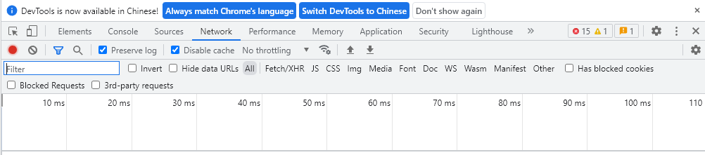

# Python逆向爬虫之初体验

> 网络爬虫是一种按照一定的规则，自动地抓取万维网信息的程序或者脚本。

说起网络爬虫，人们常常会用这样一个比喻：如果把互联网比喻成一张网，那么网络爬虫就可以认为是一个在网上爬来爬去的小虫子，它通过网页的链接地址来寻找网页，通过特定的搜索算法来确定路线，通常从网站的某一个页面开始，读取网页的内容，找到在网页中的其它链接地址，然后通过这些链接地址寻找下一个网页，这样一直循环下去，直到把这个网站所有网页都抓取完为止。

## 一、爬虫基本原理

下面的图片很好的展现了一般网络爬虫的基本过程，下面让我们来详细解释一下这张图片的含义吧


### 1.1 有什么作用？

通过有效的爬虫手段批量采集数据，可以降低人工成本，提高有效数据量，给予运营/销售的数据支撑，加快产品发展。

### 1.2 业界的情况

目前互联网产品竞争激烈，业界大部分都会使用爬虫技术对竞品产品的数据进行挖掘、采集、大数据分析，这是必备手段，并且很多公司都设立了“爬虫工程师”的岗位。

### 1.3 合法性

爬虫是利用程序进行批量爬取网页上的公开信息，也就是前端显示的数据信息。因为信息是完全公开的，所以是合法的。其实就像浏览器一样，浏览器解析响应内容并渲染为页面，而爬虫解析响应内容采集想要的数据进行存储。

## 二、HTTP 协议

HTTP是Hyper Text Transfer Protocol(超文本传输协议)的缩写。它的发展是万维网协会(World Wide Web Consortium)和Internet工作小组IETF(Internet Engineering Task Force)合作的结果，(他们)最终发布了一系列的RFC，RFC 1945定义了HTTP/1.0版本。其中最著名的就是RFC 2616。RFC 2616定义了今天普遍使用的一个版本——HTTP 1.1。

### 2.1 HTTP协议格式和抓取

HTTP属于文本格式的协议，因此不需要去理解具体的二进制位，而只需要理解文本格式即可，也更方便用肉眼去观察。

#### 2.1.1 HTTP抓取

想要获取一些具体的HTTP交互过程中的信息，就需要一些抓包工具了。我们可以将这些抓包工具看做是一个代理 ，请求和响应都需要路过代理，这时候在代理上就很容易获取到请求和响应的详细信息了，我当前使用的是Fiddler。

Fiddler左侧是一个列表，显示了当前抓到的所有HTTP/HTTPS的数据报。


当选中左侧列表中的某个条目，双击的时候，右侧就会显示这个条目的详细信息。 其中上面的那部分是HTTP请求，下面的是HTTP响应。


### 2.2 请求的格式

HTTP的请求分成四个部分：

1. 请求行
2. 请求报头
3. 空行
4. 请求正文

#### 2.2.1 请求行

**用来说明请求类型,要访问的资源以及所使用的HTTP版本。**

#### 2.2.2 请求报头

紧接着请求行（即第一行）之后的部分，用来说明服务器要使用的附加信息。

- Host字段：客户端发送请求时，用来指定服务器的域名。有了 Host 字段，就可以将请求发往「同一台」服务器上的不同网站。
- Connection字段：最常用于客户端要求服务器使用 TCP 持久连接，以便其他请求复用。
- User-Agent字段：服务器端和客户端脚本都能访问它,它是浏览器类型检测逻辑的重要基础。该信息由你的浏览器来定义,并且在每个请求中自动发送。
- Accept字段：声明自己可以接受哪些数据格式。
- Referer字段：当浏览器向web服务器发送请求的时候，一般会带上Referer，告诉服务器该网页是从哪个页面链接过来的。
- Accept-Encoding字段：客户端在请求时，用 Accept-Encoding 字段说明自己可以接受哪些压缩方法。
- Accept-Language字段：表示客户端所希望的语言种类。

#### 2.2.3 空行

请求头部后面的空行是必须的。

#### 2.2.4 请求正文

请求正文也叫主体，可以添加任意的其他数据。

### 2.3 HTTP请求方法

根据HTTP标准，HTTP请求可以使用多种请求方法。
HTTP1.0定义了三种请求方法： GET, POST 和 HEAD方法。
HTTP1.1新增了五种请求方法：OPTIONS, PUT, DELETE, TRACE 和 CONNECT 方法。


## 三、Chrome抓包分析

在这篇文章中，我们将尝试使用直观的网页分析工具（Chrome 开发者工具）对网页进行[抓包](https://so.csdn.net/so/search?q=抓包&spm=1001.2101.3001.7020)分析。

本次测试版本是：Chrome浏览器 版本 103.0.5060.114（正式版本）（64 位）

### 3.1 什么是抓包

即抓取我们本地电脑与远端服务器通信时候所传递的数据包。

### 3.2 Chrome浏览器讲解

Chrome 开发者工具是一套内置于Google Chrome中的Web开发和调试工具，可用来对网站进行迭代、调试和分析。

### 3.3 打开Chrome开发者工具

- 在Chrome界面按F12
- 在页面元素上右键点击，选择“检查”

### 3.4 开发者工具的结构



- **Elements（元素面板）**：使用“元素”面板可以通过自由操纵DOM和CSS来重演您网站的布局和设计。
- **Console（控制台面板）**：在开发期间，可以使用控制台面板记录诊断信息，或者使用它作为 shell，在页面上与JavaScript交互。
- **Sources（源代码面板）**：在源代码面板中设置断点来调试 JavaScript ，或者通过Workspaces（工作区）连接本地文件来使用开发者工具的实时编辑器。
- **Network（网络面板）**：从发起网页页面请求Request后得到的各个请求资源信息
  （包括状态、资源类型、大小、所用时间等），并可以根据这个进行网络性能优化。
- **Performance（性能面板）**：使用时间轴面板，可以通过记录和查看网站生命周期内发生的各种事件来提高页面运行时的性能。
- **Memory（内存面板）**：分析web应用或者页面的执行时间以及内存使用情况。
- **Application（应用面板**）：记录网站加载的所有资源信息，包括存储数据（Local Storage、Session Storage、-IndexedDB、Web SQL、Cookies）、缓存数据、字体、图片、脚本、样式表等。
- **Security（安全面板）**：使用安全面板调试混合内容问题，证书问题等等。

### 3.5 重点讲解Network

- 定义：Network 面板记录页面上每个网络操作的相关信息，包括详细的耗时数据、HTTP 请求与响应标头和 Cookie
- 结构：由五个窗格组成，如图


#### 3.5.1 **Controls（控件）** 

使用这些选项可以控制 Network(网络)面板的外观和功能。


#### 3.5.2 **Filters（过滤器）**

使用这些选项可以控制在请求列表中显示哪些资源。

**domain**：仅显示来自指定域的资源。

```bash
domain:img-blog.csdnimg.cn
```

**has-response-header**：显示包含指定HTTP响应头信息的资源。

```bash
has-response-header:Keep-Alive
```

**larger-than(大于)** ：显示大于指定大小的资源（以字节为单位）。设置值1000等效于设置值1k。

```bash
larger-than:100000
```

**method(方法)** ：显示通过指定的HTTP方法类型检索的资源。

```bash
method:OPTIONS
```

**Scheme（协议）**：显示通过不受保护的HTTP（scheme:http）或受保护的HTTPS（scheme:https）检索的资源。

```bash
scheme:https
```

**status-code（状态码）**：仅显示其HTTP状态代码与指定代码匹配的资源。

```bash
status-code:204
```


