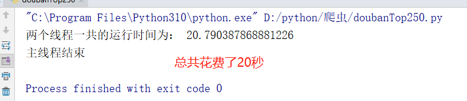
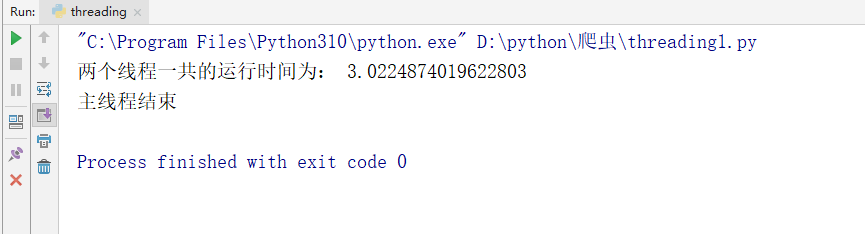
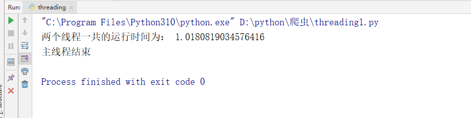
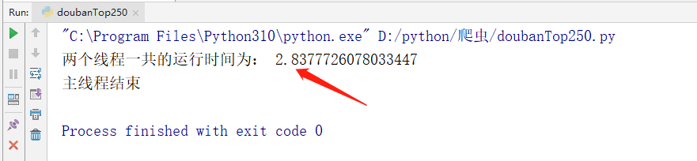
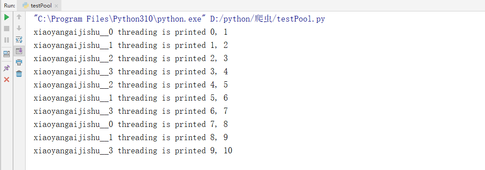

# Python爬虫之多线程爬虫


在使用 Python 的过程中，我们可能遇到这样一个场景，需要下载某一个网站上的多个资源；

例如：我们想下载豆瓣电影 Top 250 所有的宣传图片


具体代码如下：

```python
# -*- coding: utf-8 -*-

"""
    1、每页25个电影，总共10页
    2、获取每一页中的宣传图片URL
    3、下载图片
"""
import requests
import time
from bs4 import BeautifulSoup
import os

def getMovieUrl():
    """
    图片链接生成器
    :return:
    """

    # 第一页链接
    url = "https://movie.douban.com/top250?start=%d&filter="

    # 总页数
    num = 10

    # 链接生成器
    for i in range(num):
        yield url % (i * 25)

def getImgUrl(url):

    """
    获取宣传图片URL
    :param url:
    :return:
    """

    html = requests.get(url=url, headers=getHeader())

    htmlValue = BeautifulSoup(html.text, "lxml")

    imgValue = htmlValue.select(".grid_view li .item .pic a img")

    for i in imgValue:
        downloadImg(i.attrs.get("src"))

def getHeader():
    """
    获取Header
    :return:
    """

    ua_headers = {
        "User-Agent": 'Mozilla/5.0 (Windows NT 10.0; Win64; x64) AppleWebKit/537.36 (KHTML, like Gecko) Chrome/103.0.0.0 Safari/537.36',
        "Referer": "https://movie.douban.com/top250?start=0&filter="
    }

    return ua_headers

def downloadImg(url):
    """
    下载图片
    :param url:
    :return:
    """

    img = requests.get(url=url, headers=getHeader())

    src = "./img/"
    
    setDir(src)

    with open(src + getImgName(url), 'wb') as imgValue:
        imgValue.write(img.content)

def setDir(filepath):
    """
    如果文件夹不存在就创建，如果文件存在就清空！
    :param filepath:需要创建的文件夹路径
    :return:
    """
    if not os.path.exists(filepath):
        os.mkdir(filepath)

def getImgName(url):

    """
    获取图片名称
    :param url:
    :return:
    """

    imgName = url.split("/")[-1]

    return imgName

def main():
    """
    主函数
    :return:
    """
    start_time = time.time()
    url = getMovieUrl()
    for i in range(10):
        getImgUrl(next(url))
    end_time = time.time()
    print("两个线程一共的运行时间为：", end_time - start_time)
    print("主线程结束")

if __name__ == '__main__':
    main()

```



我们测试得出，下载 250 张电影宣传图片总共需要花费 20 秒钟 的时间。相对而言，这是非常缓慢的。

这是因为，每一次下载都必须在上一次下载结束之后才能进行本次下载。这就相当于我们去银行柜台取钱，在一个窗口多个人同时取钱，就只能进行排队，相对而言就会比较慢。

这里我们就可以设想一下，如果我们想加快取款的速度，最好的办法就是多开几个窗口。我们把这个办法类比到 python 中，就是我们今天所要说的多线程。每一个线程就相当于一个窗口，线程与线程（窗口与窗口）之间互不影响。

## 一、线程

首先，我们需要了解一下线程是什么？

线程也叫轻量级进程，事操作系统能够调度的最小单位。但是一般情况下，线程是不能够独立运行的；一般是运行在进程之中。举个例子：一个进程就相当于一个工厂，一个线程就相当于一条流水线。

一个进程中至少有一个线程。

### 1.1 为什么要使用线程呢？

1. 线程在程序中是独立的、并发的执行流。与分隔的进程相比，进程中线程之间的隔离程度要小，它们共享内存、文件句柄和其他进程应有的状态。
2. 因为线程的划分尺度小于进程，使得多线程程序的并发性高。进程在执行过程之中拥有独立的内存单元，而多个线程共享内存，从而极大的提升了程序的运行效率。
3. 线程比进程具有更高的性能，这是由于同一个进程中的线程都有共性，多个线程共享一个进程的虚拟空间。线程的共享环境包括进程代码段、进程的共有数据等，利用这些共享的数据，线程之间很容易实现通信。
4. 操作系统在创建进程时，必须为进程分配独立的内存空间，并分配大量的相关资源，但创建线程则简单得多。因此，使用多线程来实现并发比使用多进程的性能高得要多。

总结起来，进程之间不能共享内存，并且多线程的代价很小，性能很高。

## 二、多线程实战

先来看一个未使用多线程的版本。

```python
# -*- coding: utf-8 -*-

import time

def run():
    """
    测试函数
    :return:
    """
    time.sleep(1)

if __name__ == '__main__':
    start_time = time.time()
    for i in range(3):
        run()
    end_time = time.time()
    print("两个线程一共的运行时间为：", end_time - start_time)
    print("主线程结束")
```



我们可以看到的是，在默认情况下，运行 3 次 sleep(1) 总共要花费 3 秒钟的时间。

下面我们采用多线程的方式进行测试，具体如下：

```python
# -*- coding: utf-8 -*-

import time
import threading

def run():
    """
    测试函数
    :return:
    """
    time.sleep(1)

if __name__ == '__main__':
    start_time = time.time()

    # 创建线程
    s1 = threading.Thread(target=run)
    s2 = threading.Thread(target=run)
    s3 = threading.Thread(target=run)

    # 开启线程
    s1.start()
    s2.start()
    s3.start()

    # 等待线程执行完毕
    s1.join()
    s2.join()
    s3.join()
    end_time = time.time()
    
    print("两个线程一共的运行时间为：", end_time - start_time)
    print("主线程结束")
```



下面，我们将上方的爬虫项目多线程化。

```python
# -*- coding: utf-8 -*-

"""
    1、每页25个电影，总共10页
    2、获取每一页中的宣传图片URL
    3、下载图片
"""
import requests
import time
from bs4 import BeautifulSoup
import os
import threading

def getMovieUrl():
    """
    图片链接生成器
    :return:
    """

    # 第一页链接
    url = "https://movie.douban.com/top250?start=%d&filter="

    # 总页数
    num = 10

    # 链接生成器
    for i in range(num):
        yield url % (i * 25)

def getImgUrl(url):

    """
    获取宣传图片URL
    :param url:
    :return:
    """

    html = requests.get(url=url, headers=getHeader())

    htmlValue = BeautifulSoup(html.text, "lxml")

    imgValue = htmlValue.select(".grid_view li .item .pic a img")

    for i in imgValue:
        downloadImg(i.attrs.get("src"))

def getHeader():
    """
    获取Header
    :return:
    """

    ua_headers = {
        "User-Agent": 'Mozilla/5.0 (Windows NT 10.0; Win64; x64) AppleWebKit/537.36 (KHTML, like Gecko) Chrome/103.0.0.0 Safari/537.36',
        "Referer": "https://movie.douban.com/top250?start=0&filter="
    }

    return ua_headers

def downloadImg(url):
    """
    下载图片
    :param url:
    :return:
    """

    img = requests.get(url=url, headers=getHeader())

    src = "./img/"

    setDir(src)

    with open(src + getImgName(url), 'wb') as imgValue:
        imgValue.write(img.content)

def setDir(filepath):
    """
    如果文件夹不存在就创建，如果文件存在就清空！
    :param filepath:需要创建的文件夹路径
    :return:
    """
    if not os.path.exists(filepath):
        os.mkdir(filepath)

def getImgName(url):

    """
    获取图片名称
    :param url:
    :return:
    """

    imgName = url.split("/")[-1]

    return imgName

def main():
    """
    主函数
    :return:
    """

    start_time = time.time()
    url = getMovieUrl()

    # 多线程启监控任务
    thread_list = []

    for i in range(10):
        thread = threading.Thread(target=getImgUrl, args=(next(url),))
        thread_list.append(thread)

    for t in thread_list:
        t.start()

    for t in thread_list:
        t.join()

    end_time = time.time()
    print("两个线程一共的运行时间为：", end_time - start_time)
    print("主线程结束")

if __name__ == '__main__':
    main()

```



我们可以看到的是在实际运行过程中，使用多线程的方式进行下载图片总共花费了 2 秒中的时间。和之前的普通方式下载相比，快了进 20 倍。

上面我们说了，线程是可以再创建新的线程的；所以我们还可以把下载的部分修改成多线程的方式，具体如下：

```python
for i in imgValue:
    s = threading.Thread(target=downloadImg, args=(i.attrs.get("src"),))
    s.start()
```


## 三、线程池

这里讲到线程池主要考虑有如下几个方面：

1. 第一个方面：操作系统启动一个新的线程的成本比较高，因为它涉及与操作系统的交互；正是从这个方面考虑，才提出了线程池这个概念。所谓的线程池就是一个装线程的列表，每一个线程在处理完相关任务之后都会返回到线程池之中接受新的任务。这样就避免了创建新的线程所带来的性能损耗。
2. 第二个方面：从爬虫的角度来考虑，如果爬取一个网站下载十万张图片的话，按照之前的程序，可能就会同一时间创建十万个线程去下载；这样就会带来两个问题，分别是：
   1. 爬取的服务器一旦检测到某一个 IP 在很短的时间内有大量的请求的话，很有可能就会导致触发爬取服务器上的警报，进而封锁咱们爬取的 IP。
   2. 当系统中包含有大量的并发线程时，会导致系统性能急剧下降，甚至导致 Python 解释器崩溃。

### 3.1 线程池的使用

线程池的基类是 `concurrent.futures` 模块中的 `Executor`，`Executor` 提供了两个子类，即 `ThreadPoolExecutor` 和 `ProcessPoolExecutor`，其中 `ThreadPoolExecutor` 用于创建线程池，而 `ProcessPoolExecutor` 用于创建进程池。

如果使用线程池/进程池来管理并发编程，那么只要将相应的 `task` 函数提交给线程池/进程池，剩下的事情就由线程池/进程池来搞定。

`Exectuor` 提供了如下常用方法：

- `submit(fn, *args, **kwargs)`：将 fn 函数提交给线程池。*args 代表传给 fn 函数的参数，*kwargs 代表以关键字参数的形式为 fn 函数传入参数。
- `map(func, *iterables, timeout=None, chunksize=1)`：该函数类似于全局函数 map(func, *iterables)，只是该函数将会启动多个线程，以异步方式立即对 iterables 执行 map 处理。
- `shutdown(wait=True)`：关闭线程池。

程序将 task 函数提交（submit）给线程池后，submit 方法会返回一个 Future 对象，Future 类主要用于获取线程任务函数的返回值。由于线程任务会在新线程中以异步方式执行，因此，线程执行的函数相当于一个“将来完成”的任务，所以 Python 使用 Future 来代表。

Future 提供了如下方法：

- `cancel()`：取消该 Future 代表的线程任务。如果该任务正在执行，不可取消，则该方法返回 False；否则，程序会取消该任务，并返回 True。
- `cancelled()`：返回 Future 代表的线程任务是否被成功取消。
- `running()`：如果该 Future 代表的线程任务正在执行、不可被取消，该方法返回 True。
- `done()`：如果该 Funture 代表的线程任务被成功取消或执行完成，则该方法返回 True。
- `result(timeout=None)`：获取该 Future 代表的线程任务最后返回的结果。如果 Future 代表的线程任务还未完成，该方法将会阻塞当前线程，其中 timeout 参数指定最多阻塞多少秒。
- `exception(timeout=None)`：获取该 Future 代表的线程任务所引发的异常。如果该任务成功完成，没有异常，则该方法返回 None。
- `add_done_callback(fn)`：为该 Future 代表的线程任务注册一个“回调函数”，当该任务成功完成时，程序会自动触发该 fn 函数。


在用完一个线程池后，应该调用该线程池的 `shutdown()` 方法，该方法将启动线程池的关闭序列。调用 `shutdown()` 方法后的线程池不再接收新任务，但会将以前所有的已提交任务执行完成。当线程池中的所有任务都执行完成后，该线程池中的所有线程都会死亡。

使用线程池来执行线程任务的步骤如下：

1. 调用 `ThreadPoolExecutor` 类的构造器创建一个线程池。
2. 定义一个普通函数作为线程任务。
3. 调用 `ThreadPoolExecutor` 对象的 `submit()` 方法来提交线程任务。
4. 当不想提交任何任务时，调用 `ThreadPoolExecutor` 对象的 `shutdown()` 方法来关闭线程池。

```python
import time
import threading
from concurrent.futures import ThreadPoolExecutor

def test(value1, value2=None):
    print("%s threading is printed %s, %s"%(threading.current_thread().name, value1, value2))
    time.sleep(2)
    return 'finished'

if __name__ == "__main__":

    threadPool = ThreadPoolExecutor(max_workers=4, thread_name_prefix="xiaoyangaijishu_")
    for i in range(0,10):
        future = threadPool.submit(test, i,i+1)

    threadPool.shutdown(wait=True)
```



我们可以得到的是线程池中的线程是无序的，但是一直是这四个线程，没有创建新的线程。

下面我们将爬取豆瓣爬取的程序修改成线程池的方式。

```python
# -*- coding: utf-8 -*-

"""
    1、每页25个电影，总共10页
    2、获取每一页中的宣传图片URL
    3、下载图片
"""
import requests
import time
from bs4 import BeautifulSoup
import os
import threading
from concurrent.futures import ThreadPoolExecutor

def getMovieUrl():
    """
    图片链接生成器
    :return:
    """

    # 第一页链接
    url = "https://movie.douban.com/top250?start=%d&filter="

    # 总页数
    num = 10

    # 链接生成器
    for i in range(num):
        yield url % (i * 25)

def getImgUrl(url):

    """
    获取宣传图片URL
    :param url:
    :return:
    """

    print(threading.current_thread().name)

    html = requests.get(url=url, headers=getHeader())

    htmlValue = BeautifulSoup(html.text, "lxml")

    imgValue = htmlValue.select(".grid_view li .item .pic a img")

    for i in imgValue:
        downloadImg(i.attrs.get("src"))

def getHeader():
    """
    获取Header
    :return:
    """

    ua_headers = {
        "User-Agent": 'Mozilla/5.0 (Windows NT 10.0; Win64; x64) AppleWebKit/537.36 (KHTML, like Gecko) Chrome/103.0.0.0 Safari/537.36',
        "Referer": "https://movie.douban.com/top250?start=0&filter="
    }

    return ua_headers

def downloadImg(url):
    """
    下载图片
    :param url:
    :return:
    """

    img = requests.get(url=url, headers=getHeader())

    src = "./img/"

    setDir(src)

    with open(src + getImgName(url), 'wb') as imgValue:
        imgValue.write(img.content)

def setDir(filepath):
    """
    如果文件夹不存在就创建，如果文件存在就清空！
    :param filepath:需要创建的文件夹路径
    :return:
    """
    if not os.path.exists(filepath):
        os.mkdir(filepath)

def getImgName(url):

    """
    获取图片名称
    :param url:
    :return:
    """

    imgName = url.split("/")[-1]

    return imgName

def main():
    """
    主函数
    :return:
    """

    start_time = time.time()
    url = getMovieUrl()

    threadPool = ThreadPoolExecutor(max_workers=4, thread_name_prefix="douban_getImg_")

    for i in range(0, 10):
        future = threadPool.submit(getImgUrl, next(url))

    threadPool.shutdown(wait=True)

    end_time = time.time()
    print("两个线程一共的运行时间为：", end_time - start_time)
    print("主线程结束")

if __name__ == '__main__':

    main()

```


## 四、多线程下载 Acfun 视频

```python
# -*- coding: utf-8 -*-

from bs4 import BeautifulSoup
import threading
from concurrent.futures import ThreadPoolExecutor
import requests
import re
import json
import m3u8
import os
import subprocess
import shutil

def getAcfunUrl():

    """
    获取需要下载的URL
    :return:
    """

    url = "https://www.acfun.cn/v/ac32639924"

    return url

def getHtmlData():
    url = getAcfunUrl()

    htmlValue = getHtml(url=url)

    videoInfo = htmlValue.find_all("script")[8].text

    videoInfoJson = re.findall(".*window.videoInfo.*", videoInfo)[0].replace('window.pageInfo = window.videoInfo = ', '').replace(";", '')

    # 获取 m3u8 文件链接
    getM3u8Url = json.loads(json.loads(videoInfoJson)['currentVideoInfo']['ksPlayJson'])['adaptationSet'][0]['representation'][0]['url']

    getM3u8UrlList = getM3u8(getM3u8Url)

    threadPool = ThreadPoolExecutor(max_workers=4, thread_name_prefix="xiaoyangaijishu_video_")

    for item in getM3u8UrlList:
        m3u8AppendFiles(item)

    for item in getM3u8UrlList:
        threadPool.submit(downloadFile, item, getM3u8Url)

    threadPool.shutdown(wait=True)

    mergeVideos(getM3u8UrlList[0])
    removeTs(getM3u8UrlList[0])

def removeTs(m3u8_url):

    """
    删除 Ts 视频文件
    :param path:
    :return:
    """

    shutil.rmtree(getSrc(m3u8_url), True)

def mergeVideos(m3u8_url):

    """
    合并视频
    :param m3u8_url:
    :return:
    """

    setDir('./video')

    merge_cmd = "ffmpeg -f concat -safe 0 -i " + getSrc(m3u8_url) + "m3u8.txt -c copy ./video/" + getVideoName(m3u8_url) + ".mp4"

    subprocess.call(merge_cmd, shell=True)

def getDownloadUrl(m3u8_url):
    """
    获取下载链接
    :param m3u8_url:
    :return:
    """
    return m3u8_url.split("acfun_video/")[0]

def m3u8AppendFiles(m3u8_url):
    """
    视频名称写入文件
    :param path:
    :return:
    """

    setDir(getSrc(m3u8_url))

    with open(getSrc(m3u8_url) + 'm3u8.txt', 'a') as f:
        f.write("file '" + getVideoName(m3u8_url) + "'\n")

def downloadFile(m3u8_url, download_uri):

    """
     下载视频
     :param url:
     :return:
     """
    # #
    # print(threading.current_thread().name)
    url = getDownloadUrl(download_uri) + "acfun_video/" + m3u8_url

    m3u8_info = requests.get(url=url, headers=getHeader())

    setDir(getSrc(m3u8_url))

    with open(getSrc(m3u8_url) + getVideoName(m3u8_url), 'wb') as M3u8Value:
        M3u8Value.write(m3u8_info.content)

def getSrc(url):

    """
    获取 SRC
    :param url:
    :return:
    """

    return "./" + url.split('?')[0].split('_')[0] + "/"

def getVideoName(url):

    """
    获取视频名称
    :param url:
    :return:
    """

    return url.split('?')[0]

def setDir(filepath):
    """
    如果文件夹不存在就创建，如果文件存在就清空！
    :param filepath:需要创建的文件夹路径
    :return:
    """
    if not os.path.exists(filepath):
        os.mkdir(filepath)

def getM3u8(url):

    """
    解密 M3U8
    :param url:
    :return:
    """

    playlist = m3u8.load(uri=url, headers=getHeader())

    return playlist.files

def getHtml(url):

    """
    获取 HTML
    :param url:
    :return:
    """

    html = requests.get(url=url, headers=getHeader())

    htmlValue = BeautifulSoup(html.text, 'lxml')

    return htmlValue

def getHeader():
    """
    获取Header
    :return:
    """

    ua_headers = {
        "User-Agent": 'Mozilla/5.0 (Windows NT 10.0; Win64; x64) AppleWebKit/537.36 (KHTML, like Gecko) Chrome/103.0.0.0 Safari/537.36',
        "Referer": getAcfunUrl()
    }

    return ua_headers


if __name__ == '__main__':
    getHtmlData()
```


