# Python逆向爬虫之selenimu动态渲染页面爬虫

Selenium 是最广泛使用的开源 Web UI（用户界面）自动化测试套件之一。Selenium 支持的语言包括C#，Java，Perl，PHP，Python 和 Ruby。目前，Selenium Web 驱动程序最受 Python 和 C＃欢迎。 Selenium 测试脚本可以使用任何支持的编程语言进行编码，并且可以直接在大多数现代 Web 浏览器中运行。在爬虫领域 selenium 同样是一把利器，能够解决大部分的网页的反爬问题。

## 一、安装 selenium 

```python
pip install selenium
```

安装完 `selenium` 之后，并不能立即使用，我们还需要下载各种浏览器的驱动才可以。

- [Chrome浏览器驱动](https://registry.npmmirror.com/binary.html?path=chromedriver/)
- [Firefox浏览器驱动](https://github.com/mozilla/geckodriver/releases)
- [IE浏览器驱动](http://selenium-release.storage.googleapis.com/index.html)
- [Edge浏览器驱动](https://developer.microsoft.com/en-us/microsoft-edge/tools/webdriver/)

注意：部分浏览器驱动需要科学上网才能下载。

### 1.1 Chrome 浏览器驱动安装

在 Chrome 浏览器地址栏输入：`chrome://settings/help`

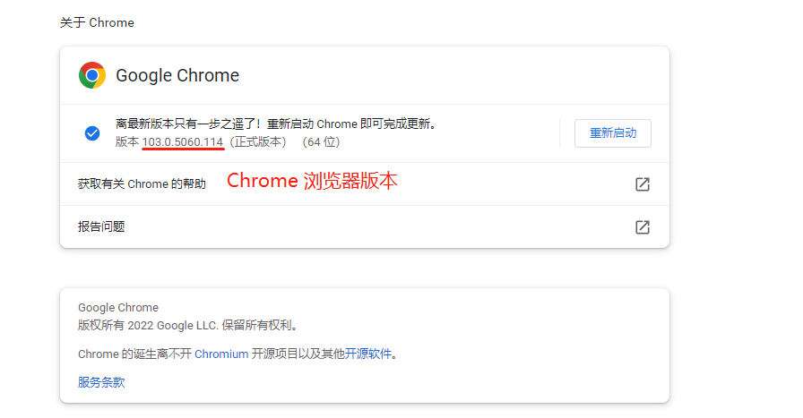

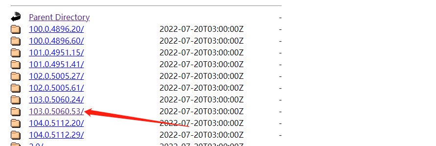

下载离当前浏览器版本的最相近的版本。

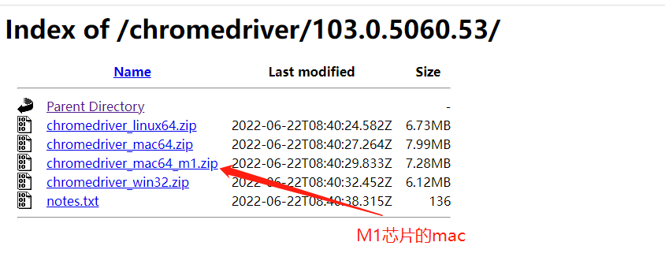

根据不同的电脑类型下载驱动。

下载完成之后，解压到任何一个路径中，然后添加环境变量即可。

### 1.2 测试浏览器驱动

```python
# -*- coding: utf-8 -*-
from selenium.webdriver import Chrome

web = Chrome(executable_path="./chromedriver.exe")

web.get(url="https://www.baidu.com/")
```

如果打开了新的浏览器，就表示安装成功。

## 二、定位

前面我们已经了解到 selenium 是用来操作浏览器的，所以这一小节我们主要用来了解 selenium 是如何操作 Chrome 浏览器。

### 2.1 id 定位

根据标签的 ID 属性来定位需要操作的内容。

标签的 `id` 具有唯一性，就像人的身份证，假设有个 `a` 标签如下。

```python
<a id="baidu" href="https://www.baidu.com"></a>
```

我们可以通过 `id` 定位到它，由于 `id` 的唯一性，我们可以不用管其他的标签的内容。

```python
from selenium.webdriver.common.by import By

web.find_element(By.ID, "baidu")
```

### 2.2 name 定位

`name` 指定标签的名称，在页面中可以不唯一。假设有个 `meta` 标签如下

```python
<meta name="description" content="CSDN是全球知名中文IT技术交流平台,创建于1999年,包含原创博客、精品问答、职业培训、技术论坛、资源下载等产品服务,提供原创、优质、完整内容的专业IT技术开发社区.">
```

我们可以使用 `find_element` 定位到 `meta` 标签。

```python
# -*- coding: utf-8 -*-
from selenium.webdriver import Chrome
from selenium.webdriver.common.by import By

web = Chrome(executable_path="./chromedriver.exe")

web.get(url="https://blog.csdn.net/")

web.find_element(By.NAME, "description")
```

### 2.3 class 定位

`class` 指定标签的类名，在页面中可以不唯一。

```python
<div class=" active-blog"></div>
```

我们可以使用 `By.CLASS_NAME` 定位到 `div` 标签。

```python
# -*- coding: utf-8 -*-
from selenium.webdriver import Chrome
from selenium.webdriver.common.by import By

web = Chrome(executable_path="./chromedriver.exe")

web.get(url="https://blog.csdn.net/")

web.find_element(By.CLASS_NAME, "active-blog")
```

### 2.4 标签定位

每个 `tag` 往往用来定义一类功能，所以通过 `tag` 来识别某个元素的成功率很低，每个页面一般都用很多相同的 `tag` 。

```python
<div></div>
```

我们可以使用 `By.TAG_NAME` 定位到 `div` 标签。

```python
# -*- coding: utf-8 -*-
from selenium.webdriver import Chrome
from selenium.webdriver.common.by import By

web = Chrome(executable_path="./chromedriver.exe")

web.get(url="https://blog.csdn.net/")

web.find_element(By.TAG_NAME, "active-blog")
```

### 2.5 xpath 定位

`xpath` 是一种在 `XML` 文档中定位元素的语言，它拥有多种定位方式。

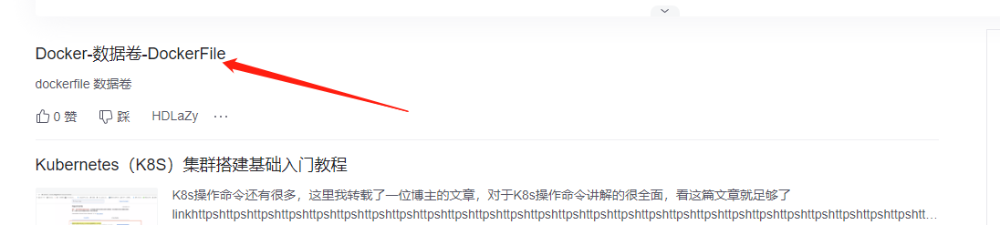

```python
# -*- coding: utf-8 -*-
from selenium.webdriver import Chrome
from selenium.webdriver.common.by import By

web = Chrome(executable_path="./chromedriver.exe")

web.get(url="https://blog.csdn.net/")

web.find_element(By.XPATH, '//*[@id="floor-blog-index_747"]/div/div[1]/div[1]/div[1]/div/a/span')
```

### 2.6 css 定位

`CSS` 使用选择器来为页面元素绑定属性，它可以较为灵活的选择控件的任意属性，一般定位速度比 `xpath` 要快，但使用起来略有难度。

```python
# -*- coding: utf-8 -*-
from selenium.webdriver import Chrome
from selenium.webdriver.common.by import By

web = Chrome(executable_path="./chromedriver.exe")

web.get(url="https://blog.csdn.net/")

web.find_element(By.CSS_SELECTOR, '.blog-text')
```

### 2.7 文本定位

`link` 专门用来定位文本链接，假如要定位下面这一标签。

```python
# -*- coding: utf-8 -*-
from selenium.webdriver import Chrome
from selenium.webdriver.common.by import By

web = Chrome(executable_path="./chromedriver.exe")

web.get(url="https://blog.csdn.net/qq_33261700/article/details/119549172")

web.find_element(By.LINK_TEXT, 'K8S系列第九篇（持久化存储，emptyDir、hostPath、PV/PVC）')
```

### 2.8 模糊定位

`partial_link` 翻译过来就是“部分链接”，对于有些文本很长，这时候就可以只指定部分文本即可定位，同样使用刚才的例子。

```python
# -*- coding: utf-8 -*-
from selenium.webdriver import Chrome
from selenium.webdriver.common.by import By

web = Chrome(executable_path="./chromedriver.exe")

web.get(url="https://blog.csdn.net/qq_33261700/article/details/119549172")

web.find_element(By.PARTIAL_LINK_TEXT, 'K8S系列第九篇')
```

## 三、浏览器控制

控制浏览器的大小及其操作。

### 3.1 设置浏览器窗口大小

`webdriver` 提供 `set_window_size()` 方法来修改浏览器窗口的大小。

```python
# -*- coding: utf-8 -*-
from selenium.webdriver import Chrome
from selenium.webdriver.common.by import By

web = Chrome(executable_path="./chromedriver.exe")

web.get(url="https://blog.csdn.net/qq_33261700/article/details/119549172")

web.set_window_size(100, 150)

web.find_element(By.PARTIAL_LINK_TEXT, 'K8S系列第九篇')
```

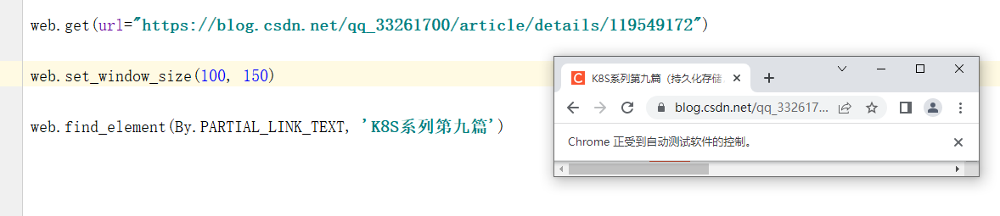

### 3.2 浏览器全屏

`webdriver` 提供 `maximize_window()` 方法来设置浏览器窗口全屏。

```python
web.maximize_window()
```

### 3.3 浏览器前进&后退

`webdriver` 提供 `back` 和 `forward` 方法来实现页面的后退与前进。

```python
# -*- coding: utf-8 -*-
from selenium.webdriver import Chrome
import time

web = Chrome(executable_path="chromedriver.exe")

web.get("https://blog.csdn.net/")
time.sleep(2)

web.get("https://blog.csdn.net/qq_33261700")
time.sleep(2)

web.back()
time.sleep(2)

web.forward()
```

### 3.4 浏览器刷新

在一些特殊情况下我们可能需要刷新页面来获取最新的页面数据，这时我们可以使用 `refresh()` 来刷新当前页面。

```python
# -*- coding: utf-8 -*-
from selenium.webdriver import Chrome
import time

web = Chrome(executable_path="chromedriver.exe")

web.get(url="https://blog.csdn.net/qq_33261700?type=blog")
time.sleep(2)

web.refresh()
```

### 3.5 浏览器窗口切换

在很多时候我们都需要用到窗口切换，比如：当我们点击注册按钮时，它一般会打开一个新的标签页，但实际上代码并没有切换到最新页面中，这时你如果要定位注册页面的标签就会发现定位不到，这时就需要将实际窗口切换到最新打开的那个窗口。我们先获取当前各个窗口的句柄，这些信息的保存顺序是按照时间来的，最新打开的窗口放在数组的末尾，这时我们就可以定位到最新打开的那个窗口了。

```python
# -*- coding: utf-8 -*-
from selenium.webdriver import Chrome
from selenium.webdriver.common.by import By
import time

web = Chrome(executable_path="chromedriver.exe")

web.get(url="https://blog.csdn.net/qq_33261700?type=blog")

web.maximize_window()

web.find_element(By.XPATH, '//*[@id="userSkin"]/div[2]/div/div[2]/div[1]/div[2]/div/article[1]/a').click()

windows = web.window_handles
web.switch_to.window(windows[0])
```

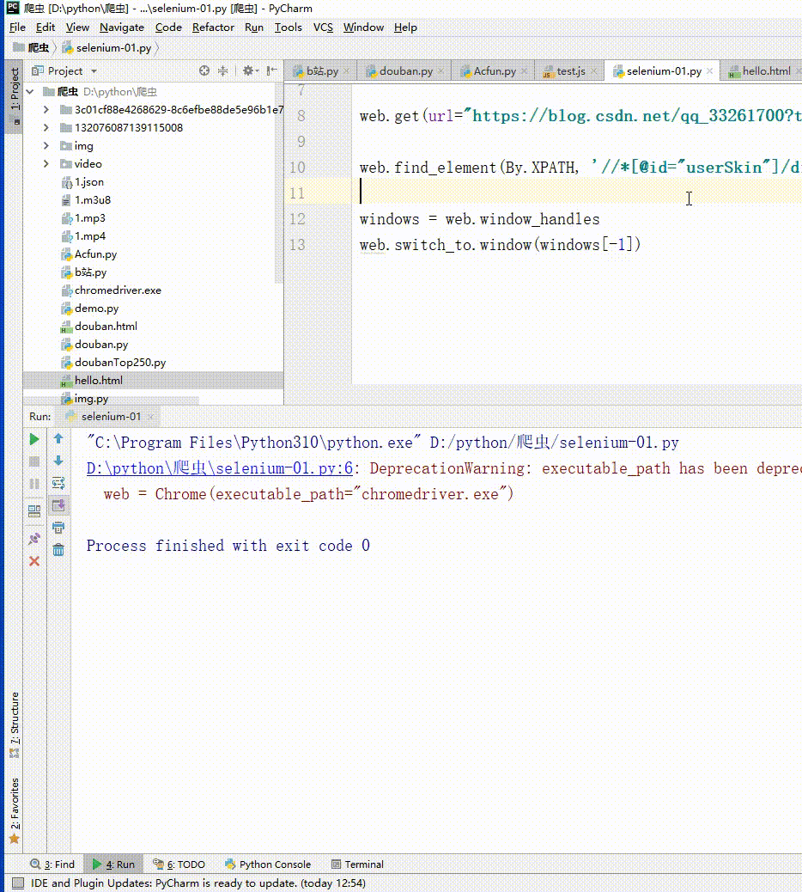

### 3.6 输入内容

在浏览器中使用 `send_keys()` 输入搜索内容。

```python
# -*- coding: utf-8 -*-
from selenium.webdriver import Chrome
from selenium.webdriver.common.by import By
import time

web = Chrome(executable_path="chromedriver.exe")

web.get(url="https://blog.csdn.net/qq_33261700?type=blog")

time.sleep(1)

keys = web.find_element(By.XPATH, '//*[@id="toolbar-search-input"]')

time.sleep(1)

keys.send_keys('selenimu')

time.sleep(1)

web.find_element(By.XPATH, '//*[@id="toolbar-search-button"]').click()
```

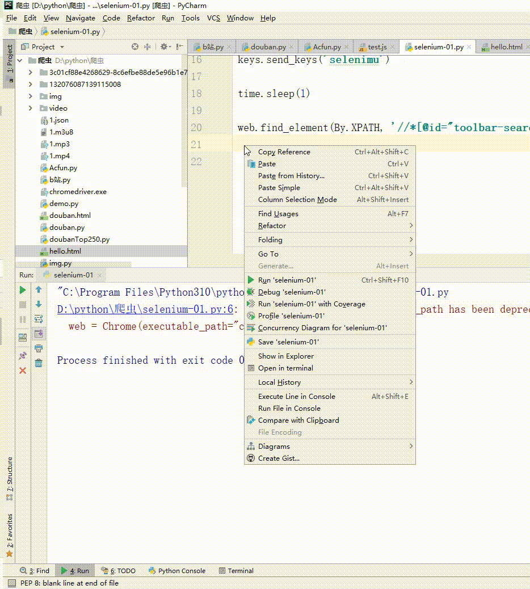

### 3.7 还有其他操作

| 方法              | 描述               |
| ----------------- | ------------------ |
| `clear()`         | 清除文本内容       |
| `is_displayed()`  | 判断该元素是否可见 |
| `get_attribute()` | 获取标签属性值     |
| `size`            | 返回元素的尺寸     |
| `text`            | 返回元素文本       |

## 四、鼠标控制

在webdriver 中，鼠标操作都封装在ActionChains类中，常见方法如下：

| 方法                | 描述                             |
| ------------------- | -------------------------------- |
| `click()`           | 单击左键                         |
| `context_click()`   | 单击右键                         |
| `double_click()`    | 双击                             |
| `drag_and_drop()`   | 拖动                             |
| `move_to_element()` | 鼠标悬停                         |
| `perform()`         | 执行所有ActionChains中存储的动作 |

```python
# -*- coding: utf-8 -*-
from selenium.webdriver import Chrome
from selenium.webdriver.common.by import By
from selenium.webdriver.common.action_chains import ActionChains
import time

web = Chrome(executable_path="chromedriver.exe")

web.get(url="https://www.zhipin.com/shanghai/")

time.sleep(1)

keys = web.find_element(By.XPATH, '//*[@id="main"]/div/div[1]/div/div[1]/dl[1]')

time.sleep(1)

move = ActionChains(web).move_to_element(keys).perform()

```

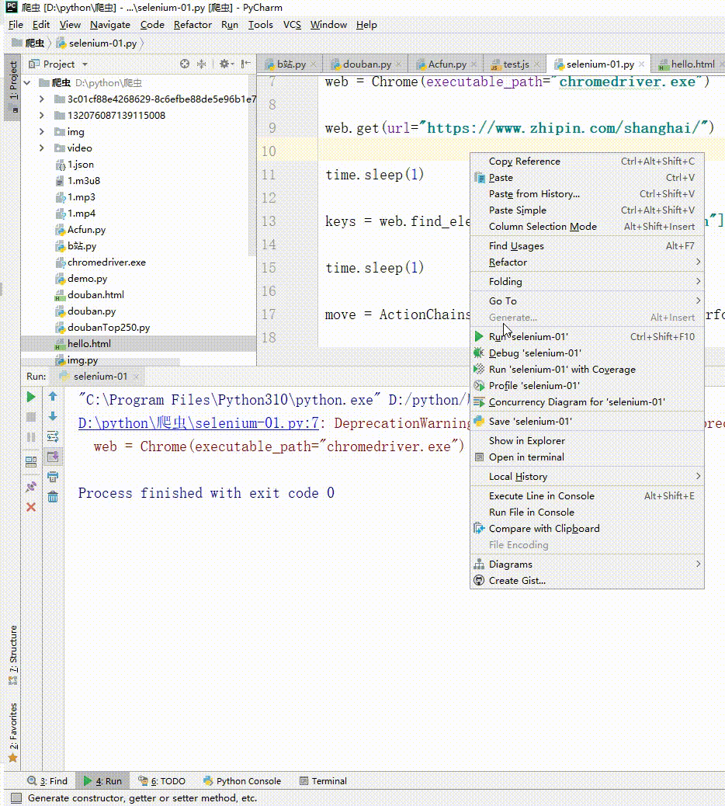

## 五、键盘操作

`webdriver` 中 `Keys` 类几乎提供了键盘上的所有按键方法，我们可以使用 `send_keys + Keys` 实现输出键盘上的组合按键如 **“Ctrl + C”、“Ctrl + V”** 等。

```python
# -*- coding: utf-8 -*-
from selenium.webdriver import Chrome
from selenium.webdriver.common.by import By
from selenium.webdriver.common.action_chains import ActionChains
from selenium.webdriver.common.keys import Keys
import time

web = Chrome(executable_path="chromedriver.exe")

web.get(url="https://www.zhipin.com/shanghai/")

# Ctrl + c
web.find_element(By.XPATH, '').send_keys(Keys.CONTROL, "c")
# Ctrl + v
web.find_element(By.XPATH, '').send_keys(Keys.CONTROL, "v")
# 回车
web.find_element(By.XPATH, '').send_keys(Keys.ENTER)
# F1
web.find_element(By.XPATH, '').send_keys(Keys.F1)
# 空格
web.find_element(By.XPATH, '').send_keys(Keys.SPACE)
# tab
web.find_element(By.XPATH, '').send_keys(Keys.TAB)
# ESC键
web.find_element(By.XPATH, '').send_keys(Keys.ESCAPE)
# ALT
web.find_element(By.XPATH, '').send_keys(Keys.ALT)
# SHIFT
web.find_element(By.XPATH, '').send_keys(Keys.SHIFT)
# 向下
web.find_element(By.XPATH, '').send_keys(Keys.ARROW_DOWN)
# 向左
web.find_element(By.XPATH, '').send_keys(Keys.ARROW_LEFT)
# 向右
web.find_element(By.XPATH, '').send_keys(Keys.ARROW_RIGHT)
# 向上
web.find_element(By.XPATH, '').send_keys(Keys.ARROW_UP)
```

## 六、设置元素等待

很多页面都使用 `ajax` 技术，页面的元素不是同时被加载出来的，为了防止定位这些尚在加载的元素报错，可以设置元素等来增加脚本的稳定性。`webdriver` 中的等待分为 显式等待 和 隐式等待。

### 6.1 显式等待

设置一个超时时间，每个一段时间就去检测一次该元素是否存在，如果存在则执行后续内容，如果超过最大时间（超时时间）则抛出超时异常（`TimeoutException`）。显示等待需要使用 `WebDriverWait`，同时配合 `until` 或 `not until` 。下面详细讲解一下。

- driver：浏览器驱动
- timeout：超时时间，单位秒
- poll_frequency：每次检测的间隔时间，默认为0.5秒
- ignored_exceptions：指定忽略的异常，如果在调用 until 或 until_not 的过程中抛出指定忽略的异常，则不中断代码，默认忽略的只有 NoSuchElementException 。
- method：指定预期条件的判断方法，在等待期间，每隔一段时间调用该方法，判断元素是否存在，直到元素出现。until_not 正好相反，当元素消失或指定条件不成立，则继续执行后续代码
- message: 如果超时，抛出 TimeoutException ，并显示 message 中的内容

```python
# -*- coding: utf-8 -*-
from selenium.webdriver import Chrome
from selenium.webdriver.common.by import By
from selenium.webdriver.common.action_chains import ActionChains
from selenium.webdriver.common.keys import Keys
from selenium.webdriver.support.ui import WebDriverWait
from selenium.webdriver.support import expected_conditions
import time

web = Chrome(executable_path="chromedriver.exe")

el = WebDriverWait(web, 5, 0.5).until(
    expected_conditions.presence_of_element_located((By.ID, 'kw')),
    message="超时了。。。"
)
```

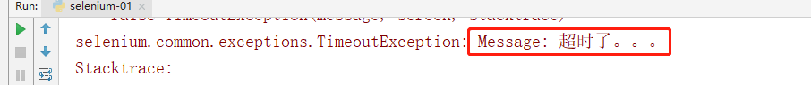


### 6.2 隐士等待

隐式等待也是指定一个超时时间，如果超出这个时间指定元素还没有被加载出来，就会抛出 NoSuchElementException 异常。
除了抛出的异常不同外，还有一点，隐式等待是全局性的，即运行过程中，如果元素可以定位到，它不会影响代码运行，但如果定位不到，则它会以轮询的方式不断地访问元素直到元素被找到，若超过指定时间，则抛出异常。

```python
# -*- coding: utf-8 -*-
from selenium.webdriver import Chrome
from selenium.webdriver.common.by import By
from selenium.webdriver.common.action_chains import ActionChains
from selenium.webdriver.common.keys import Keys
from selenium.webdriver.support.ui import WebDriverWait
from selenium.webdriver.support import expected_conditions
import time

web = Chrome(executable_path="chromedriver.exe")

web.get(url="https://blog.csdn.net/qq_33261700?type=blog")

web.implicitly_wait(5)

start = time.time()

try:
    web.find_element(By.ID, 'kw')
except Exception as e:
    print(e)
    print(time.time() - start)
```

## 七、find_elements 和 find_element

在 `selenium` 之前的版本中，定位元素是有 8 种方式，而 `selenium 4.0` 以后的版本中变成了find_elements 和 find_element 两种。

其中 find_elements 和 find_element 之间的区别也非常的简单，find_elements 是定位多个元素的而 find_elemen 是只能定位一个元素。

```python
# -*- coding: utf-8 -*-
from selenium.webdriver import Chrome
from selenium.webdriver.common.by import By
from selenium.webdriver.common.action_chains import ActionChains
from selenium.webdriver.common.keys import Keys
from selenium.webdriver.support.ui import WebDriverWait
from selenium.webdriver.support import expected_conditions
import time

web = Chrome(executable_path="chromedriver.exe")

web.get(url="https://blog.csdn.net/qq_33261700?type=blog")

for item in web.find_elements(By.XPATH, '//*[@id="userSkin"]/div[2]/div/div[2]/div[1]/div[2]/div/article'):
    print(item.find_element(By.XPATH, "./a/div[1]/h4").text)
```

## 八、上传 & 下载文件

常见的 web 页面的上传，一般使用 `input` 标签或是插件（`JavaScript`、`Ajax`），对于 `input` 标签的上传，可以直接使用 `send_keys(路径)` 来进行上传。

### 8.1 上传文件

```html
<!doctype html>
<html lang="en">
<head>
    <meta charset="UTF-8">
    <meta name="viewport"
          content="width=device-width, user-scalable=no, initial-scale=1.0, maximum-scale=1.0, minimum-scale=1.0">
    <meta http-equiv="X-UA-Compatible" content="ie=edge">
    <title>Document</title>
</head>
<body>
	<input type="file">
</body>
</html>
```

下面通过 `xpath` 定位 `input` 标签，然后使用 `send_keys(str(file_path)` 上传文件。

```python
# -*- coding: utf-8 -*-
from selenium.webdriver import Chrome
from selenium.webdriver.common.by import By
from selenium.webdriver.common.action_chains import ActionChains
from selenium.webdriver.common.keys import Keys
from selenium.webdriver.support.ui import WebDriverWait
from selenium.webdriver.support import expected_conditions
import time

web = Chrome(executable_path="chromedriver.exe")

web.get(url="file:///D:/python/爬虫/hello.html")

web.find_element(By.NAME, 'upload').send_keys(str('D:/python/爬虫/hello.html'))
```

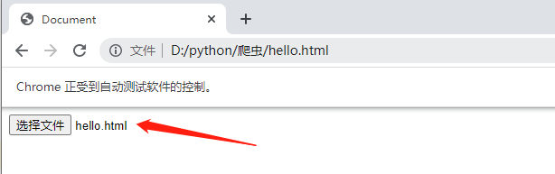

### 8.2 下载文件

```python
# -*- coding: utf-8 -*-
from selenium.webdriver import Chrome, ChromeOptions
from selenium.webdriver.common.by import By
from selenium.webdriver.common.action_chains import ActionChains
from selenium.webdriver.common.keys import Keys
from selenium.webdriver.support.ui import WebDriverWait
from selenium.webdriver.support import expected_conditions
import time, os
current_directory = os.path.dirname(os.path.abspath(__file__))

prefs = {
    'profile.default_content_settings.popups': 0,
    'download.default_directory': str(current_directory)
}

option = ChromeOptions()
option.add_experimental_option('prefs', prefs)

web = Chrome(executable_path="chromedriver.exe", options=option)

web.get(url="https://image.baidu.com/search/index?ct=201326592&tn=baiduimage&word=%E9%A3%8E%E6%99%AF&pn=3&spn=0&ie=utf-8&oe=utf-8&cl=2&lm=-1&fr=&se=&sme=&cs=2984023968%2C2695166758&os=1902941552%2C2392086484&objurl=https%3A%2F%2Fgimg2.baidu.com%2Fimage_search%2Fsrc%3Dhttp%3A%2F%2Fimg.jj20.com%2Fup%2Fallimg%2F1115%2F092621094155%2F210926094155-8-1200.jpg%26refer%3Dhttp%3A%2F%2Fimg.jj20.com%26app%3D2002%26size%3Df9999%2C10000%26q%3Da80%26n%3D0%26g%3D0n%26fmt%3Dauto%3Fsec%3D1660909844%26t%3D18a8b8c697e65c79c5dd86ccaf3b506e&di=7108135681917976577&tt=1&is=0%2C0&adpicid=0&gsm=1e&dyTabStr=MCwzLDYsMSw0LDUsNywyLDgsOQ%3D%3D")

web.find_element(By.XPATH, '//*[@id="mediacy-toolbar"]/span[1]').click()

web.switch_to.window(web.window_handles[-1])
web.find_element(By.TAG_NAME, 'html').send_keys('thisisunsafe')
```

## 九、cookies

`cookies` 是识别用户登录与否的关键，[爬虫](https://so.csdn.net/so/search?q=爬虫&spm=1001.2101.3001.7020)中常常使用 `selenium + requests` 实现 `cookie`持久化，即先用 `selenium` 模拟登陆获取 `cookie` ，再通过 `requests` 携带 `cookie` 进行请求。

webdriver 提供 cookies 的几种操作：读取、添加删除。

- get_cookies：以字典的形式返回当前会话中可见的 cookie 信息。
- get_cookie(name)：返回 cookie 字典中 key == name 的 cookie 信息。
- add_cookie(cookie_dict)：将 cookie 添加到当前会话中。
- delete_cookie(name)：删除指定名称的单个 cookie。
- delete_all_cookies()：删除会话范围内的所有 cookie。

```python
# -*- coding: utf-8 -*-
from selenium.webdriver import Chrome, ChromeOptions
from selenium.webdriver.common.by import By
from selenium.webdriver.common.action_chains import ActionChains
from selenium.webdriver.common.keys import Keys
from selenium.webdriver.support.ui import WebDriverWait
from selenium.webdriver.support import expected_conditions
import time, os
current_directory = os.path.dirname(os.path.abspath(__file__))

web = Chrome(executable_path="chromedriver.exe")
web.get("https://www.baidu.com")

print(web.get_cookies())
print(web.get_cookie('domain'))
```

## 十、使用 JS

在使用 selenimu 的时候，难免需要操作 JS，下面我们实操一下 selenimu 调用 JS。

```python
# -*- coding: utf-8 -*-
from selenium.webdriver import Chrome, ChromeOptions
from selenium.webdriver.common.by import By
from selenium.webdriver.common.action_chains import ActionChains
from selenium.webdriver.common.keys import Keys
from selenium.webdriver.support.ui import WebDriverWait
from selenium.webdriver.support import expected_conditions
import time, os
current_directory = os.path.dirname(os.path.abspath(__file__))

web = Chrome(executable_path="chromedriver.exe")
web.get("https://www.baidu.com")

web.execute_script('alert("Hello World!")')
```

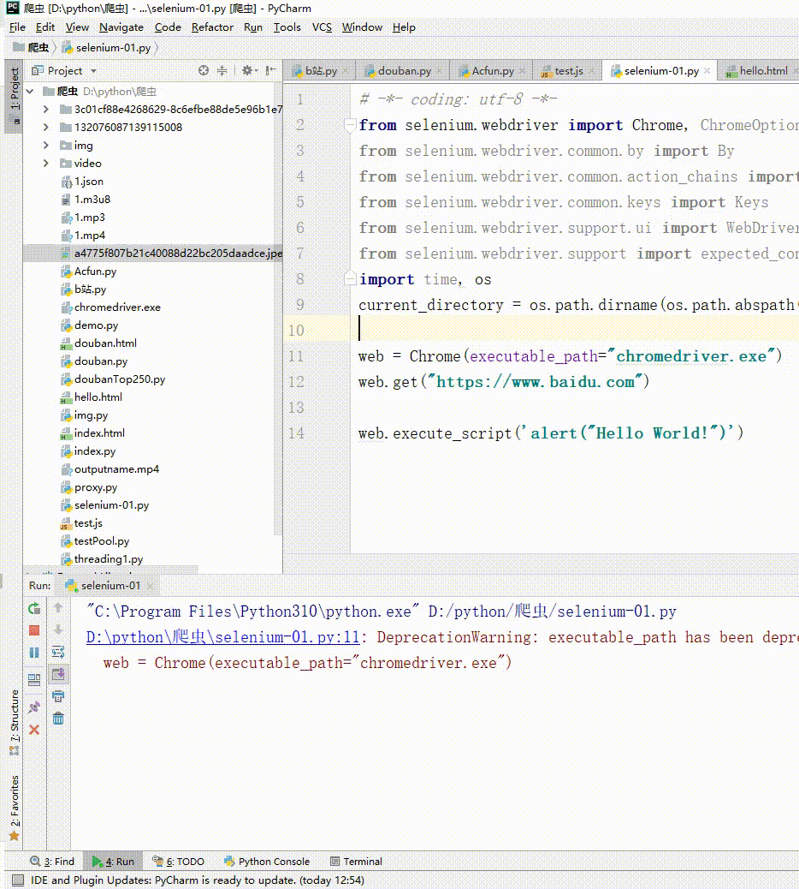

## 十一、隐藏浏览器指纹

selenium 对于部分网站来说十分强大，但它也不是万能的，实际上，selenium 启动的浏览器，有几十个特征可以被网站检测到，轻松的识别出你是爬虫。
不相信？接着往下看，首先你手动打开浏览器输入https://bot.sannysoft.com/，在网络无异常的情况下，显示应该如下：

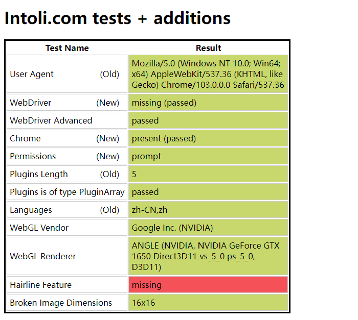

同样的，我们使用 selenium 打开该网站。

```python
# -*- coding: utf-8 -*-
from selenium.webdriver import Chrome

web = Chrome(executable_path="chromedriver.exe")
web.get("https://bot.sannysoft.com/")
```

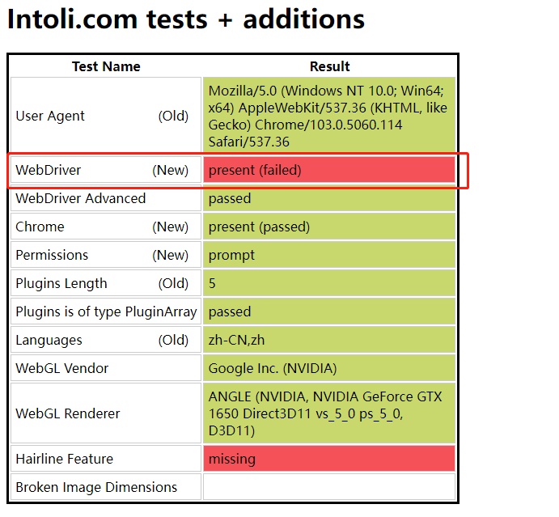

我们可以看到的是，如果我们爬取的网站真的想阻止也是非常简单的。那么是不是说 selenium 就不能使用呢？并不是这样的。如果我们想隐藏的足够好，就需要 `stealth.min.js` 这个文件。

### 11.1 生成 stealth.min.js

生成 stealth.min.js 首先需要安装 nodejs。

```bash
npx extract-stealth-evasions
```

### 11.2 测试

```python
# -*- coding: utf-8 -*-
from selenium.webdriver import Chrome

web = Chrome(executable_path="chromedriver.exe")

with open('stealth.min.js', 'r') as f:
    js = f.read()

web.execute_cdp_cmd("Page.addScriptToEvaluateOnNewDocument", {
    "source": js
})

web.get("https://bot.sannysoft.com/")
```

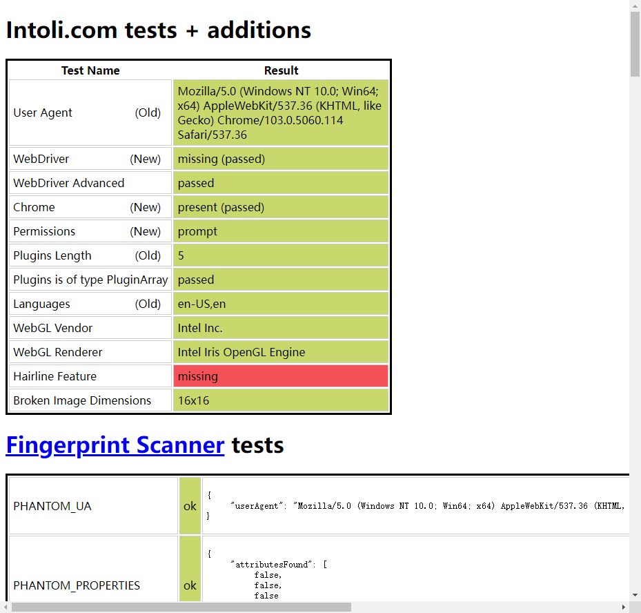

通过 `stealth.min.js` 的隐藏，可以看到这次使用无头浏览器特征基本都以隐藏，已经十分接近人工打开浏览器了。

## 十二、selenium 模拟登录

```python
# -*- coding: utf-8 -*-
from selenium.webdriver import Chrome
from selenium.webdriver.common.by import By
from selenium.webdriver.support.ui import WebDriverWait
from selenium.webdriver.support import expected_conditions
import time, ddddocr
from PIL import Image

def runLogin():

    """
    开始登录
    :return:
    """
    url = "https://weibo.com/login.php"

    web = Chrome(executable_path="chromedriver.exe")

    with open('stealth.min.js', 'r') as f:
        js = f.read()

    web.execute_cdp_cmd("Page.addScriptToEvaluateOnNewDocument", {
        "source": js
    })

    web.get(url=url)

    web.maximize_window()

    element = WebDriverWait(web, 10, 0.5).until(
        expected_conditions.presence_of_element_located((By.XPATH, '//*[@id="loginname"]')),
        message="超时了。。。"
    )

    web.find_element(By.XPATH, '//*[@id="loginname"]').send_keys('用户名')
    web.find_element(By.XPATH, '//*[@id="pl_login_form"]/div/div[3]/div[2]/div/input').send_keys('密码')

    code_img_name = downloadCodeImg(web)

    code = IdentifyPictures(code_img_name)

    # 输入识别出来的验证码
    web.find_element(By.XPATH, '//*[@id="pl_login_form"]/div/div[3]/div[3]/div/input').send_keys(code)
    
    # 开始登录
    web.find_element(By.XPATH, '//*[@id="pl_login_form"]/div/div[3]/div[6]/a').click()

def IdentifyPictures(code_img_name):

    """
    识别验证码
    :param code_img_name:
    :return:
    """
    det = ddddocr.DdddOcr(old=True)

    with open(code_img_name, 'rb') as f:
        img = f.read()

    res = det.classification(img)

    return res

def downloadCodeImg(web):

    """
    保存图形验证码
    :param web:
    :return:
    """

    element = WebDriverWait(web, 10, 0.5).until(
        expected_conditions.presence_of_element_located((By.XPATH, '//*[@id="pl_login_form"]/div/div[3]/div[3]/a/img')),
        message="超时了。。。"
    )

    time.sleep(1)

    # 对当前页面进行截图保存
    web.save_screenshot('page.png')
    # 定位验证码图片的位置
    code_img_ele = web.find_element(By.XPATH, '//*[@id="pl_login_form"]/div/div[3]/div[3]/a/img')
    # 获取验证码左上角的坐标x,y
    location = code_img_ele.location
    # 获取验证码图片对应的长和宽
    size = code_img_ele.size

    # 左上角和右下角的坐标
    rangle = (
        int(location['x']),
        int(location['y']),
        int((location['x'] + size['width'])),
        int((location['y'] + size['height']))
    )

    i = Image.open('./page.png')
    code_img_name = './code_img.png'

    # crop根据rangle元组内的坐标进行裁剪
    frame = i.crop(rangle)
    frame.save(code_img_name)

    return code_img_name

def main():

    runLogin()

if __name__ == '__main__':

    main()

```

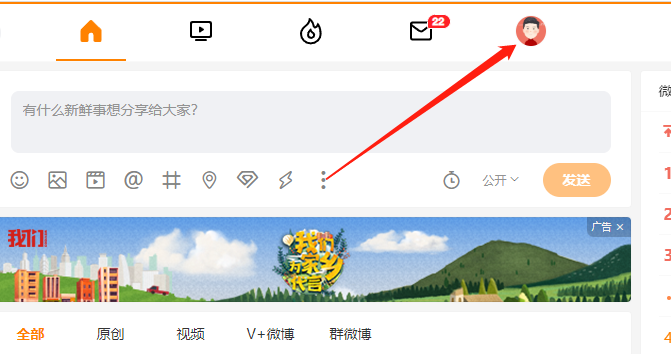


