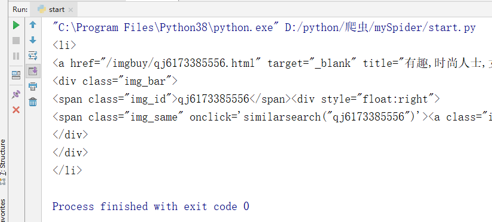
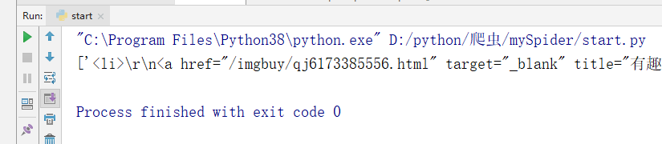

# Python逆向爬虫之scrapy框架

## 一、爬虫入门

那么，我相信初学的小伙伴现在一定是似懂非懂的。那么下面我们通过一个案例来慢慢进行分析，具体如下：

今天，我们的目标是一个图片网站，https://www.quanjing.com/tupian/meinv-1.html

首先，我们第一步需要做的就是项目分析，我们来看看爬取这个网站我们需要哪些步骤。

### 1.1 定义需求

需求就是将该网站中所有的美女图片分类下载到本地。


### 1.2 需求分析

如果我们需要下载上面所表示的所有的图片的话，我们需要如下几个步骤：

1. 下载某个页面上所有的图片
2. 分页
2. 进行下载图片

#### 1.2.1 下载某个页面上所有的图片

```python
# -*- coding: utf-8 -*-

import requests
from lxml import etree

import urllib3
urllib3.disable_warnings()

def getClassification(num):
    """
    获取分类链接
    :return:
    """

    url = f"https://www.quanjing.com/tupian/meinv-{num}.html"

    html = sendRequest(url, "get")

    htmlValus = htmlAnalysis(html.text, '//*[@id="gallery-list"]/li')

    for item in htmlValus:
        imgUrl = item.xpath('./a/img/@src')[0]
        downLoad(imgUrl)

def downLoad(url):

    """
    下载图片
    :param url:
    :return:
    """

    img = sendRequest(url)

    imgName = url.split("@")[0].split("/")[-1]

    with open("./quanjing/" + imgName, 'wb') as imgValue:
        imgValue.write(img.content)

def htmlAnalysis(html, rule):

    """
    根据 xpath 获取数据
    :param html:
    :param rule:
    :return:
    """

    htmlValues = etree.HTML(html)

    value = htmlValues.xpath(rule)

    return value


def sendRequest(url, method="get"):
    """
    发送请求
    :param url:
    :param method:
    :return:
    """
    if method.lower() == "get":
        html = requests.get(url=url, headers=getHeader(), verify=False)
    elif method.lower() == "post":
        html = requests.post(url=url, headers=getHeader())
    else:
        html = None

    return html


def getHeader():
    """
    获取Header
    :return:
    """

    ua_headers = {
        "User-Agent": 'Mozilla/5.0 (Windows NT 10.0; Win64; x64) AppleWebKit/537.36 (KHTML, like Gecko) Chrome/103.0.0.0 Safari/537.36',
        "referer": "https://www.quanjing.com/"
    }

    return ua_headers


def main():
    getClassification(1)


if __name__ == '__main__':
    main()

```

#### 1.2.2 分页

```python
def main():
    for i in range(10):
        getClassification(i)

```

#### 1.2.3 进行下载图片

```python
def downLoad(url):

    """
    下载图片
    :param url:
    :return:
    """

    img = sendRequest(url)

    imgName = url.split("@")[0].split("/")[-1]

    with open("./quanjing/" + imgName, 'wb') as imgValue:
        imgValue.write(img.content)

```

## 二、Scrapy

Scrapy是一个为了爬取网站数据，提取结构性数据而编写的应用框架。 可以应用在包括数据挖掘，信息处理或存储历史数据等一系列的程序中。

其最初是为了页面抓取 (更确切来说, 网络抓取 )所设计的， 也可以应用在获取API所返回的数据(例如 Amazon Associates Web Services ) 或者通用的网络爬虫。

下面我们给出一个 Scrapy 的架构图


上面的架构图明确的说明了 Scrapy 主要有 5 个部分。

- 引擎(Scrapy Engine)：引擎负责控制数据流在系统中所有组件中流动，并在相应动作发生时触发事件。
- 管道(Pipline)：主要提供存储服务，把需要存储的数据存储到相关数据库之中。
- 调度器(Scheduler)：主要提供两个功能，分别是 去重 和 队列。
- 下载器(Downloader)：下载器负责获取页面数据并提供给引擎，而后提供给spider。
- 爬虫(Spiders)：Spider是Scrapy用户编写用于分析response并提取item(即获取到的item)或额外跟进的URL的类。 每个spider负责处理一个特定(或一些)网站。

其实除了上述的内容外，Scrapy 还提供一些中间件，例如：下载器中间件(Downloader Middlewares)和爬虫中间件(Spider Middlewares)等。

所以，把上面完整的图可以画成如下：


### 2.1 安装 Scrapy

在命令行模式下使用pip命令即可安装。

```bash
$ pip install scrapy
```

### 2.2 Scrapy 创建项目

第一步：创建一个scrapy项目

```bash
$ scrapy startproject mySpider
```

第二步：生成一个爬虫

```bash
$ cd mySpider
$ scrapy genspider tupian https://www.quanjing.com/
```

### 2.3 scrapy 命令

```bash
#1 查看帮助
scrapy -h
scrapy <command> -h

#2 有两种命令：其中Project-only必须切到项目文件夹下才能执行，而Global的命令则不需要
Global commands:
startproject #创建项目
genspider    #创建爬虫程序
settings     #如果是在项目目录下，则得到的是该项目的配置
runspider    #运行一个独立的python文件，不必创建项目
shell        #scrapy shell url地址  在交互式调试，如选择器规则正确与否
fetch        #独立于程单纯地爬取一个页面，可以拿到请求头
view         #下载完毕后直接弹出浏览器，以此可以分辨出哪些数据是ajax请求
version      #查看scrapy的版本

Project-only commands:
crawl        #运行爬虫，必须创建项目才行，确保配置文件中ROBOTSTXT_OBEY = False
check        #检测项目中有无语法错误
list         #列出项目中所包含的爬虫名
edit         #编辑器，一般不用
parse        #scrapy parse url地址 --callback 回调函数
bench        #scrapy bentch压力测试

#3 官网链接
    https://docs.scrapy.org/en/latest/topics/commands.html
```


### 2.4 生成文件详情

- scrapy.cfg：项目的主配置信息，用来部署scrapy时使用，爬虫相关的配置信息在settings.py文件中。
- items.py：设置数据存储模板，用于结构化数据，如：Django的Model
- pipelines：数据处理行为，如：一般结构化的数据持久化
- settings.py：配置文件。
- spiders：爬虫目录，如：创建文件，编写爬虫规则

### 2.5 第一个 scrapy 爬虫程序

#### 2.5.1 编辑 spider

```python
import scrapy
from ..items import MyspiderItem

class TupianSpider(scrapy.Spider):
    # 定义爬虫名，scrapy会根据该值定位爬虫程序,所以它必须要有且必须唯一
    name = 'tupian'
    # 定义允许爬取的域名，如果OffsiteMiddleware启动（默认就启动），
    # 那么不属于该列表的域名及其子域名都不允许爬取
    allowed_domains = ['www.quanjing.com']
    # 如果没有指定url，就从该列表中读取url来生成第一个请求
    start_urls = ['https://www.quanjing.com/tupian/meinv.html']

    # 爬虫启动函数，必须定义成这个函数名称
    def parse(self, response):

        imgList = response.xpath('//*[@id="gallery-list"]/li')

        for item in imgList:

            imgSrcValue = item.xpath('./a/img/@src').get()

            yield MyspiderItem(img_url=imgSrcValue)
```

#### 2.5.2 编辑 piplines

```python
from itemadapter import ItemAdapter


class MyspiderPipeline:

    def process_item(self, item, spider):
        print(item)
        return item
```

#### 2.5.3 编辑配置文件

```python
# 设置日志的级别
LOG_LEVEL = "WARNING"

# 关闭 Robots.txt 协议
ROBOTSTXT_OBEY = False

# 开启 pipelines
ITEM_PIPELINES = {
   'mySpider.pipelines.MyspiderPipeline': 300,
}
```

## 三、Scrapy Spider

Spider 负责处理所有Responses,从中分析提取数据，获取Item字段需要的数据，并将需要跟进的URL提交给引擎，再次进入Scheduler(调度器)。

总结 Spider 主要有三个作用，分别是：链接配置、抓取逻辑和解析逻辑。

Spider 的整个爬取循环过程如下：

- 以初始的 URL 初始化 Request ，并设置回调函数。当该 Request 成功请求并返回时， Response 生成并作为参数传给该回调函数。
- 在回调函数内分析返回的网页内容 。 返回结果有两种形式：
  - 一种是解析到的有效结果返回字典或 Item 对象，它们可以经过处理后（或直接）保存
  - 另一种是解析得到下一个（如下一页）链接，可以利用此链接构造 Request 并设置新的回调函数，返回 Request 等待后续调度
- 如果返回的是字典或 Item 对象，我们可通过 Feed Exports 等组件将返回结果存入到文件。 如果设置了 Pipeline 的话，我们可以使用 Pipeline 处理 （如过滤、修正等）并保存。
- 如果返回的是 Request ，那么 Request 执行成功得到 Response 之后， Response 会被传递给Request 中定义的回调函数，在回调函数中我们可以再次使用选择器来分析新得到的网页内容，并根据分析的数据生成 Item。

### 3.1 Spider 详细

Spider 继承自 `scrapy.spiders.Spider`。`scrapy.spiders.Spider `这个类是最简单最基本的 Spider 类，其他 Spider 必须继承这个类。
`scrapy.spiders.Spider` 类提供了`start_requests()`方法的默认实现，读取并请求 `start_urls` 属性 ，并根据返回的结果调用 `parse() `方法解析结果 。

它有如下一些基础属性：

- name：爬虫名称，是定义 Spider 名字的字符串。Spider 的名字定义了 Scrapy 如何定位并初始化 Spider ，它必须是唯一的。不过我们可以生成多个相同的 Spider 实例，数量没有限制。name 是 Spider 最重要的属性 。 **如果 Spider 爬取单个网站， 一个常见的做法是以该网站的域名名称来命名 Spider。** 例如， Spider 爬取 mywebsite.com ， 该 Spider通常会被命名为 mywebsite。

- `allowed_domains`：**允许爬取的域名，是可选配置，不在此范围的链接不会被跟进爬取** 。

- `start_urls`：它是起始 URL 列表，当我们没有实现`start_requests()`方法时，默认会从这个列表开始抓取。

- `custom_settings`：**它是一个字典，是专属于本 Spider 的配置，此设置会覆盖项目全局的设置**。此设置必须在初始化前被更新，必须定义成类变量。

  ```python
  不同爬虫pipeline设置
  custom_settings = {
      'ITEM_PIPELINES': {
          'video.pipelines.VideoPipeline': 301,
      }
  }
  ```

- `crawler`：它是由 `from_crawler() `方法设置的，代表的是本 Spider 类对应的 Crawler 对象 。Crawler 对象包含了很多项目组件，利用它我们可以获取项目的一些配置信息，如最常见的获取项目的设置信息，即 Settings。

- `settings`：它是一个 Settings 对象，**利用它我们可以直接获取项目的全局设置变量** 。

除了基础属性，Spider 还有一些常用的方法。

- `start_requests()`：此方法用于**生成初始请求**，它**必须返回一个可迭代对象**，该方法可以被**重写**。此方法会**默认使用 start_urls 里面的 URL 来构造 Request**，而且 Request **默认是 GET 请求方式**。如果我们想在启动时以 POST方式访问某个站点，可以直接**重写这个方法**，发送 POST请求时使用 `FormRequest `即可 。
- `parse(response)`：**当 Response 没有指定回调函数时，该方法会默认被调用** 。 它负**责处理 Response 处理返回结果**，并从中提取出想要的数据和下一步的请求，然后返回。该方法需要返回一个包含 `Request `或 `ltem`的可迭代对象。
- `closed(reason)`：**当 Spider 关闭时，该方法会被调用，在这里一般会定义释放资源的一些操作或其他收尾操作**。

```python
import scrapy
from ..items import MyspiderItem

class TupianSpider(scrapy.Spider):
    # 定义爬虫名，scrapy会根据该值定位爬虫程序,所以它必须要有且必须唯一
    name = 'tupian'
    # 定义允许爬取的域名，如果OffsiteMiddleware启动（默认就启动），
    # 那么不属于该列表的域名及其子域名都不允许爬取
    allowed_domains = ['www.quanjing.com']
    # 如果没有指定url，就从该列表中读取url来生成第一个请求
    start_urls = ['https://www.quanjing.com/tupian/meinv.html']

    def start_requests(self):
        
        """
        开始请求之前的执行
        :return: 
        """
        print("我是开始")
        yield scrapy.Request(
            url=self.start_urls[0],
            callback=self.parse
        )


    # 爬虫启动函数，必须定义成这个函数名称
    def parse(self, response):
        
        """
        爬虫具体内容
        :param response: 
        :return: 
        """
        print("我是 parse")

        imgList = response.xpath('//*[@id="gallery-list"]/li')

        for item in imgList:

            imgSrcValue = item.xpath('./a/img/@src').get()

            yield MyspiderItem(img_url=imgSrcValue)

    def close(spider, reason):
        
        """
        结束时调用
        :param reason: 
        :return: 
        """
        print("关闭")
        return None

```


### 3.2 spider常用的方法

#### 3.2.1 解析常用的几个方法

我们可以通过 `scrapy.selector.unified.SelectorList` 对象来查找**get()**、**getall()**、**extract()**、**extract_first()**、**re.first()**的如何使用。

1. extract()方法：获取的是一个列表内容

```python
    def parse(self, response):

        """
        爬虫具体内容
        :param response:
        :return:
        """
        imgList = response.xpath('//*[@id="gallery-list"]/li').extract()
        print(imgList)
```


2. extract_first()方法：返回列表的第一个内容，也就是extract()列表的第一个元素

```python
    def parse(self, response):

        """
        爬虫具体内容
        :param response:
        :return:
        """
        imgList = response.xpath('//*[@id="gallery-list"]/li').extract_first()
        print(imgList)
```



3. getall()方法：返回所有的元素

```python
imgList = response.xpath('//*[@id="gallery-list"]/li').extract_first()
print(imgList)
```



4. get()方法：返回第一个元素，是str类型数据

```python
    def parse(self, response):

        """
        爬虫具体内容
        :param response:
        :return:
        """
        imgList = response.xpath('//*[@id="gallery-list"]/li').get()
        print(imgList)
```


5. re()方法：正则的使用。返回所以的满足条件，结果是列表类型

```python
def parse(self, response):

    """
        爬虫具体内容
        :param response:
        :return:
        """
    imgList = response.xpath('//*[@id="gallery-list"]/li').re("\d+")
    print(imgList)
```


6. re_first()方法：正则使用，返回的是满足条件第一个元素

```python
def parse(self, response):

    """
        爬虫具体内容
        :param response:
        :return:
        """
    imgList = response.xpath('//*[@id="gallery-list"]/li').re_first("\d+")
    print(imgList)
```


#### 3.2.2 response 常用的几个方法

常见的几个 response 方法。

1. response.body.decode("utf-8")：返回 HTML 并设置字符集编码


2. response.body：以 bytes 类型返回请求的 HTML 。


3. response.url：返回 URL

```python
print(response.url)
```

4. response.urljoin("dsadasd")：返回 URL 拼接后的结果

```python
print(response.urljoin("dsadasd"))
```


5. response.encoding：返回请求状态码


## 四、Scrapy Pipline

当 Item 在 Spide r中被收集之后，就会被传递到 Item Pipeline 中进行处理。

每个 item pipeline 组件是实现了简单的方法的 python 类，负责接收到 item 并通过它执行一些行为，同时也决定此 Item 是否继续通过 pipeline ,或者被丢弃而不再进行处理。

item pipeline 的主要作用：清理html数据、验证爬取的数据、去重并丢弃和保存数据。


