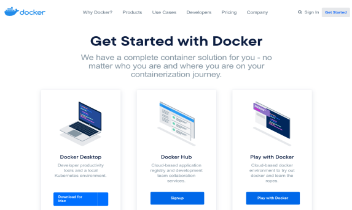

# 第一章：docker基础入门

Docker 是一个开源项目，诞生于 2013 年初，最初是 dotCloud 公司内部的一个业余项目。它基于 Google 公司推出的 Go 语言实现。 项目后来加入了 Linux 基金会，遵从了 Apache 2.0 协议，项目代码在 [GitHub](https://github.com/docker/docker) 上进行维护。Docker 自开源后受到广泛的关注和讨论，以至于 dotCloud 公司后来都改名为 Docker Inc。Redhat 已经在其 RHEL6.5 中集中支持 Docker；Google 也在其 PaaS 产品中广泛应用。Docker 项目的目标是实现轻量级的操作系统虚拟化解决方案。 Docker 的基础是 Linux 容器（LXC）等技术。在 LXC 的基础上 Docker 进行了进一步的封装，让用户不需要去关心容器的管理，使得操作更为简便。用户操作 Docker 的容器就像操作一个快速轻量级的虚拟机一样简单。Docker 可以让开发者打包他们的应用以及依赖包到一个轻量级、可移植的容器中，然后发布到任何流行的 Linux 机器上，也可以实现虚拟化。容器是完全使用沙箱机制，相互之间不会有任何接口（类似 iPhone 的 app）,更重要的是容器性能开销极低。

## **一、** 为什么要使用Docker

### **1、** Docker容器虚拟化的好处

在云时代，开发者创建的应用必须要能很方便地在网络上传播，也就是说应用必须脱离底层物理硬件的限制；同时必须满足“任何时间任何地点”可获取可使用的特点。因此，开发者们需要一种新型的创建分布式应用程序的方式，快速分发部署，而这正是Docker所能够提供的最大优势。Docker提供了一种更为聪明的方式，通过容器来打包应用、解耦应用和运行平台。这意味着迁移的时候，只需要在新的服务器上启动需要的容器就可以了，无论新旧服务器是否是同一类别的平台。这无疑帮助我们节约了大量的宝贵时间，并降低部署过程出现问题的风险。

### 2、Docker在开发和运维中的优势

对于开发和运维人员来说，最梦寐以求的效果可能就是一次创建和配置，之后可以在任意地方、任意时间让应用正常运行，而Docker恰恰可以实现这一中级目标。具体来说，在开发和运维过程中，Docker具有以下几个方面的优势：

1. **更快的交付和部署**：使用Docker，开发人员可以使用镜像来快速构建一套标准的开发环境；开发完之后，测试和运维人员可以直接使用完全相同的环境来部署代码。只要是开发测试过的代码，就可以确保在生产环境无缝运行。Docker可以快速创建和删除容器，实现快速迭代，节约开发、测试及部署的时间。
2. **更高效的利用资源**：运行Docker容器不需要额外的虚拟化管理程序的支持，Docker是内核级的虚拟化，可以实现更高的性能，同时对资源的额外需求很低，与传统的虚拟机方式相比，Docker的性能要提高1 ~ 2个数量级。
3. **更轻松的迁移和扩展**：Docker容器几乎可以在任意的平台上运行，包括物理机、虚拟机、公有云、私有云、个人电脑等等，同时支持主流的操作系统发行版本。这种兼容性能让用户可以在不同的平台之间轻松的迁移应用。
4. **更轻松的管理和更新**：使用Dockerfile，只需要小小的配置修改，就可以替代以往大量的更新工作。所有的修改都以增量的方式被分发和更新，从而实现自动化并且高效的容器管理。

### 3、Docker与虚拟机的比较

作为一种轻量级的虚拟化方式，Docker在运行应用上跟传统的虚拟机的方式相比具有如下显著优势：

- Docker容器启动很快，启动和停止可以实现秒级，相比传统的虚拟机方式（分钟级）要快速很多。
- Docker容器对系统资源需求很少，一台主机上可以同时运行数千个Docker容器。
- Docker通过类似git设计理念的操作来方便用户获取、分发和更新应用镜像，存储复用，增量更新。
- Docker通过Dockerfile支持灵活的自动化创建和部署机制，可以提高工作效率，并标准化流程。

| 特性     | 容器               | 虚拟机           |
| -------- | ------------------ | ---------------- |
| 启动速度 | 秒级               | 分钟级           |
| 性能     | 接近原生           | 较好             |
| 内存     | MB级               | GB级             |
| 硬盘适应 | MB级               | GB级             |
| 运行密度 | 单台主机支持上千个 | 单台主机支持几个 |
| 隔离性   | 安全隔离           | 完全隔离         |
| 迁移     | 优秀               | 一般             |

## 二、Docker与虚拟化

Docker以及其他容器技术，都属于操作系统虚拟化范畴，操作系统细腻化最大的特点就是不需要额外的supervisor支持。Docker虚拟化方式之所以有众多优势，跟操作系统虚拟化技术自身的设计和实现分不开。


传统方式是在硬件层面实现虚拟化，需要有额外的虚拟机管理应用和虚拟机操作系统层。Docker容器时在操作系统层面实现虚拟化，直接复用本地主机的操作系统，因此更加轻量级。

## 三、Docker概念和使用

Docker中有三个核心概念：镜像、容器和仓库。因此，准确把握这三大概念对于掌握Docker技术尤为重要。

1. 镜像（Image）

Docker 镜像（Image），就相当于是一个 root 文件系统。比如官方镜像 ubuntu:16.04 就包含了完整的一套 Ubuntu16.04 最小系统的 root 文件系统。

2. 容器（Container）

镜像（Image）和容器（Container）的关系，就像是面向对象程序设计中的类和实例一样，镜像是静态的定义，容器是镜像运行时的实体。容器可以被创建、启动、停止、删除、暂停等。

3. 仓库（Repository）

用来保存镜像的仓库。当我们构建好自己的镜像之后，需要存放在仓库中，当我们需要启动一个镜像时，可以在仓库中下载下来。

### 1、Docker安装

Docker引擎是使用Docker容器的核心组件，可以在主流的操作系统和云平台上使用，包括Linux操作系统、MacOSS和Windows系统上。用户可以访问[Docker官网](https://www.docker.com/get-started)去获取Docker安装包。



#### 1.1、在CentOS系统上安装Docker

Docker目前支持CentOS 7及以后版本。系统的要求跟Ubuntu情况类似，64位操作系统，内核至少是3.10以上。

##### 1.1.1. 更换系统yum源

```bash
# 查看系统内核版本
$ uname -a
Linux alvin-test-os 3.10.0-1127.el7.x86_64 #1 SMP Tue Mar 31 23:36:51 UTC 2020 x86_64 x86_64 x86_64 GNU/Linux

# 备份原来YUN源
$ cp /etc/yum.repos.d/CentOS-Base.repo /etc/yum.repos.d/CentOS-Base.repo.bak

# 更换YUM源
$ curl -o /etc/yum.repos.d/CentOS-Base.repo https://mirrors.aliyun.com/repo/Centos-7.repo

# 刷新yum源缓存
$ yum makecache
```

##### 1.1.2. 更新一下系统

```bash
$ yum update -y --exclud=kernel*
```

##### 1.1.3. 安装所需的基础软件

```bash
$ yum install -y yum-utils device-mapper-persistent-data lvm2
```

##### 1.1.4. 安装yum源

```bash
$ yum-config-manager --add-repo https://mirrors.aliyun.com/docker-ce/linux/centos/docker-ce.repo
$ yum makecache fast
```

##### 1.1.5. 安装Docker

```bash
$ yum -y install docker-ce
```

##### 1.1.6. 设置开机自启动

```bash
$ systemctl enable --now docker
```

##### 1.1.7. 测试启动

```bash
$ docker info
```

##### 1.1.8. docker加速

```bash
sudo mkdir -p /etc/docker
sudo tee /etc/docker/daemon.json <<-'EOF'
{
  "registry-mirrors": ["https://8mh75mhz.mirror.aliyuncs.com"]
}
EOF
sudo systemctl daemon-reload
sudo systemctl restart docker
```

#### 1.2. 在 Ubuntu 环境上安装 Docker

Ubuntu操作系统对Docker的支持十分成熟，可以支持包括x86_64、armhf等系统架构，只要是64位即可。

Docker目前支持最低Ubuntu版本为14.04LTS，但实际上从稳定性上考虑，推荐使用16.04LTS 或18.04LTS版本，并且系统内核越新越好，以支持Docker最新的特性。

##### 1.2.1. 查看版本信息

```bash
# 第一种方式
$ uname -a

# 第二种方式
$ cat /proc/version
```

##### 1.2.2. 更新系统

```BASH
$ apt-get update
```

##### 1.2.3. 安装基础软件

```BASH
$ apt-get -y install apt-transport-https ca-certificates curl software-properties-common
```

##### 1.2.4. 安装GPG证书

```bash
$ curl -fsSL https://mirrors.aliyun.com/docker-ce/linux/ubuntu/gpg | sudo apt-key add -
OK
```

##### 1.2.5. 写入软件源信息

```bash
$ sudo add-apt-repository "deb [arch=amd64] https://mirrors.aliyun.com/docker-ce/linux/ubuntu $(lsb_release -cs) stable"
```

##### 1.2.6. 更新并安装Docker-CE

```bash
$ sudo apt-get -y install docker-ce
```

