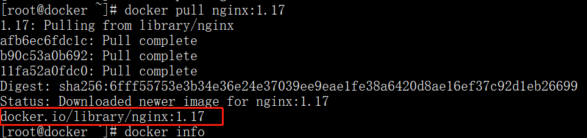

# 第02章：docker容器与镜像

## 一、Docker镜像

docker镜像是docker中三大概念之一，其主要作用是作为启动容器的模板。

### 1.1、获取镜像

镜像是运行容器的模板，官方Docker Hub 仓库已经提供了许多镜像共开发者使用。如果我们需要获取某个镜像则可以去docker仓库下载所需的镜像。
下载镜像的格式：docker pull [仓库的URL]/[名称空间]/[仓库的名称]:[版本号]
下载镜像实例:

```bash
$ docker pull nginx:1.17
```

下载的时候，我们可以看到有若干层组成，像afb6ec6fdc1c这样的字符串是层的唯一ID（实际上，完整的ID包括256比特， 64个十六进制字符组成）。使用docker pull 命令下载中会获取并输出镜像的各层信息。当不同的镜像包括相同的层的时候，本地仅存一份内容，减小存储空间。

注意：上面我们介绍了，下载格式是`[仓库的URL]/[名称空间]/[仓库的名称]:[版本号]`，但是我们下载的时候只有`[仓库的名称]:[版本号]`；

这是为什么呢？因为docker为我们提供了一个默认的 `仓库的URL` 和 `名称空间` ，具体如下：



- 仓库的URL：docker.io
- 名称空间：library

### 1.2.查看镜像信息

镜像主要包括镜像文件、镜像tag以及镜像详细信息等等。

#### 1.2.1、镜像列表

使用docker images 或 docker images ls命令可以列举本地主机上已有镜像的基本信息。

```bash
$ docker images
REPOSITORY   TAG       IMAGE ID       CREATED       SIZE
nginx        1.17      9beeba249f3e   2 years ago   127MB
```

列举信息中，可以看到几个字段信息：

- 镜像来源：来自哪个仓库，默认来自：hub.docker.com
- 镜像标签：比喻：1.17
- 镜像ID：例如：9beeba249f3e
- 镜像创建时间：例如：2 years ago
- 镜像大小：127MB

其中镜像的ID信息十分重要，它唯一标识了镜像。在使用镜像ID的时候，一般可以使用该ID的前若干个字符组成的可区分串来替代完整的ID。

TAG信息用于标记来自同一个仓库的不同镜像。TAG在同一个仓库中是唯一的。

镜像大小信息只是表示了该镜像的逻辑体积大小，实际上由于相同的镜像层本地只会存储一份，物理上占用的存储空间会小于各镜像逻辑体积之和。

image子命令主要支持如下选项：

- -a : 列出所有（包括临时文件）镜像文件
- --digests=true|false：列出镜像的数字摘要值
- -q : 仅显示ID信息

#### 1.2.2. 为镜像添加tag

为了方便后续工作中使用特定的镜像，还可以使用docker tag命令来为本地的镜像添加标签。

```bash
[root@docker ~]# docker images
REPOSITORY   TAG       IMAGE ID       CREATED       SIZE
nginx        1.17      9beeba249f3e   2 years ago   127MB
[root@docker ~]# docker images -a
REPOSITORY   TAG       IMAGE ID       CREATED       SIZE
nginx        1.17      9beeba249f3e   2 years ago   127MB
[root@docker ~]# docker tag nginx:1.17 mynginx:1.17-tag
[root@docker ~]# docker images -a
REPOSITORY   TAG        IMAGE ID       CREATED       SIZE
mynginx      1.17-tag   9beeba249f3e   2 years ago   127MB
nginx        1.17       9beeba249f3e   2 years ago   127MB
```

#### 1.2.3. 使用inspect命令查看详细信息

使用`docker inspect`命令获取镜像的详细信息，包括PID、作者、架构等等。

```bash
[root@docker ~]# docker inspect 9beeba249f3e
```

#### 1.2.4、使用history命令查看镜像历史

查看镜像的构建历史。

```bash
[root@docker ~]# docker history  9beeba249f3e
```

注意：有些构建信息过长，可以使用`--no-trunc`选项来输出完整信息。

#### 1.2.5. 搜索镜像

在docker中搜索镜像主要使用Search子命令，默认只搜索Docker Hub官方镜像仓库中的镜像。其语法为docker search [option] keyword。支持的命令选项主要包括：

- -f : 过滤输出内容

```bash
# 搜索官方提供的带有Redis关键字的镜像
$ docker search -f is-official=true  nginx
NAME      DESCRIPTION                STARS     OFFICIAL   AUTOMATED
nginx     Official build of Nginx.   17047     [OK] 

# 搜索被收藏超过8000个的并且关键词包括Redis的镜像
[root@docker ~]# docker search -f stars=8000  redis
NAME      DESCRIPTION                                     STARS     OFFICIAL   AUTOMATED
redis     Redis is an open source key-value store that…   11101     [OK]  
```

- NAME: 镜像仓库源的名称
- DESCRIPTION: 镜像的描述
- OFFICIAL: 是否 docker 官方发布
- stars: 类似 Github 里面的 star，表示点赞、喜欢的意思。
- AUTOMATED: 自动构建。

### 1.3 删除和清理镜像

在docker中，删除镜像主要使用rmi子命令，清理镜像主要使用prune子命令。

- 使用标签删除镜像

使用docker rmi 或docker image rm命令可以删除镜像，命令格式为docker rmi image

```bash
[root@docker ~]# docker rmi nginx

-f 参数强制删除镜像
```

### 1.4 清理镜像

使用一段时间之后，docker会产生很多临时文件，以及一些没有被使用的镜像， 我们可以通过docker image prune命令来进行清理。

- -a 删除所有无用的镜像，不光是临时镜像。

```bash
[root@docker ~]# docker image prune -a
```

- -f ：强制删除镜像，而不进行提示。

```bash
[root@docker ~]# docker image prune -a -f
```

### 1.5 构建镜像

构建镜像一般有三种情况，基于容器导入、基于本地模板导入、基于Dockerfile创建，本章主讲基于容器保存镜像和本地保存镜像导入。

- 基于容器保存

主要格式：docker [container id] commit 
主要参数：

| -a   | 作者信息             |
| ---- | -------------------- |
| -m   | 提交信息             |
| -p   | 提交时，暂停容器运行 |

启动一个容器、修改并保存

```bash
$ docker run -d nginx
$ docker ps
CONTAINER ID   IMAGE 
a27ec801ef65   nginx    
$ docker commit -a xiaoyang -m 'hello world' -p a27ec801ef65 test:v1
```

基于本地模板导入

用户也可以将保存的镜像传到另一台机器上，另一台机器就可以直接导入。

```bash
cat ubuntu-18.04-x86_64-minimal.tar.gz | docker import - ubuntu:18.04
```

#### 1.5.1. 保存镜像

有时我们需要将一台电脑上的镜像复制到另一台电脑上使用，除了可以借助仓库外，还可以直接将镜像保存成一个文件，再拷贝到另一台电脑上导入使用。

对于镜像的导出和导入，Docker 提供了两种方案，下面分别进行介绍。

##### 使用export保存容器为镜像

export 和 import的针对点是容器，将本机的容器导出为镜像包。

```bash
[root@instance-gvpb80ao docs]# docker export daf9c3656be3 > nginx.tar
[root@instance-gvpb80ao docs]# ll | grep nginx.tar
-rw-r--r-- 1 root root 135117824 9月  24 20:51 nginx.tar
```

##### 使用import导入包为镜像

```bash
[root@instance-gvpb80ao docs]# docker import nginx.tar test/nginx:v1
sha256:02107323de1b074c5d2034b01eff855fec5922b45776c2721882d100ba6dd15b
[root@instance-gvpb80ao docs]# docker images | grep test
test/nginx                                                        v1                         02107323de1b        22 seconds ago      131MB
```

##### 使用save保存镜像

```bash
[root@instance-gvpb80ao docs]# docker save 6858809bf669 > busybox.tar
[root@instance-gvpb80ao docs]# ll | grep busy
-rw-r--r-- 1 root root   1458176 9月  24 21:01 busybox.tar
```

##### 使用save保存多个镜像

```bash
[root@instance-gvpb80ao docs]# docker save -o test.tar busybox nginx:1.18.0
[root@instance-gvpb80ao docs]# docker load < test.tar
Loaded image: busybox:latest
Loaded image: nginx:1.18.0
```

##### 使用load导入镜像

```bash
[root@instance-gvpb80ao docs]# docker load < busybox.tar
[root@instance-gvpb80ao docs]# docker load -i busybox.tar
Loaded image ID: sha256:6858809bf669cc5da7cb6af83d0fae838284d12e1be0182f92f6bd96559873e3
[root@instance-gvpb80ao docs]# docker images | grep 685880
busybox                                                           latest                     6858809bf669        2 weeks ago         1.23MB
```

##### 两种方案的差别

- 文件大小不同：export导出的镜像文件体积小于 save 保存的镜像
- 是否可以对镜像重命名：docker import可以为镜像指定新名称，docker load不能对载入的镜像重命名。
- 是否可以同时将多个镜像打包到一个文件中：docker export不支持，docker save支持。
- 是否包含镜像历史：export 导出（import 导入）是根据容器拿到的镜像，再导入时会丢失镜像所有的历史记录和元数据信息（即仅保存容器当时的快照状态），所以无法进行回滚操作。

## 二、Docker容器

容器是镜像的运行时实例。正如从虚拟机模板上启动 VM 一样，用户也同样可以从单个镜像上启动一个或多个容器。

### 2.1. 创建容器

在Docker中，真正对外提供服务的还是容器，本小节咱们来创建一个容器。

创建容器的格式：docker  run  [option]  image  [cmd]

```bash
[root@alvin-test-os ~]# docker run -d --name nginx -p 80:80 nginx
Unable to find image 'nginx:latest' locally
latest: Pulling from library/nginx
852e50cd189d: Pull complete
a29b129f4109: Pull complete
b3ddf1fa5595: Pull complete
c5df295936d3: Pull complete
232bf38931fc: Pull complete
Digest: sha256:c3a1592d2b6d275bef4087573355827b200b00ffc2d9849890a4f3aa2128c4ae
Status: Downloaded newer image for nginx:latest
6381d29d6e0ec3f6b01cf1aabb58b799ee88acf1a722e251807c9cb44e73a3e0
```

#### 2.1.1. 容器启动参数

| -d        | 以守护进程方式运行       |
| --------- | ------------------------ |
| -p        | 指定映射端口             |
| -P        | 随机映射端口             |
| -i        | 保持标准输入打开         |
| -t        | 分配一个伪终端           |
| -v        | 设置挂载文件到主机上     |
| --rm      | 当容器关闭时自动删除     |
| --name    | 为启动的容器设置一个名字 |
| --network | 指定使用哪个网络         |
| -e        | 设置容器中的环境变量     |
| --link    | 链接到另一个容器         |
| -h        | 指定容器内的主机名       |

### 2.2. 停止容器

docker终止容器是首先向容器发送SIGTERM信号，等待一段时间超时后（默认10秒），再发送SIGKILL信号来终止容器。

```bash
$ docker stop nginx
```

可见，NGINX容器已经被我们终止了。这个时候我们也可以重新启动这个容器。

```bash
$ docker start nginx
```

### 2.3. 进入容器

在使用容器的过程中，我们难免需要进入容器进行排查问题。下面我们就来介绍进入容器的集中方式。

#### 2.3.1 attach

attach是最早docker官方推出的进入容器的命令了，不过使用该命令有一个问题。当多个窗口同时使用该命令进入该容器时，所有的窗口都会同步显示。如果有一个窗口阻塞了，那么其他窗口也无法再进行操作，当所有窗口退出时，容器结束。

```bash
[root@instance-gvpb80ao docs]# docker attach nginx
127.0.0.1 - "GET / HTTP/1.1" 308 171 "-" "curl/7.59.0" 0.000 - .
```

#### 2.3.2 exec

既attach之后，exec是官方推出的有一个新的进入容器的命令，这个命令相当于在容器中执行一个命令。

```bash
[root@instance-gvpb80ao docs]# docker exec -it nginx /bin/bash
nginx [ / ]$
nginx [ / ]$
```

#### 2.3.3 nsenter

需要配合docker inspect来使用（早期没有exec命令时，企业当中最长用的方式之一）,Docker是用golang语言开发，所以它也支持go语言的摸版语法。

```bash
[root@instance-gvpb80ao docs]# nsenter --target $( docker inspect -f {{.State.Pid}} nginxv1 ) --mount --uts --ipc --net --pid
mesg: ttyname failed: No such device
root@6f99ae8757f7:/#
```

### 2.4. 删除容器

可以使用 docker rm 命令来删除处于终止或退出状态的容器，命令格式为：docker  rm  container。

```bash
[root@alvin-test-os ~]# docker rm nginx
```

强制删除一个正在运行的容器。

```bash
[root@alvin-test-os ~]# docker rm  -f nginx
nginx
```

#### 2.4.1 导入与导出容器

某些时候，需要将容器从一个系统迁移到另外一个系统，此时可以使用 Docker 的导人和导出功能，这也是 Docker 自身提供的一个重要特性。

##### 导出容器

导出容器是指，导出一个已经创建的容器到一个文件，不管此时这个容器是否处于运行状态 可以使用 docker [container] export 令，该命令格式为：

```bash
[root@instance-gvpb80ao docs]# docker export daf9c3656be3 > nginx.tar
[root@instance-gvpb80ao docs]# ll | grep nginx.tar
```

##### 导入容器

导出的文件又可以使用 docker [ container] import 命令导人变成镜像，该命令格式为：

```bash
[root@instance-gvpb80ao docs]# docker import nginx.tar test/nginx:v1
sha256:02107323de1b074c5d2034b01eff855fec5922b45776c2721882d100ba6dd15b
[root@instance-gvpb80ao docs]# docker images | grep test
test/nginx                                                        v1                         02107323de1b        22 seconds ago      131MB
```

实际上，既可以使用 docker load 命令来导入镜像存储文件到本地镜像库，也可以使docker [container] import 命令来导入一个容器快照到本地镜像库 这两者的区别在于 容器快照文件将丢弃所有的历史记录和元数据信息（即仅保存容器当时的快照状态），而镜像存储文件将保存完整记录，体积更大 此外，从容器快照文件导人时可以重新指定标签等元数据信息。

### 2.5. 查看容器

查看容器详情可以使用 docker container inspect [OPTIONS] CONTAINER [CONTAINER . .. ］子命令。

```bash
[root@alvin-test-os ~]# docker inspect k8s
```

### 2.6. 容器命令详解

#### 1. 复制命令

复制命令类似于Linux系统中的scp命令，是将宿主主机上的内容上传到容器中，也可能是将容器中的文件下载到宿主主机中。

```bash
# 将容器中的内容复制到宿主主机
[root@alvin-test-os ~]# docker cp 726b695a337c:/opt/start .
[root@alvin-test-os ~]# ls | grep start
Start

#将宿主主机中的文件复制到容器中
[root@alvin-test-os ~]# docker cp start  726b695a337c:/root
[root@alvin-test-os ~]# docker exec 726b695a337c ls /root
start
```

