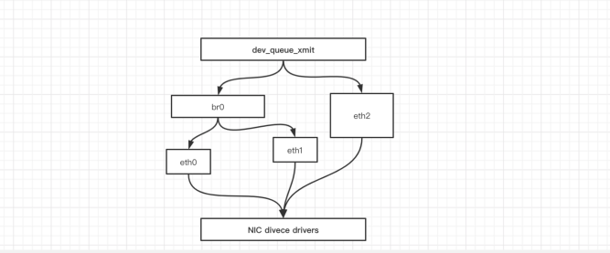
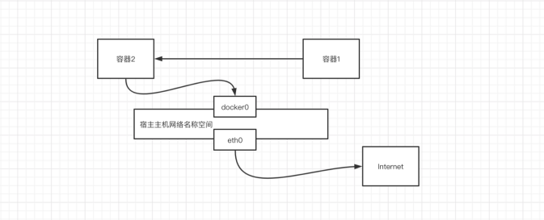
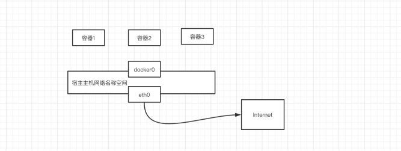
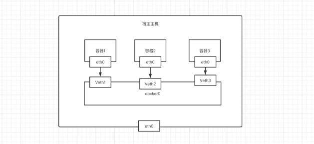

# 第03章：docker网络

Docker本身的技术依赖于Linux内核虚拟化技术的发展。所以Docker对Linux内核的特性有很强的依赖。本章主要介绍Docker所使用的Linux网络技术。

## 一、网络基础

其中Docker使用到的与Linux网络有关的技术分别有：网络名称空间、Veth、Iptables、网桥、路由。

### 1.1 网络名称空间

为了支持网络协议栈的多个实例，Linux在网络协议栈中引入了网络名称空间(Network Namespace)，这些独立的协议栈被隔离到不同的命名空间中。处于不同的命名空间的网络协议栈是完全隔离的，彼此之间无法进行网络通信，就好像两个“平行宇宙”。通过这种对网络资源的隔离，就能在一个宿主机上虚拟多个不同的网络环境，而Docker正是利用这种网络名称空间的特性，实现了不同容器之间的网络隔离。在Linux的网络命名空间内可以有自己独立的Iptables来转发、NAT及IP包过滤等功能。

Linux的网络协议栈是十分复杂的，为了支持独立的协议栈，相关的这些全局变量都必须修改为协议栈私有。最好的办法就是让这些全局变量成为一个Net Namespace变量的成员，然后为了协议栈的函数调用加入一个Namespace参数。这就是Linux网络名称空间的核心。所以的网络设备都只能属于一个网络名称空间。当然，通常的物理网络设备只能关联到root这个命名空间中。虚拟网络设备则可以被创建并关联到一个给定的命名空间中，而且可以在这些名称空间之间移动。

 

### 1.2 创建一个命名空间

```bash
[root@alvin-test-os ~]# ip netns add test01
[root@alvin-test-os ~]# ip netns add test02
[root@alvin-test-os ~]# ip netns list
test02
test01
```

### 1.3 Veth设备

引入Veth设备对是为了在不同的网络名称空间之间进行通信，利用它可以直接将两个网络名称空间链接起来。由于要连接的两个网络命名空间，所以Veth设备是成对出现的，很像一对以太网卡，并且中间有一根直连的网线。既然是一对网卡，那么我们将其中一端称为另一端的peer。在Veth设备的一端发送数据时，它会将数据直接发送到另一端，并触发另一端的接收操作。


### 1.4 Veth设备操作

#### 1.4.1 创建Veth设备对

```bash
[root@alvin-test-os ~]# ip link add veth type veth peer name veth001
[root@alvin-test-os ~]# ip link show
1: lo: <LOOPBACK,UP,LOWER_UP> mtu 65536 qdisc noqueue state UNKNOWN mode DEFAULT group default qlen 1000
    link/loopback 00:00:00:00:00:00 brd 00:00:00:00:00:00
2: eth0: <BROADCAST,MULTICAST,UP,LOWER_UP> mtu 1500 qdisc mq state UP mode DEFAULT group default qlen 1000
    link/ether 00:0c:29:e2:5b:2d brd ff:ff:ff:ff:ff:ff
3: docker0: <BROADCAST,MULTICAST,UP,LOWER_UP> mtu 1500 qdisc noqueue state UP mode DEFAULT group default
    link/ether 02:42:ad:75:28:7e brd ff:ff:ff:ff:ff:ff
7: veth4cb1ab3@if6: <BROADCAST,MULTICAST,UP,LOWER_UP> mtu 1500 qdisc noqueue master docker0 state UP mode DEFAULT group default
    link/ether ce:90:13:71:7f:8f brd ff:ff:ff:ff:ff:ff link-netnsid 0
9: vethbbf7148@if8: <BROADCAST,MULTICAST,UP,LOWER_UP> mtu 1500 qdisc noqueue master docker0 state UP mode DEFAULT group default
    link/ether 7e:6c:9f:d5:5b:26 brd ff:ff:ff:ff:ff:ff link-netnsid 1
14: veth001@veth: <BROADCAST,MULTICAST,M-DOWN> mtu 1500 qdisc noop state DOWN mode DEFAULT group default qlen 1000
    link/ether 96:f1:a2:1d:1d:10 brd ff:ff:ff:ff:ff:ff
15: veth@veth001: <BROADCAST,MULTICAST,M-DOWN> mtu 1500 qdisc noop state DOWN mode DEFAULT group default qlen 1000
    link/ether 66:af:ad:f0:5f:6d brd ff:ff:ff:ff:ff:ff
```

生成了两个veth设备， 互为对方的peer。

#### 1.4.2 绑定命名空间

```bash
[root@alvin-test-os ~]# ip link set veth001 netns test01
[root@alvin-test-os ~]# ip link show | grep veth
7: veth4cb1ab3@if6: <BROADCAST,MULTICAST,UP,LOWER_UP> mtu 1500 qdisc noqueue master docker0 state UP mode DEFAULT group default
9: vethbbf7148@if8: <BROADCAST,MULTICAST,UP,LOWER_UP> mtu 1500 qdisc noqueue master docker0 state UP mode DEFAULT group default
15: veth@if14: <BROADCAST,MULTICAST> mtu 1500 qdisc noop state DOWN mode DEFAULT group default qlen 1000
```

已经查看不到veth001，当我们进入test01命名空间之后，就可以查看到

```bash
[root@alvin-test-os ~]# ip netns exec test01 bash
[root@alvin-test-os ~]# ip link show
1: lo: <LOOPBACK> mtu 65536 qdisc noop state DOWN mode DEFAULT group default qlen 1000
    link/loopback 00:00:00:00:00:00 brd 00:00:00:00:00:00
14: veth001@if15: <BROADCAST,MULTICAST> mtu 1500 qdisc noop state DOWN mode DEFAULT group default qlen 1000
    link/ether 96:f1:a2:1d:1d:10 brd ff:ff:ff:ff:ff:ff link-netnsid 0
```

#### 1.4.3 将Veth分配IP

```bash
# 设置IP
[root@alvin-test-os ~]# ip netns exec test01 ip addr add 172.16.0.111/20 dev veth001
# 绑定
[root@alvin-test-os ~]# ip netns exec test01 ip link set dev veth001 up
# 查看
[root@alvin-test-os ~]# ip netns exec test01 ip a
1: lo: <LOOPBACK> mtu 65536 qdisc noop state DOWN group default qlen 1000
    link/loopback 00:00:00:00:00:00 brd 00:00:00:00:00:00
14: veth001@if15: <NO-CARRIER,BROADCAST,MULTICAST,UP> mtu 1500 qdisc noqueue state LOWERLAYERDOWN group default qlen 1000
    link/ether 96:f1:a2:1d:1d:10 brd ff:ff:ff:ff:ff:ff link-netnsid 0
    inet 172.16.0.111/20 scope global veth001
       valid_lft forever preferred_lft forever
```

这个时候双方就通了。

#### 1.4.4 查看对端Veth设备

```bash
[root@alvin-test-os ~]# ip netns exec test01 ethtool -S veth001
NIC statistics:
     peer_ifindex: 15
[root@alvin-test-os ~]# ip a | grep 15
14: veth001@if15: <NO-CARRIER,BROADCAST,MULTICAST,UP> mtu 1500 qdisc noqueue state LOWERLAYERDOWN group default qlen 1000
```

#### 1.4.5 为对端Veth设备设置IP

```bash
[root@alvin-test-os ~]# ip addr add 172.16.0.112/20 dev veth
[root@alvin-test-os ~]# ip link set dev veth down
[root@alvin-test-os ~]# ip link set dev veth up
[root@alvin-test-os ~]# ping 172.16.0.111
PING 172.16.0.111 (172.16.0.111) 56(84) bytes of data.
64 bytes from 172.16.0.111: icmp_seq=1 ttl=64 time=0.126 ms
64 bytes from 172.16.0.111: icmp_seq=2 ttl=64 time=0.081 ms
^C
--- 172.16.0.111 ping statistics ---
2 packets transmitted, 2 received, 0% packet loss, time 999ms
rtt min/avg/max/mdev = 0.081/0.103/0.126/0.024 ms
```

### 1.5 网桥

Linux 可以支持多个不同的网络，它们之间能够相互通信，就需要一个网桥。 网桥是二层的虚拟网络设备，它是把若干个网络接口“连接”起来，从而报文能够互相转发。网桥能够解析收发的报文，读取目标 MAC 地址的信息，和自己记录的 MAC 表结合，来决定报文的转发目标网口。

网桥设备 brO 绑定了 eth0、 eth1 。对于网络协议械的上层来说，只看得到 brO 。因为桥接是在数据链路层实现的 ，上层不需要关心桥接的细节，于是协议枝上层需要发送的报文被送到 brO ，网桥设备的处理代码判断报文该被转发到 eth0 还是 ethl ，或者两者皆转发。反过来，从 ethO 或从 ethl 接收到的报文被提交给网桥的处理代码，在这里会判断报文应该被转发、丢弃还是提交到协议枝上层。 而有时 ethl 也可能会作为报文的源地址或目的地址 直接参与报文的发送与接收，从而绕过网桥。



### 1.6 Iptables

我们知道， Linux 络协议樵非常高效，同时比较复杂 如果我们希望在数据的处理过程中对关心的数据进行一些操作该怎么做呢？ Linux 提供了一套机制来为用户实现自定义的数据包处理过程。

在Linux网络协议棋中有一组回调函数挂接点，通过这些挂接点挂接的钩子函数可以在Linux 网络棋处理数据包的过程中对数据包进行 些操作，例如过滤、修改、丢弃等 整个挂接点技术叫作 Netfilter lptables

Netfilter 负责在内核中执行各种挂接的规则，运行在内核模式中：而 lptables 是在用户模式下运行的进程，负责协助维护内核中 Netfilter 的各种规则表 通过 者的配合来实现整个 Linux网络协议战中灵活的数据包处理机制。

### 1.7 总结

| 设备               | 作用总结                                                     |
| ------------------ | ------------------------------------------------------------ |
| network  namespace | 主要提供了关于网络资源的隔离，包括网络设备、IPv4和IPv6协议栈、IP路由表、防火墙、/proc/net目录、/sys/class/net目录、端口（socket）等。 |
| linux Bridge       | 功能相当于物理交换机，为连在其上的设备（容器）转发数据帧。如docker0网桥。 |
| iptables           | 主要为容器提供NAT以及容器网络安全。                          |
| veth pair          | 两个虚拟网卡组成的数据通道。在Docker中，用于连接Docker容器和Linux Bridge。一端在容器中作为eth0网卡，另一端在Linux Bridge中作为网桥的一个端口。 |

## 二、Docker网络模式

Docker使用Linux桥接的方式，在宿主机虚拟一个Docker容器网桥(docker0)，Docker启动一个容器时会根据Docker网桥的网段分配给容器一个IP地址，称为Container-IP，同时Docker网桥是每个容器的默认网关。因为在同一宿主机内的容器都接入同一个网桥，这样容器之间就能够通过容器的Container-IP直接通信。

Docker网桥是宿主机虚拟出来的，并不是真实存在的网络设备，外部网络是无法寻址到的，这也意味着外部网络无法通过直接Container-IP访问到容器。如果容器希望外部访问能够访问到，可以通过映射容器端口到宿主主机（端口映射），即docker run创建容器时候通过 -p 或 -P 参数来启用，访问容器的时候就通过[宿主机IP]:[容器端口]访问容器。

| Docker网络模型 | 配置                   | 说明                                                         |
| -------------- | ---------------------- | ------------------------------------------------------------ |
| host模式       | –-network=host         | 容器和宿主机共享Network namespace。                          |
| containe模式   | --network=container:ID | 容器和另外一个容器共享Network namespace。 kubernetes中的pod就是多个容器共享一个Network namespace。 |
| none模式       | --network=none         | 容器有独立的Network namespace，但并没有对其进行任何网络设置，如分配veth pair 和网桥连接，配置IP等。 |
| bridge模式     | --network=bridge       | 当Docker进程启动时，会在主机上创建一个名为docker0的虚拟网桥，此主机上启动的Docker容器会连接到这个虚拟网桥上。虚拟网桥的工作方式和物理交换机类似，这样主机上的所有容器就通过交换机连在了一个二层网络中。（默认为该模式） |

### 2.1 HOST模式

如果启动容器的时候使用host模式，那么这个容器将不会获得一个独立的Network Namespace，而是和宿主机共用一个Network Namespace。容器将不会虚拟出自己的网卡，配置自己的IP等，而是使用宿主机的IP和端口。但是，容器的其他方面，如文件系统、进程列表等还是和宿主机隔离的。

使用host模式的容器可以直接使用宿主机的IP地址与外界通信，容器内部的服务端口也可以使用宿主机的端口，不需要进行NAT，host最大的优势就是网络性能比较好，但是docker host上已经使用的端口就不能再用了，网络的隔离性不好。


```bash
[root@instance-gvpb80ao ~]# docker run -d --name my-web --network host  nginx
Unable to find image 'nginx:latest' locally
latest: Pulling from library/nginx
d121f8d1c412: Pull complete
ebd81fc8c071: Pull complete
655316c160af: Pull complete
d15953c0e0f8: Pull complete
2ee525c5c3cc: Pull complete
Digest: sha256:c628b67d21744fce822d22fdcc0389f6bd763daac23a6b77147d0712ea7102d0
Status: Downloaded newer image for nginx:latest
06941559a3f7e0c53cf228302dedc2040c10f2eb0b6e3d0f962c065b0e0419ce
[root@instance-gvpb80ao ~]# docker ps
CONTAINER ID        IMAGE               COMMAND                  CREATED             STATUS              PORTS               NAMES
06941559a3f7        nginx               "/docker-entrypoint.…"   6 minutes ago       Up 6 minutes                            my-web
[root@instance-gvpb80ao ~]# curl 127.0.0.1:80
<!DOCTYPE html>
<html>
<head>
<title>Welcome to nginx!</title>
<style>
    body {
        width: 35em;
        margin: 0 auto;
        font-family: Tahoma, Verdana, Arial, sans-serif;
    }
</style>
</head>
<body>
<h1>Welcome to nginx!</h1>
<p>If you see this page, the nginx web server is successfully installed and
working. Further configuration is required.</p>

<p>For online documentation and support please refer to
<a href="http://nginx.org/">nginx.org</a>.<br/>
Commercial support is available at
<a href="http://nginx.com/">nginx.com</a>.</p>

<p><em>Thank you for using nginx.</em></p>
</body>
</html>
```

### 2.2 Containe模式

这个模式指定新创建的容器和已经存在的一个容器共享一个 Network Namespace，而不是和宿主机共享。新创建的容器不会创建自己的网卡，配置自己的 IP，而是和一个指定的容器共享 IP、端口范围等。同样，两个容器除了网络方面，其他的如文件系统、进程列表等还是隔离的。两个容器的进程可以通过 lo 网卡设备通信。



```bash
[root@instance-gvpb80ao ~]# docker run  -itd --name test01 busybox
Unable to find image 'busybox:latest' locally
latest: Pulling from library/busybox
df8698476c65: Pull complete
Digest: sha256:d366a4665ab44f0648d7a00ae3fae139d55e32f9712c67accd604bb55df9d05a
Status: Downloaded newer image for busybox:latest
dd99687d303d61d649364084ad353ec38b4e07149b0328301ec9691f18669951
[root@instance-gvpb80ao ~]# docker run  -itd --name test02  --network "container:test01" busybox
72adb0dcdb93b6adc7a62e1ad1ac274f64b8cec941d5f89da43fcd0757f99fa3
[root@instance-gvpb80ao ~]# docker exec -it test02 sh
/ # ifconfig
eth0      Link encap:Ethernet  HWaddr 02:42:AC:11:00:02
          inet addr:172.17.0.2  Bcast:172.17.255.255  Mask:255.255.0.0
          UP BROADCAST RUNNING MULTICAST  MTU:1500  Metric:1
          RX packets:28 errors:0 dropped:0 overruns:0 frame:0
          TX packets:0 errors:0 dropped:0 overruns:0 carrier:0
          collisions:0 txqueuelen:0
          RX bytes:2423 (2.3 KiB)  TX bytes:0 (0.0 B)

lo        Link encap:Local Loopback
          inet addr:127.0.0.1  Mask:255.0.0.0
          UP LOOPBACK RUNNING  MTU:65536  Metric:1
          RX packets:0 errors:0 dropped:0 overruns:0 frame:0
          TX packets:0 errors:0 dropped:0 overruns:0 carrier:0
          collisions:0 txqueuelen:1000
          RX bytes:0 (0.0 B)  TX bytes:0 (0.0 B)

/ # exit
[root@instance-gvpb80ao ~]# docker exec -it test01 sh
/ # ifconfig
eth0      Link encap:Ethernet  HWaddr 02:42:AC:11:00:02
          inet addr:172.17.0.2  Bcast:172.17.255.255  Mask:255.255.0.0
          UP BROADCAST RUNNING MULTICAST  MTU:1500  Metric:1
          RX packets:29 errors:0 dropped:0 overruns:0 frame:0
          TX packets:0 errors:0 dropped:0 overruns:0 carrier:0
          collisions:0 txqueuelen:0
          RX bytes:2493 (2.4 KiB)  TX bytes:0 (0.0 B)

lo        Link encap:Local Loopback
          inet addr:127.0.0.1  Mask:255.0.0.0
          UP LOOPBACK RUNNING  MTU:65536  Metric:1
          RX packets:0 errors:0 dropped:0 overruns:0 frame:0
          TX packets:0 errors:0 dropped:0 overruns:0 carrier:0
          collisions:0 txqueuelen:1000
          RX bytes:0 (0.0 B)  TX bytes:0 (0.0 B)

/ #
```

### 2.3 none模式

使用none模式，Docker容器拥有自己的Network Namespace，但是，并不为Docker容器进行任何网络配置。也就是说，这个Docker容器没有网卡、IP、路由等信息。需要我们自己为Docker容器添加网卡、配置IP等。

这种网络模式下容器只有lo回环网络，没有其他网卡。none模式可以在容器创建时通过`--network=none`来指定。这种类型的网络没有办法联网，封闭的网络能很好的保证容器的安全性。



```bash
[root@instance-gvpb80ao ~]# docker run  -itd --name test03  --network none busybox
b9dde79754bc110314be4aecde1251dcdd6ce28fdf43102ae184b79c6e7414bc
[root@instance-gvpb80ao ~]# docker exec -it test03 sh
/ # ifconfig
lo        Link encap:Local Loopback
          inet addr:127.0.0.1  Mask:255.0.0.0
          UP LOOPBACK RUNNING  MTU:65536  Metric:1
          RX packets:0 errors:0 dropped:0 overruns:0 frame:0
          TX packets:0 errors:0 dropped:0 overruns:0 carrier:0
          collisions:0 txqueuelen:1000
          RX bytes:0 (0.0 B)  TX bytes:0 (0.0 B)
```

### 2.4 bridge模式

当Docker进程启动时，会在主机上创建一个名为docker0的虚拟网桥，此主机上启动的Docker容器会连接到这个虚拟网桥上。虚拟网桥的工作方式和物理交换机类似，这样主机上的所有容器就通过交换机连在了一个二层网络中。

从docker0子网中分配一个IP给容器使用，并设置docker0的IP地址为容器的默认网关。在主机上创建一对虚拟网卡veth pair设备，Docker将veth pair设备的一端放在新创建的容器中，并命名为eth0（容器的网卡），另一端放在主机中，以vethxxx这样类似的名字命名，并将这个网络设备加入到docker0网桥中。可以通过brctl show命令查看。

bridge模式是docker的默认网络模式，不写--net参数，就是bridge模式。使用docker run -p时，docker实际是在iptables做了DNAT规则，实现端口转发功能。可以使用`iptables -t nat -vnL`查看。



```bash
[root@instance-gvpb80ao ~]# docker run -itd --name test04 busybox
dd17d863b2957a29df44b2552365eb0cfc01552fd4ec6b8b63e28dfd0d61472e
[root@instance-gvpb80ao ~]# ip a
1: lo: <LOOPBACK,UP,LOWER_UP> mtu 65536 qdisc noqueue state UNKNOWN group default qlen 1000
    link/loopback 00:00:00:00:00:00 brd 00:00:00:00:00:00
    inet 127.0.0.1/8 scope host lo
       valid_lft forever preferred_lft forever
    inet6 ::1/128 scope host
       valid_lft forever preferred_lft forever
2: eth0: <BROADCAST,MULTICAST,UP,LOWER_UP> mtu 1500 qdisc mq state UP group default qlen 1000
    link/ether fa:16:3e:4a:9c:c7 brd ff:ff:ff:ff:ff:ff
    inet 172.16.0.4/20 brd 172.16.15.255 scope global noprefixroute eth0
       valid_lft forever preferred_lft forever
    inet6 fe80::f816:3eff:fe4a:9cc7/64 scope link noprefixroute
       valid_lft forever preferred_lft forever
3: docker0: <BROADCAST,MULTICAST,UP,LOWER_UP> mtu 1500 qdisc noqueue state UP group default
    link/ether 02:42:ab:42:6a:8a brd ff:ff:ff:ff:ff:ff
    inet 172.17.0.1/16 brd 172.17.255.255 scope global docker0
       valid_lft forever preferred_lft forever
    inet6 fe80::42:abff:fe42:6a8a/64 scope link
       valid_lft forever preferred_lft forever
5: veth870d996@if4: <BROADCAST,MULTICAST,UP,LOWER_UP> mtu 1500 qdisc noqueue master docker0 state UP group default
    link/ether ae:36:24:dc:11:6d brd ff:ff:ff:ff:ff:ff link-netnsid 0
    inet6 fe80::ac36:24ff:fedc:116d/64 scope link
       valid_lft forever preferred_lft forever
7: veth6acb18a@if6: <BROADCAST,MULTICAST,UP,LOWER_UP> mtu 1500 qdisc noqueue master docker0 state UP group default
    link/ether 4e:03:b1:5e:40:91 brd ff:ff:ff:ff:ff:ff link-netnsid 1
    inet6 fe80::4c03:b1ff:fe5e:4091/64 scope link
       valid_lft forever preferred_lft forever
[root@instance-gvpb80ao ~]# docker exec -it test04 bash
/ # ping 172.16.0.4
PING 172.16.0.4 (172.16.0.4): 56 data bytes
64 bytes from 172.16.0.4: seq=0 ttl=64 time=0.113 ms
64 bytes from 172.16.0.4: seq=1 ttl=64 time=0.101 ms
^C
--- 172.16.0.4 ping statistics ---
2 packets transmitted, 2 packets received, 0% packet loss
round-trip min/avg/max = 0.101/0.107/0.113 ms
```


