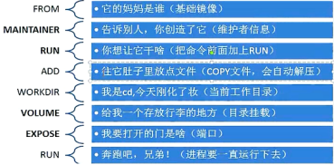

# 第04章：dockerfile

Dockerfile 由一行行命令语句组成， 并且支持以＃开头的注释行。一般而言， Dockerfile 主体内容分为四部分：基础镜像信息、 维护者信息、 镜像操作指令和容器启动时执行指令。

Docker以从上到下的顺序运行Dockerfile的指令。为了指定基本映像，第一条指令必须是FROM。一个声明以＃字符开头则被视为注释。可以在Docker文件中使用RUN，CMD，FROM，EXPOSE，ENV等指令。



## FROM：指定基础镜像，必须为第一个命令

```bash
格式：
　　FROM <image>
　　FROM <image>:<tag>
　　FROM <image>@<digest>
示例：　　FROM mysql:5.6
注：　　tag或digest是可选的，如果不使用这两个值时，会使用latest版本的基础镜像
```

## MAINTAINER: 维护者信息

```bash
格式：
    MAINTAINER <name>
示例：
    MAINTAINER xx Xu
    MAINTAINER xxx@163.com
    MAINTAINER xx Xu <xxx@163.com>
```

## RUN：构建镜像时执行的命令

```bash
RUN用于在镜像容器中执行命令，其有以下两种命令执行方式：
shell执行
格式：
    RUN <command>
exec执行
格式：
    RUN ["executable", "param1", "param2"]
示例：
    RUN ["executable", "param1", "param2"]
    RUN apk update
    RUN ["/etc/execfile", "arg1", "arg1"]
注：　　RUN指令创建的中间镜像会被缓存，并会在下次构建中使用。如果不想使用这些缓存镜像，可以在构建时指定--no-cache参数，如：docker build --no-cache
```

## ADD：将本地文件添加到镜像中

tar类型文件会自动解压(网络压缩资源不会被解压)

```bash
格式：
    ADD <src>... <dest>
    ADD ["<src>",... "<dest>"] 用于支持包含空格的路径
示例：
    ADD hom* /mydir/          # 添加所有以"hom"开头的文件
    ADD hom?.txt /mydir/      # ? 替代一个单字符,例如："home.txt"
    ADD test relativeDir/     # 添加 "test" 到 `WORKDIR`/relativeDir/
    ADD test /absoluteDir/    # 添加 "test" 到 /absoluteDir/
```

## COPY：将本地文件复制到镜像中

```bash
指令：COPY
功能描述：复制文件到镜像中
语法：COPY < src>… < dest>|[“< src>”,… “< dest>”]
提示：指令逻辑和ADD十分相似，同样Docker Daemon会从编译目录寻找文件或目录，dest为镜像中的绝对路径或者相对于WORKDIR的路径
```

## CMD：构建容器后调用，也就是在容器启动时才进行调用

```bash
格式：
    CMD ["executable","param1","param2"] (执行可执行文件，优先)
    CMD ["param1","param2"] (设置了ENTRYPOINT，则直接调用ENTRYPOINT添加参数)
    CMD command param1 param2 (执行shell内部命令)
示例：
    CMD echo "This is a test." | wc -
    CMD ["/usr/bin/wc","--help"]注： 　　CMD不同于RUN，CMD用于指定在容器启动时所要执行的命令，而RUN用于指定镜像构建时所要执行的命令。
```

## LABEL：用于为镜像添加元数据

```bash
格式：
    LABEL <key>=<value> <key>=<value> <key>=<value> ...
示例：
　　LABEL version="1.0" description="这是一个Web服务器" by="IT笔录"
注：
　　使用LABEL指定元数据时，一条LABEL指定可以指定一或多条元数据，指定多条元数据时不同元数据之间通过空格分隔。推荐将所有的元数据通过一条LABEL指令指定，以免生成过多的中间镜像。
```

## ENV：设置环境变量

```bash
格式：
    ENV <key> <value>  #<key>之后的所有内容均会被视为其<value>的组成部分，因此，一次只能设置一个变量
    ENV <key>=<value> ...  #可以设置多个变量，每个变量为一个"<key>=<value>"的键值对，如果<key>中包含空格，可以使用\来进行转义，也可以通过""来进行标示；另外，反斜线也可以用于续行
示例：
    ENV myName John Doe
    ENV myDog Rex The Dog
    ENV myCat=xxxxx
```

## EXPOSE：指定于外界交互的端口

```bash
格式：
    EXPOSE <port> [<port>...]
示例：
    EXPOSE 80 443
    EXPOSE 8080    
    EXPOSE 11211/tcp 11211/udp
注：　　
        EXPOSE并不会让容器的端口访问到主机。要使其可访问，需要在docker run运行容器时通过-p来发布这些端口，或通过-P参数来发布EXPOSE导出的所有端口
```

## VOLUME：用于指定持久化目录

```bash
格式：
    VOLUME ["/path/to/dir"]
示例：
    VOLUME ["/data"]
    VOLUME ["/var/www", "/var/log/apache2", "/etc/apache2"]

注：　　一个卷可以存在于一个或多个容器的指定目录，该目录可以绕过联合文件系统，并具有以下功能：

1 卷可以容器间共享和重用
2 容器并不一定要和其它容器共享卷
3 修改卷后会立即生效
4 对卷的修改不会对镜像产生影响
5 卷会一直存在，直到没有任何容器在使用它
```

## WORKDIR：工作目录，类似于cd命令

```bash
格式：
    WORKDIR /path/to/workdir
示例：
    WORKDIR /a  (这时工作目录为/a)
    WORKDIR b  (这时工作目录为/a/b)
    WORKDIR c  (这时工作目录为/a/b/c)
注：　　
        通过WORKDIR设置工作目录后，Dockerfile中其后的命令RUN、CMD、ENTRYPOINT、ADD、COPY等命令都会在该目录下执行。在使用docker run运行容器时，可以通过-w参数覆盖构建时所设置的工作目录。
```

## ARG：用于指定传递给构建运行时的变量

```bash
格式：
    ARG <name>[=<default value>]
示例：
    ARG site
    ARG build_user=www
```

## ONBUILD：用于设置镜像触发器

```bash
格式：　　ONBUILD [INSTRUCTION]
示例：
　　ONBUILD ADD . /app/src
　　ONBUILD RUN /usr/local/bin/python-build --dir /app/src
注：当所构建的镜像被用做其它镜像的基础镜像，该镜像中的触发器将会被钥触发
```

## Dockerfile构建镜像案例

```dockerfile
FROM centos7

MAINTAINER Alvin alvincy@qq.com

RUN mv /etc/yum.repos.d/CentOS-Base.repo /etc/yum.repos.d/CentOS-Base.repo.backup

RUN curl -o /etc/yum.repos.d/CentOS-Base.repo http://mirrors.aliyun.com/repo/Centos-7.repo

RUN yum makecache

RUN yum update -y

RUN yum install python3 -y

RUN pip3 install django

COPY docker /root/docker

WORKDIR /root/docker

EXPOSE 8080

CMD ["python3", "manage.py", "runserver", "0.0.0.0:8080"]
```


