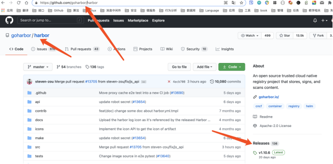
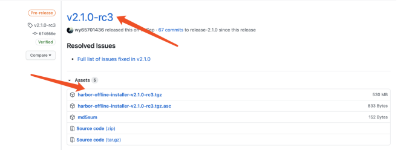
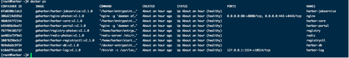
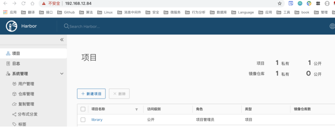

# 第05章：Harbor私有仓库

Harbor 是由 VMware 公司中国团队为企业用户设计的 Registry server 开源项目，包括了权限管理(RBAC)、LDAP、审计、管理界面、自我注册、HA 等企业必需的功能，同时针对中国用户的特点，设计镜像复制和中文支持等功能。作为一个企业级私有 Registry 服务器，Harbor 提供了更好的性能和安全。提升用户使用 Registry 构建和运行环境传输镜像的效率。Harbor 支持安装在多个 Registry 节点的镜像资源复制，镜像全部保存在私有 Registry 中， 确保数据和知识产权在公司内部网络中管控。另外，Harbor 也提供了高级的安全特性，诸如用户管理，访问控制和活动审计等。

## 一、配置HTTPS

默认情况下，Harbor不附带证书。可以在没有安全性的情况下部署Harbor，以便您可以通过HTTP连接到它。但是，只有在没有连接到外部Internet的空白测试或开发环境中，才可以使用HTTP。在没有空隙的环境中使用HTTP会使您遭受中间人攻击。要配置HTTPS，必须创建SSL证书。您可以使用由受信任的第三方CA签名的证书，也可以使用自签名证书。本节介绍如何使用 OpenSSL创建CA，以及如何使用CA签署服务器证书和客户端证书。

### 1.1 生成证书颁发机构证书

在生产环境中，您应该从CA获得证书。在测试或开发环境中，您可以生成自己的CA。要生成CA证书，请运行以下命令。

### 1.2 生成CA证书私钥

```bash
mkdir /opt/cert
cd /opt/cert

openssl genrsa -out ca.key 4096
```

### 1.3 生成CA证书

```bash
openssl req -x509 -new -nodes -sha512 -days 3650 \
 -subj "/C=CN/ST=ShangHai/L=ShangHai/O=Oldboy/OU=Linux/CN=192.168.12.84" \
 -key ca.key \
 -out ca.crt
```

### 1.4 生成服务器证书

```bash
openssl genrsa -out 192.168.12.84.key 4096
```

### 1.5 生成证书签名请求

```bash
openssl req -sha512 -new \
    -subj "/C=CN/ST=ShangHai/L=ShangHai/O=Oldboy/OU=Linux/CN=192.168.12.84" \
    -key 192.168.12.84.key \
    -out 192.168.12.84.csr
```

### 1.6 生成一个x509 v3扩展文件

- 域名版

```bash
cat > v3.ext <<-EOF
authorityKeyIdentifier=keyid,issuer
basicConstraints=CA:FALSE
keyUsage = digitalSignature, nonRepudiation, keyEncipherment, dataEncipherment
extendedKeyUsage = serverAuth
subjectAltName = @alt_names

[alt_names]
DNS.1=yourdomain.com
DNS.2=yourdomain
DNS.3=hostname
EOF
```

- IP版

```bash
cat > v3.ext <<-EOF
authorityKeyIdentifier=keyid,issuer
basicConstraints=CA:FALSE
keyUsage = digitalSignature, nonRepudiation, keyEncipherment, dataEncipherment
extendedKeyUsage = serverAuth
subjectAltName = IP:192.168.12.84
EOF
```

### 1.7 使用该v3.ext文件生成证书

```bash
openssl x509 -req -sha512 -days 3650 \
    -extfile v3.ext \
    -CA ca.crt -CAkey ca.key -CAcreateserial \
    -in 192.168.12.84.csr \
    -out 192.168.12.84.crt
```

### 1.8 提供证书给Harbor和Docker

生成后ca.crt，192.168.12.84.crt和192.168.12.84.key文件，必须将它们提供给港口和码头工人，和重新配置港使用它们。

#### 1.8.1 将服务器证书和密钥复制到Harbor主机上的certficates文件夹中

```bash
openssl x509 -inform PEM -in 192.168.12.84.crt -out 192.168.12.84.cert

mkdir -pv /etc/docker/certs.d/192.168.12.84/

cp 192.168.12.84.cert /etc/docker/certs.d/192.168.12.84/
cp 192.168.12.84.key /etc/docker/certs.d/192.168.12.84/
cp ca.crt /etc/docker/certs.d/192.168.12.84/

# 如果nginx端口默认部署443和80
/etc/docker/certs.d/192.168.12.84:port
/etc/docker/certs.d/192.168.12.84:port


# 复制Harbor证书
mkdir -p /data/cert && cd /data/cert
cp 192.168.12.84.crt  /data/cert
cp 192.168.12.84.key /data/cert
```

#### 1.8.2 docker加载证书

```bash
systemctl restart docker

# 登录测试
docker login --username admin 192.168.12.84
```

## 二、安装

### 1.2 下载Harbor

链接：https://github.com/goharbor/harbor





```bash
# 进入下载目录
cd /opt

# 下载
wget https://github.com/goharbor/harbor/releases/download/v2.1.0-rc2/harbor-offline-installer-v2.1.0-rc2.tgz

# 解压
tar xf harbor-offline-installer-v2.1.0-rc2.tgz

# 进入harbor目录
cd harbor/

# 下载docker-composrt
curl -L "https://github.com/docker/compose/releases/download/1.24.1/docker-compose-$(uname -s)-$(uname -m)" -o /usr/local/bin/docker-compose

# 设置可执行权限
chmod +x /usr/local/bin/docker-compose 

# 测试docker-composer
docker-compose -v

# 修改harbor.yaml以下三处
hostname: 192.168.12.84
certificate: /data/cert/192.168.12.84.crt 
private_key: /data/cert/192.168.12.84.key

# 生成配置文件
./prepare 

# 清空相关容器
Docker-composer down

# 安装并启动
./install.sh
```



## 三、登录

用户名：admin
密码：Harbor12345



## 四、上传镜像

### 4.1 证书受信

```bash
在/etc/docker/daemon.json 中添加如下内容
{
  "insecure-registries": ["192.168.12.84"]
}
```

### 4.2 上传镜像

```bash
[root@kubernetes-master-01 ~]# docker push 192.168.12.84/test/pause:3.2
The push refers to repository [192.168.12.84/test/pause]
ba0dae6243cc: Pushed 
3.2: digest: sha256:4a1c4b21597c1b4415bdbecb28a3296c6b5e23ca4f9feeb599860a1dac6a0108 size: 526
```
