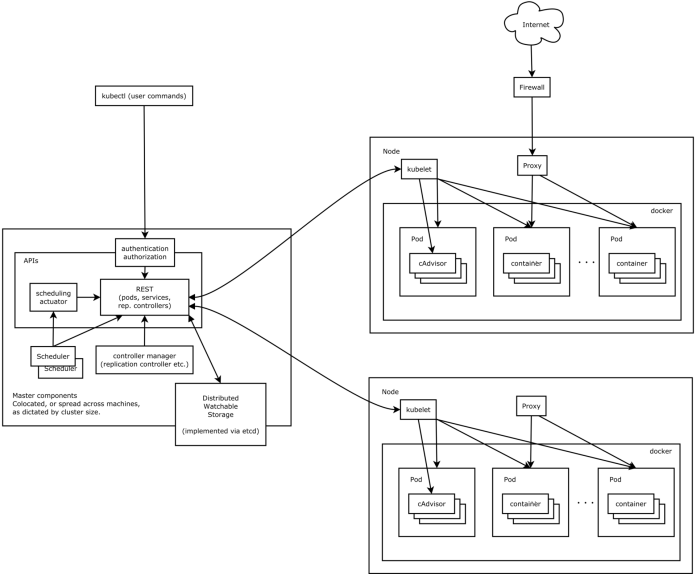

# 第06章：k8s入门及简介

`Kubernetes` 是一个可移植的、可扩展的开源平台，用于管理容器化的工作负载和服务，可促进声明式配置和自动化。Kubernetes 拥有一个庞大且快速增长的生态系统。Kubernetes 的服务、支持和工具广泛可用。 

## 一、简介

Kubernetes是一个全新的基于容器技术的分布式领先方案。简称：K8S。它是Google开源的容器集群管理系统，它的设计灵感来自于Google内部的一个叫作Borg的容器管理系统。继承了Google十余年的容器集群使用经验。它为容器化的应用提供了部署运行、资源调度、服务发现和动态伸缩等一些列完整的功能，极大地提高了大规模容器集群管理的便捷性。

k8s具有完备的集群管理能力，多扩多层次的安全防护和准入机制、多租户应用支撑能力、透明的服务注册和发现机制、內建智能负载均衡器、强大的故障发现和自我修复能力、服务滚动升级和在线扩容能力、可扩展的资源自动调度机制以及多粒度的资源配额管理能力。

在集群管理方面，`k8s` 将集群中的机器划分为一个Master节点和一群工作节点Node，其中，在Master节点运行着集群管理相关的一组进程`kube-apiserver`、`kube-controller-manager`和`kube-scheduler`，这些进程实现了整个集群的资源管理、Pod调度、弹性伸缩、安全控制、系统监控和纠错等管理能力，并且都是全自动完成的。Node作为集群中的工作节点，运行真正的应用程序，在Node上`k8s`管理的最小运行单元是Pod。Node上运行着`k8s`的kubelet、kube-proxy服务进程，这些服务进程负责Pod的创建、启动、监控、重启、销毁以及实现软件模式的负载均衡器。

在`k8s`集群中，它解决了传统IT系统中服务扩容和升级的两大难题。如果今天的软件并不是特别复杂并且需要承载的峰值流量不是特别多，那么后端项目的部署其实也只需要在虚拟机上安装一些简单的依赖，将需要部署的项目编译后运行就可以了。但是随着软件变得越来越复杂，一个完整的后端服务不再是单体服务，而是由多个职责和功能不同的服务组成，服务之间复杂的拓扑关系以及单机已经无法满足的性能需求使得软件的部署和运维工作变得非常复杂，这也就使得部署和运维大型集群变成了非常迫切的需求。

`k8s`的出现不仅主宰了容器编排的市场，更改变了过去的运维方式，不仅将开发与运维之间边界变得更加模糊，而且让 DevOps 这一角色变得更加清晰，每一个软件工程师都可以通过 `k8s` 来定义服务之间的拓扑关系、线上的节点个数、资源使用量并且能够快速实现水平扩容、蓝绿部署等在过去复杂的运维操作。

## 二、架构

`k8s`遵循非常传统的客户端服务端架构，客户端通过 RESTful 接口或者直接使用 kubectl 与 `k8s` 集群进行通信，这两者在实际上并没有太多的区别，后者也只是对 `k8s` 提供的 RESTful API 进行封装并提供出来。每一个 `k8s` 集群都由一组 Master 节点和一系列的 Worker 节点组成，其中 Master 节点主要负责存储集群的状态并为 `k8s` 对象分配和调度资源。

### 2.1 Master

它主要负责接收客户端的请求，安排容器的执行并且运行控制循环，将集群的状态向目标状态进行迁移，Master 节点内部由三个组件构成:

#### 2.1.1 API Server

负责处理来自用户的请求，其主要作用就是对外提供 RESTful 的接口，包括用于查看集群状态的读请求以及改变集群状态的写请求，也是唯一一个与 etcd 集群通信的组件。

#### 2.1.2 ControllerManager

管理器运行了一系列的控制器进程，这些进程会按照用户的期望状态在后台不断地调节整个集群中的对象，当服务的状态发生了改变，控制器就会发现这个改变并且开始向目标状态迁移。

#### 2.1.3 Scheduler

调度器其实为 `Kubernetes` 中运行的 `Pod` 选择部署的 `Worker` 节点，它会根据用户的需要选择最能满足请求的节点来运行`Pod`，它会在每次需要调度 `Pod` 时执行。

### 2.2 Node

Node节点实现相对简单一点，主要是由kubelet和kube-proxy两部分组成： 

- kubelet 是一个节点上的主要服务，它周期性地从 API Server 接受新的或者修改的 Pod 规范并且保证节点上的 Pod 和其中容器的正常运行，还会保证节点会向目标状态迁移，该节点仍然会向 Master 节点发送宿主机的健康状况。 
- kube-proxy 负责宿主机的子网管理，同时也能将服务暴露给外部，其原理就是在多个隔离的网络中把请求转发给正确的 Pod 或者容器。

### 2.3 kubernetes结构图

在这张系统架构图中，我们把服务分为运行在工作节点上的服务和组成集群级别控制板的服务。

Kubernetes主要由以下几个核心组件组成：

1. etcd保存了整个集群的状态
2. apiserver提供了资源操作的唯一入口，并提供认证、授权、访问控制、API注册和发现等机制
3. controller manager负责维护集群的状态，比如故障检测、自动扩展、滚动更新等
4. scheduler负责资源的调度，按照预定的调度策略将Pod调度到相应的机器上
5. kubelet负责维护容器的生命周期，同时也负责Volume（CVI）和网络（CNI）的管理
6. Container runtime负责镜像管理以及Pod和容器的真正运行（CRI）
7. kube-proxy负责为Service提供cluster内部的服务发现和负载均衡

除了核心组件，还有一些推荐的组件：

1. kube-dns负责为整个集群提供DNS服务
2. Ingress Controller为服务提供外网入口
3. Heapster提供资源监控
4. Dashboard提供GUIFederation提供跨可用区的集群
5. Fluentd-elasticsearch提供集群日志采集、存储与查询

