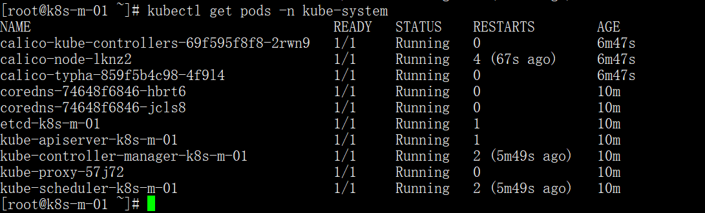
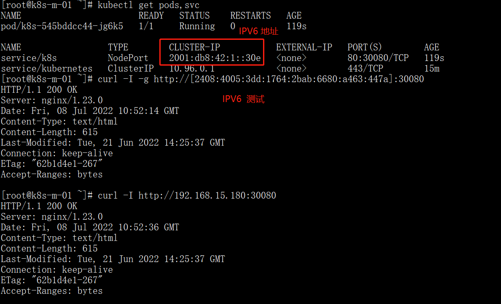

# 第07章：kubeadm 部署 IPV6 和 IPV4 双栈 K8S 集群

Kubernetes有两种方式，第一种是二进制的方式，可定制但是部署复杂容易出错；第二种是kubeadm工具安装，部署简单，不可定制化。本次我们部署kubeadm版。

## 一、部署之前的一些优化

在部署之前，我们需要先优化系统，下载不要软件。

### 1. 部署系统版本

| 软件            | 版本                                                         |
| --------------- | ------------------------------------------------------------ |
| CentOS          | CentOS Linux release 7.9.2009 (Core)                         |
| Containerd      | 1.6.6-3.1                                                    |
| Kubernetes      | V1.24-2                                                      |
| Calico          | V3.23                                                        |
| Kernel-lt       | [kernel-lt-5.4.203-1.el7.elrepo.x86_64.rpm](https://elrepo.org/linux/kernel/el7/x86_64/RPMS/kernel-lt-5.4.203-1.el7.elrepo.x86_64.rpm) |
| Kernel-lt-devel | [kernel-lt-devel-5.4.203-1.el7.elrepo.x86_64.rpm](https://elrepo.org/linux/kernel/el7/x86_64/RPMS/kernel-lt-devel-5.4.203-1.el7.elrepo.x86_64.rpm) |

### 2. 节点规划

| Hostname | Ipv4          | Ipv6                    | 内核版本  |
| -------- | ------------- | ----------------------- | --------- |
| k8s-m-01 | 192.168.15.61 | fd15:4ba5:5a2b:1008::61 | 5.4.203-1 |
| K8s-m-02 | 192.168.15.62 | fd15:4ba5:5a2b:1008::62 | 5.4.203-1 |
| K8s-m-03 | 192.168.15.63 | fd15:4ba5:5a2b:1008::63 | 5.4.203-1 |
| K8s-n-01 | 192.168.15.64 | fd15:4ba5:5a2b:1008::64 | 5.4.203-1 |
| K8s-n-02 | 192.168.15.65 | fd15:4ba5:5a2b:1008::65 | 5.4.203-1 |
| lb01     | 192.168.15.71 | fd15:4ba5:5a2b:1008::71 | 5.4.203-1 |
| lb02     | 192.168.15.72 | fd15:4ba5:5a2b:1008::72 | 5.4.203-1 |
| vip      | 192.168.15.73 |                         | 5.4.203-1 |

### 3. 关闭selinux

```bash
# 永久关闭
sed -i 's#enforcing#disabled#g' /etc/selinux/config
# 零时关闭
setenforce 0
```

### 4. 关闭swap分区

```bash
swapoff -a
sed -i.bak 's/^.*centos-swap/#&/g' /etc/fstab
echo 'KUBELET_EXTRA_ARGS="--fail-swap-on=false"' > /etc/sysconfig/kubelet
```

### 5. 配置国内yum源

默认情况下，CentOS使用的是官方yum源，所以一般情况下在国内使用是非常慢，所以我们可以替换成国内的一些比较成熟的yum源，例如：清华大学镜像源，网易云镜像源等等。

```bash
mv /etc/yum.repos.d/CentOS-Base.repo /etc/yum.repos.d/CentOS-Base.repo.backup
curl -o /etc/yum.repos.d/CentOS-Base.repo https://mirrors.aliyun.com/repo/Centos-7.repo
curl -o /etc/yum.repos.d/epel.repo http://mirrors.aliyun.com/repo/epel-7.repo

# 刷新缓存
yum makecache

# 更新系统
yum update -y --exclud=kernel*
```

### 6. 升级内核版本

由于Docker运行需要较新的系统内核功能，例如ipvs等等，所以一般情况下，我们需要使用4.0+以上版本的系统内核。

```bash
# 内核要求是4.18+，如果是`CentOS 8`则不需要升级内核

wget https://elrepo.org/linux/kernel/el7/x86_64/RPMS/kernel-lt-5.4.203-1.el7.elrepo.x86_64.rpm
wget https://elrepo.org/linux/kernel/el7/x86_64/RPMS/kernel-lt-devel-5.4.204-1.el7.elrepo.x86_64.rpm

yum localinstall -y kernel-lt*

grub2-set-default  0 && grub2-mkconfig -o /etc/grub2.cfg

grubby --default-kernel

# 重启
reboot
```

### 7. 安装ipvs

ipvs是系统内核中的一个模块，其网络转发性能很高。一般情况下，我们首选ipvs。

```bash
# 安装IPVS
yum install -y conntrack-tools ipvsadm ipset conntrack libseccomp

# 加载IPVS模块
cat > /etc/sysconfig/modules/ipvs.modules <<EOF
#!/bin/bash
ipvs_modules="ip_vs ip_vs_lc ip_vs_wlc ip_vs_rr ip_vs_wrr ip_vs_lblc ip_vs_lblcr ip_vs_dh ip_vs_sh ip_vs_fo ip_vs_nq ip_vs_sed ip_vs_ftp nf_conntrack"
for kernel_module in \${ipvs_modules}; do
  /sbin/modinfo -F filename \${kernel_module} > /dev/null 2>&1
  if [ $? -eq 0 ]; then
    /sbin/modprobe \${kernel_module}
  fi
done
EOF

chmod 755 /etc/sysconfig/modules/ipvs.modules && bash /etc/sysconfig/modules/ipvs.modules && lsmod | grep ip_vs
```

### 8. 内核参数优化

内核参数优化的主要目的是使其更适合kubernetes的正常运行。

```bash
cat > /etc/sysctl.d/k8s.conf << EOF
net.ipv4.ip_forward = 1
net.bridge.bridge-nf-call-iptables = 1
net.bridge.bridge-nf-call-ip6tables = 1
fs.may_detach_mounts = 1
vm.overcommit_memory=1
vm.panic_on_oom=0
fs.inotify.max_user_watches=89100
fs.file-max=52706963
fs.nr_open=52706963

net.ipv4.tcp_keepalive_time = 600
net.ipv4.tcp.keepaliv.probes = 3
net.ipv4.tcp_keepalive_intvl = 15
net.ipv4.tcp.max_tw_buckets = 36000
net.ipv4.tcp_tw_reuse = 1
net.ipv4.tcp.max_orphans = 327680
net.ipv4.tcp_orphan_retries = 3
net.ipv4.tcp_syncookies = 1
net.ipv4.tcp_max_syn_backlog = 16384
net.ipv4.ip_conntrack_max = 65536
net.ipv4.tcp_max_syn_backlog = 16384
net.ipv4.top_timestamps = 0
net.core.somaxconn = 16384

net.ipv6.conf.all.disable_ipv6 = 0
net.ipv6.conf.default.disable_ipv6 = 0
net.ipv6.conf.lo.disable_ipv6 = 0
net.ipv6.conf.all.forwarding = 1

EOF

# 立即生效
sysctl --system

```

### 9. 安装基础软件

安装一些基础软件，是为了方便我们的日常使用。

```bash
yum install wget expect vim net-tools ntp bash-completion ipvsadm ipset jq iptables conntrack sysstat libseccomp -y
```

### 10. 关闭防火墙

关闭防火墙是为了方便日常使用，不会给我们造成困扰。在生成环境中建议打开。

```bash
systemctl disable --now firewalld
```
### 11. 同步集群时间

在集群当中，时间是一个很重要的概念，一旦集群当中某台机器时间跟集群时间不一致，可能会导致集群面临很多问题。所以，在部署集群之前，需要同步集群当中的所有机器的时间。

```bash
yum install ntp -y

ln -sf /usr/share/zoneinfo/Asia/Shanghai /etc/localtime
echo 'Asia/Shanghai' > /etc/timezone

ntpdate time2.aliyun.com

# 写入定时任务
echo "0 */1 * * * /usr/sbin/ntpdate ntp1.aliyun.com &>/dev/null" >> /var/spool/cron/root
```

### 12. 配置主机名和IP

当前，我们需要安装的是 ipv4 和 ipv6 双栈 k8s 集群，所以在安装部署之前，需要将 ipv4 和 ipv6 两种ip和主机名解析好。

注意：不建议只开启 ipv6 ，部分共有docker仓库还不支持 ipv6。

```bash
# 这里以修改 k8s-m-01 这台机器为例，其他机器以此类推。
# 解析主机名
$ cat <<EOF >> /etc/hosts
fd15:4da5:5a2b:1008::61 k8s-m-01
fd15:4da5:5a2b:1008::62 k8s-m-02
fd15:4da5:5a2b:1008::63 k8s-m-03 
fd15:4da5:5a2b:1008::64 k8s-m-04
fd15:4da5:5a2b:1008::65 k8s-m-05

192.168.15.61 k8s-m-01
192.168.15.62 k8s-m-02
192.168.15.63 k8s-m-03
192.168.15.64 k8s-n-01
192.168.15.65 k8s-n-02

192.168.15.71 lb01
192.168.15.72 lb02
192.168.15.73 lb-vip
EOF
```

## 二、安装Containerd

containerd 作为底层运行时，必须在安装 k8s 之前部署好。

```bash
$ wget https://mirrors.aliyun.com/docker-ce/linux/centos/7/x86_64/stable/Packages/containerd.io-1.6.6-3.1.el7.x86_64.rpm

$ yum install containerd.io-1.6.6-3.1.el7.x86_64.rpm -y

$ systemctl enable --now containerd
```

### 2.1 配置Containerd所需的模块

```bash
cat <<EOF | sudo tee /etc/modules-load.d/containerd.conf
overlay
br_netfilter
EOF
```

### 2.2 加载模块

```bash
systemctl restart systemd-modules-load.service
```

### 2.3 配置Containerd所需的内核

```bash
cat <<EOF | sudo tee /etc/sysctl.d/99-kubernetes-cri.conf
net.bridge.bridge-nf-call-iptables  = 1
net.ipv4.ip_forward                 = 1
net.bridge.bridge-nf-call-ip6tables = 1
EOF
 
# 加载内核
 
sysctl --system
```

### 2.4 创建Containerd的配置文件

```bash
mkdir -p /etc/containerd
containerd config default | tee /etc/containerd/config.toml
 
 
修改Containerd的配置文件
sed -i "s#SystemdCgroup\ \=\ false#SystemdCgroup\ \=\ true#g" /etc/containerd/config.toml
 
cat /etc/containerd/config.toml | grep SystemdCgroup
 
sed -i "s#k8s.gcr.io#registry.aliyuncs.com/google_containers#g" /etc/containerd/config.toml
 
cat /etc/containerd/config.toml | grep sandbox_image


# 可执行可不执行
cat > /etc/crictl.yaml <<EOF
runtime-endpoint: unix:///run/containerd/containerd.sock
image-endpoint: unix:///run/containerd/containerd.sock
timeout: 10
debug: false
EOF
```

## 三、kubeadm 安装 k8s

### 1. 配置 Kubernetes 源

```bash
cat <<EOF > /etc/yum.repos.d/kubernetes.repo
[kubernetes]
name=Kubernetes
baseurl=https://mirrors.aliyun.com/kubernetes/yum/repos/kubernetes-el7-x86_64/
enabled=1
gpgcheck=0
repo_gpgcheck=0
gpgkey=https://mirrors.aliyun.com/kubernetes/yum/doc/yum-key.gpg https://mirrors.aliyun.com/kubernetes/yum/doc/rpm-package-key.gpg
EOF

setenforce 0

yum install kubelet kubeadm kubectl

systemctl enable kubelet && systemctl start kubelet
```

### 2. 初始化 Master 节点

```bash
$ kubeadm init --image-repository=registry.aliyuncs.com/google_containers --pod-network-cidr=10.244.0.0/16,2001:db8:42:0::/56 --service-cidr=10.96.0.0/16,2001:db8:42:1::/112
```

## 四、kubeadm 高可用安装 k8s 集群

要想实现 k8s 高可用集群，首先需要将 k8s master 节点全部加入集群。

### 1.安装 keepalived haproxy 高可用组件

```bash
yum install keepalived haproxy -y
```

### 2.配置 keepalived

```bash
mv /etc/keepalived/keepalived.conf /etc/keepalived/keepalived.conf_bak

KUBE_APISERVER_IP=`hostname -i | awk  '{print $2}'`
K8S_HOSTNAME=`hostname`

cat > /etc/keepalived/keepalived.conf <<EOF
! Configuration File for keepalived
global_defs {
    router_id ${K8S_HOSTNAME}
}

vrrp_instance VI_1 {
    state MASTER
    interface eth0
    mcast_src_ip ${KUBE_APISERVER_IP}
    virtual_router_id 51
    priority 100
    advert_int 2
    authentication {
        auth_type PASS
        auth_pass K8SHA_KA_AUTH
    }
    virtual_ipaddress {
        192.168.15.73
    }

}
EOF

```

### 3.配置 haproxy

```bash
cat > /etc/haproxy/haproxy.cfg <<EOF
global
  maxconn  2000
  ulimit-n  16384
  log  127.0.0.1 local0 err
  stats timeout 30s

defaults
  log global
  mode  http
  option  httplog
  timeout connect 5000
  timeout client  50000
  timeout server  50000
  timeout http-request 15s
  timeout http-keep-alive 15s

frontend monitor-in
  bind *:33305
  mode http
  option httplog
  monitor-uri /monitor

listen stats
  bind    *:8006
  mode    http
  stats   enable
  stats   hide-version
  stats   uri       /stats
  stats   refresh   30s
  stats   realm     Haproxy\ Statistics
  stats   auth      admin:admin

frontend k8s-master
  bind 0.0.0.0:8443
  bind 127.0.0.1:8443
  mode tcp
  option tcplog
  tcp-request inspect-delay 5s
  default_backend k8s-master

backend k8s-master
  mode tcp
  option tcplog
  option tcp-check
  balance roundrobin
  default-server inter 10s downinter 5s rise 2 fall 2 slowstart 60s maxconn 250 maxqueue 256 weight 100
  server k8s-m-01    192.168.15.61:6443  check inter 2000 fall 2 rise 2 weight 100
  server k8s-m-02    192.168.15.62:6443  check inter 2000 fall 2 rise 2 weight 100
  server k8s-m-03    192.168.15.63:6443  check inter 2000 fall 2 rise 2 weight 100
EOF
```

### 3.创建配置文件

```bash
[root@k8s-m-01 ~]# cat kubeadm-init.yaml 
apiVersion: kubeadm.k8s.io/v1beta3
bootstrapTokens:
- groups:
  - system:bootstrappers:kubeadm:default-node-token
  token: abcdef.0123456789abcdef
  ttl: 24h0m0s
  usages:
  - signing
  - authentication
kind: InitConfiguration
localAPIEndpoint:
  advertiseAddress: 192.168.15.61 
  bindPort: 6443
nodeRegistration:
  criSocket: unix:///var/run/containerd/containerd.sock
  imagePullPolicy: IfNotPresent
  name: k8s-m-01
  taints: null
---
apiServer:
  timeoutForControlPlane: 4m0s
apiVersion: kubeadm.k8s.io/v1beta3
certificatesDir: /etc/kubernetes/pki
clusterName: kubernetes
controlPlaneEndpoint: "192.168.15.73:8443"
controllerManager: {}
dns: {}
etcd:
  local:
    dataDir: /var/lib/etcd
imageRepository: registry.aliyuncs.com/google_containers
kind: ClusterConfiguration
kubernetesVersion: 1.24.0
networking:
  podSubnet: 10.244.0.0/16
  dnsDomain: cluster.local
  serviceSubnet: 10.96.0.0/12
scheduler: {}
```

### 4.查看结果

```bash
[root@k8s-m-01 ~]# kubectl get nodes
NAME       STATUS     ROLES           AGE     VERSION
k8s-m-01   NotReady   control-plane   2m42s   v1.24.2
k8s-m-02   NotReady   control-plane   94s     v1.24.2
k8s-m-03   NotReady   control-plane   38s     v1.24.2
```

### 5.安装 Calico 网络插件

```bash
$ curl https://projectcalico.docs.tigera.io/manifests/calico-typha.yaml -o calico.yaml
$ vim calico.yaml
    "ipam": {
        "type": "calico-ipam",
        "assign_ipv4": "true",
        "assign_ipv6": "true"
    },
    - name: IP
      value: "autodetect"

    - name: IP6
      value: "autodetect"

    - name: CALICO_IPV4POOL_CIDR
      value: "172.16.0.0/16"

    - name: CALICO_IPV6POOL_CIDR
      value: "fc00::/48"

    - name: FELIX_IPV6SUPPORT
      value: "true"

$ kubectl apply -f calico.yaml 
```



### 4.命令提示

```bash
yum install -y bash-completion
source /usr/share/bash-completion/bash_completion
source <(kubectl completion bash)
echo "source <(kubectl completion bash)" >> ~/.bashrc
```

### 5.测试

```yaml
---
apiVersion: apps/v1
kind: Deployment
metadata:
  name: k8s
spec:
  selector:
    matchLabels:
      app: k8s
  template:
    metadata:
      labels:
        app: k8s
    spec:
      containers:
        - name: k8s
          image: nginx
---
apiVersion: v1
kind: Service
metadata:
  name: k8s
spec:
  ipFamilyPolicy: PreferDualStack
  ipFamilies:
    - IPv6
    - IPv4
  type: NodePort
  selector:
    app: k8s
  ports:
  - port: 80
    targetPort: 80
```




