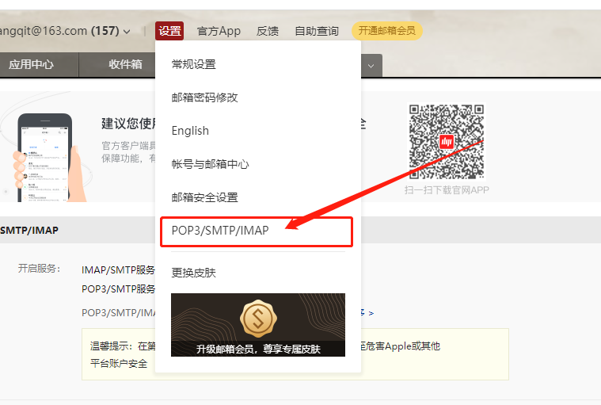
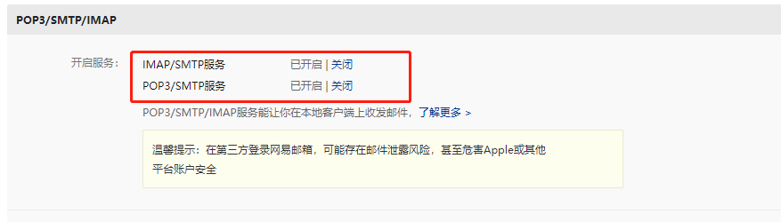
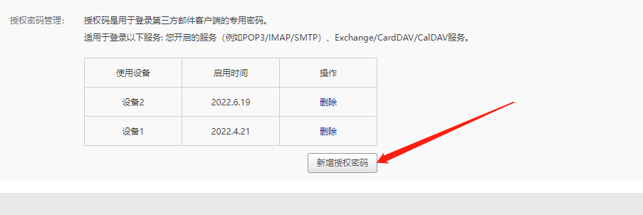
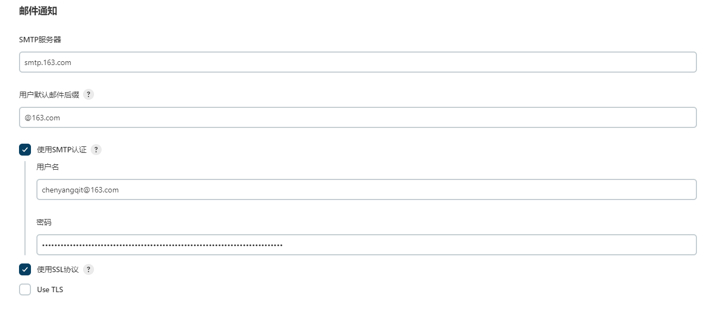
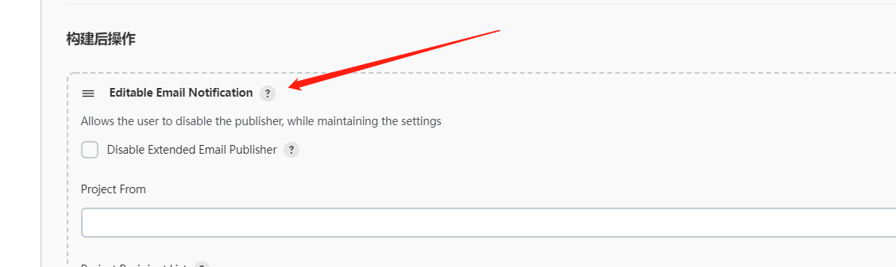
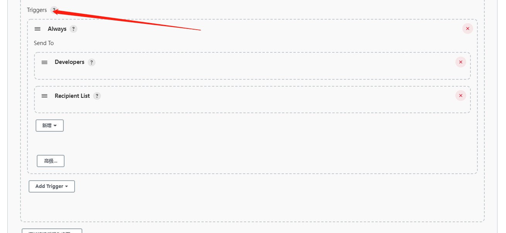

# Jenkins入门

Jenkins 是一款流行的开源持续集成（Continuous Integration）工具，广泛用于项目开发，具有自动 化构建、测试和部署等功能。

官网： https://www.jenkins.io/zh/

Jenkins的特征： 

- 开源的Java语言开发持续集成工具，支持持续集成，持续部署。
- 易于安装部署配置：可通过yum安装,或下载war包以及通过docker容器等快速实现安装部署，方便web界面配置管理。
- 消息通知及测试报告：集成RSS/E-mail通过RSS发布构建结果或当构建完成时通过e-mail通知，生成JUnit/TestNG测试报告。
- 分布式构建：支持Jenkins能够让多台计算机一起构建/测试。
- 文件识别：Jenkins能够跟踪哪次构建生成哪些jar，哪次构建使用哪个版本的jar等。
- 丰富的插件支持：支持扩展插件，你可以开发适合自己团队使用的工具，如git，svn，maven， docker等。

## Jenkins安装和持续集成环境配置


1. 第一步：开发人员每天进行代码提交，提交到Git仓库
2. 第二步：Jenkins作为持续集成工具，使用Git工具到Git仓库拉取代码到集成服务器，再配合JDK， Maven等软件完成代码编译，代码测试与审查，测试，打包等工作，在这个过程中每一步出错，都重新 再执行一次整个流程。
3. 第三步：Jenkins把生成的jar或war包分发到测试服务器或者生产服务器，测试人员或用户就可以访问 应用。

### 服务器列表

本课程虚拟机统一采用CentOS7。

| 名称           | IP            | 配置   | 软件                           |
| -------------- | ------------- | ------ | ------------------------------ |
| 代码托管服务器 | 192.168.15.20 | 2核4GB | Gitlab、Gitlab-runner          |
| Jenkins服务器  | 192.168.15.21 | 2核2GB | Jenkins，JDK1.8，Maven3.6.2,go |
| SonarQube      | 192.168.15.22 | 2核2GB | SonarQube                      |
| 禅道           | 192.168.15.30 | 2核2GB | 禅道社区版                     |
| 测试服务器1    | 192.168.15.23 | 2核2GB | JDK1.8，Tomcat9,python,golang  |
| 测试服务器2    | 192.168.15.24 | 2核2GB | JDK1.8，Tomcat9,python,golang  |
| kubernetes     | 192.168.15.25 | 2核2GB | k8s 1.24                       |

### 持续集成环境(1)-Jenkins安装

> 官网：https://www.jenkins.io/zh/download/
>
> 清华大学开源镜像站：https://mirrors.tuna.tsinghua.edu.cn/

Jenkins是开源CI&CD软件领导者， 提供超过1000个插件来支持构建、部署、自动化， 满足任何项目的需要。

Jenkins是用Java开发的，安装Jenkins之前首先需要安装JDK。

#### 安装JDK

```bash
$ yum install java-1.8.0-openjdk* -y
```

#### 安装Jenkins(国外)
```bash
$ sudo wget -O /etc/yum.repos.d/jenkins.repo https://pkg.jenkins.io/redhat-stable/jenkins.repo
$ sudo rpm --import https://pkg.jenkins.io/redhat-stable/jenkins.io.key
$ yum install jenkins
```


#### 安装Jenkins(国内)

```bash
$ wget https://mirrors.tuna.tsinghua.edu.cn/jenkins/redhat/jenkins-2.356-1.1.noarch.rpm
$ yum install jenkins-2.356-1.1.noarch.rpm -y
```


### 安装 Nginx 代理 Jenkins

```bash
$ yum install nginx -y
```

#### 默认的Nginx.conf

```nginx
user nginx;
worker_processes auto;
error_log /var/log/nginx/error.log;
pid /run/nginx.pid;

events {
    worker_connections 1024;
}

http {
    log_format  main  '$remote_addr - $remote_user [$time_local] "$request" '
                      '$status $body_bytes_sent "$http_referer" '
                      '"$http_user_agent" "$http_x_forwarded_for"';

    access_log  /var/log/nginx/access.log  main;

    sendfile            on;
    tcp_nopush          on;
    tcp_nodelay         on;
    keepalive_timeout   65;
    types_hash_max_size 4096;

    include             /etc/nginx/mime.types;
    default_type        application/octet-stream;

    include /etc/nginx/conf.d/*.conf;

}
```

#### 添加 Nginx 反向代理配置(HTTPS版)

```nginx
server {
    listen 443 ssl;
    server_name jenkins.abck8s.com;

    ssl_certificate  /etc/nginx/cert/jenkins.abck8s.com.pem;
    ssl_certificate_key /etc/nginx/cert/jenkins.abck8s.com.key;
    ssl_session_timeout 5m;
    ssl_protocols TLSv1 TLSv1.1 TLSv1.2;
    
    location / {
        proxy_redirect     off;
        proxy_set_header   Host             $host;
        proxy_set_header   X-Real-IP        $remote_addr;
        proxy_set_header   X-Forwarded-For  $proxy_add_x_forwarded_for;
        proxy_next_upstream error timeout invalid_header http_500 http_502 http_503 http_504;
        proxy_max_temp_file_size 0;
        proxy_connect_timeout      90;
        proxy_send_timeout         90;
        proxy_read_timeout         90;
        proxy_buffer_size          4k;
        proxy_buffers              4 32k;
        proxy_busy_buffers_size    64k;
        proxy_temp_file_write_size 64k;
        
        proxy_set_header X-Scheme $scheme;
        proxy_pass  http://127.0.0.1:8080
    }
    
}

# 强制HTTPS
server {
    listen 80;
    server_name jenkins.abck8s.com;
    return 301 https://$server_name$request_uri;
}
```

#### 添加 Nginx 反向代理配置(HTTP版)

```nginx
server {
    listen 80;
    server_name jenkins.abck8s.com;

    location / {
        proxy_set_header Host $http_host;
        proxy_set_header X-Real-IP $remote_addr;
        proxy_set_header X-Scheme $scheme;
        proxy_pass  http://127.0.0.1:8080
    }
}
```

#### 启动 Jenkins 和 Nginx

```bash
$ systemctl enable --now nginx jenkins
```

#### 配置 Jenkins 


>  注意：如果有推荐安装插件的界面，不要安装任何插件，因为默认是从国外下载插件，安装起来是特别的慢。等我们将插件的下载地址修改成为国内的时候，再来下载插件。


### 持续集成环境(2)-Jenkins插件管理

Jenkins本身不提供很多功能，我们可以通过使用插件来满足我们的使用。例如从Gitlab拉取代码，使用 Maven构建项目等功能需要依靠插件完成。

接下来演示如何下载插件。

#### 修改 Jenkins 插件下载地址

Jenkins国外官方插件地址下载速度非常慢，所以可以修改为国内插件地址。

第一步：修改升级站点URL

Jenkins->Manage Jenkins->Manage Plugins，点击Advanced

```bash
https://mirrors.tuna.tsinghua.edu.cn/jenkins/updates/update-center.json
```


第二步：修改下载URL

```bash
$ cd /var/lib/jenkins/updates/
$ sed -i 's/https:\/\/updates.jenkins.io\/download/https:\/\/mirrors.tuna.tsinghua.edu.cn\/jenkins/g' default.json
$ sed -i 's/http:\/\/www.google.com/https:\/\/www.baidu.com/g' default.json
```

第三步：重启 Jenkins

```bash
$ systemctl restart jenkins
```

#### 汉化 Jenkins

默认情况下，Jenkins是英文的，可以使用插件汉化 Jenkins。

Jenkins->Manage Jenkins->Manage Plugins，点击 Available


### 持续集成环境(3)-Jenkins用户权限管理

我们可以利用 `Role-based Authorization Strategy` 插件来管理Jenkins用户权限。

#### 安装 Role-based Authorization Strategy 插件

Jenkins->Manage Jenkins->Manage Plugins，点击 Available


#### 开启权限全局安全配置

Jenkins -> 全局安全配置


#### 创建角色

Jenkisn -> Manage and Assign Roles


1. Global roles（全局角色）：管理员等高级用户可以创建基于全局的角色
2. Project roles（项目角色）： 针对某个或者某些项目的角色
3. Slave roles（奴隶角色）：节点相关的权限（用的地方不多，暂且不予以深究）

我们姑且可以创建三个角色，分别是一个全局角色，两个项目角色。

- base：该角色为全局角色。这个角色需要绑定Overall下面的Read权限，是为了给所有用户绑 定最基本的Jenkins访问权限。注意：如果不给后续用户绑定这个角色，会报错误：用户名 is missing the Overall/Read permission
- role1：该角色为项目角色。使用正则表达式绑定"xiaoyangaijishu-golang.*"，意思是只能操作xiaoyangaijishu-golang开头的项目。
- role2：该角色也为项目角色。绑定"xiaoyangaijishu-python.*"，意思是只能操作xiaoyangaijishu-python开头的项目。


#### 创建用户

在系统管理页面进入管理用户。


#### 给用户分配角色

系统管理页面进入Manage and Assign Roles，点击Assign Roles 

绑定规则如下： 

- test1用户分别绑定base和role1角色
- test2用户分别绑定base和role2角色


#### 创建项目测试权限

以admin管理员账户创建两个项目，分别为xiaoyangaijishu-golang-01和xiaoyangaijishu-python-01。


登录`test1`用户只看到``xiaoyangaijishu-golang-01`。登录test2用户亦然。


### 持续集成环境(4)-Jenkins凭证管理

凭据可以用来存储需要密文保护的数据库密码、Gitlab密码信息、Docker私有仓库密码等，以便 Jenkins可以和这些第三方的应用进行交互。

#### 安装Credentials Binding插件

要在Jenkins使用凭证管理功能，需要安装Credentials Binding插件。


- Username with password：用户名和密码
- SSH Username with private key： 使用SSH用户和密钥
- Secret file：需要保密的文本文件，使用时Jenkins会将文件复制到一个临时目录中，再将文件路径 设置到一个变量中，等构建结束后，所复制的Secret file就会被删除。
- Secret text：需要保存的一个加密的文本串，如钉钉机器人或Github的api token
- Certificate：通过上传证书文件的方式

接下来以使用Git工具到Gitlab拉取项目源码为例，演示Jenkins的如何管理Gitlab的凭证。

#### 安装Git插件和Git工具

为了让Jenkins支持从Gitlab拉取源码，需要安装Git插件以及在CentOS7上安装Git工具。

> 注意：Jenkins 操作系统中必须安装 git，不然会报错。

##### Git插件安装


##### 添加 SSH 类型的密钥

```bash
# 创建密钥
$ ssh-keygen
# 将下方的公钥复制到GitLab中
$ cat ~/.ssh/id_rsa.pub 
ssh-rsa AAAAB3NzaC1yc2EAAAADAQABAAABAQDCTu8epl9j5sUVvYixhJL8NGMcM+fYPJc08WkAZXyIdpyG5xsxXFSVY5g7dxUJJe87kETQZF4ddBN84pXahlI0LdmKhQplP1Ewg0oSz+QJL3bKx+iWE7YusgdDOtDI8+tCcMsZlWB93xnzKc5DcOURAwHvlYd4Jro+gSW8ptlLXi8cBqrh7zvaqXL4WjnIofAsPbib2E21XT3bTOP5xHqxOhTFzYh1iZyyPqQVob9VlM0nBnK4mbiB4DQqxG+yTDH9ZEbxqJsIFtmkrYnCQ0xzMXbIVQKnfK9Zzxrgs/A0i4kl5ifQvNYL5SRWSjj0SycscOW4EbvXioSVPTBUexXN root@jenkins
```


Jenkins --> 系统管理 --> Manage Credentials --> 全局 --> 添加凭证


将公钥添加至 Gitlab 中。


### 持续集成环境(5)-参数化构建

在面对多种场景，多种变化的的部署环境中，参数化构建是保证Jenkins部署多样性的非常重要的一环。

[猛戳这里](https://www.yuque.com/docs/share/32a1bfe2-ee46-4db6-9548-ff9a63a78743)

### 持续集成环境(6)-邮件服务

邮件服务主要用来通知部署结果的，非常重要。

#### 安装Email Extension插件

Jenkins->Manage Jenkins->Manage Plugins，点击 Available


#### Jenkins设置邮箱相关参数

Jenkins --> Manage Jenkins -> Configure System


##### 申请邮件客户端密码







##### 设置邮件参数

设置邮件的相关参数

###### 创建邮件凭证


###### 设置邮件参数


##### 邮件通知




```html
<html lang="en">
    <head>
        <meta charset="UTF-8">
        <meta http-equiv="X-UA-Compatible" content="IE=edge">
        <meta name="viewport" content="width=device-width, initial-scale=1.0">
        <title>
            ${ENV, var="JOB_NAME"}-第${BUILD_NUMBER}次构建日志
        </title>
        <style type="text/css">
table.c3 {font-size: 11pt; font-family: Tahoma, Arial, Helvetica, sans-serif} li.c2 {list-style: none} hr.c1 {text-align: center}
        </style>
    </head>
    <body>
        本邮件由系统自动发出，无需回复！<br>
        各位同事，大家好，以下为${JOB_NAME}项目构建信息
        <table width="95%" cellpadding="0" cellspacing="0" class="c3">
            <tr>
                <td>
                    构建结果 - ${BUILD_STATUS}
                </td>
            </tr>
            <tr>
                <td>
                    <br>
                    <b>构建信息</b>
                    <hr class="c1" size="2" width="100%">
                </td>
            </tr>
            <tr>
                <td>
                    <ul>
                        <li>项目名称 ： ${JOB_NAME}
                        </li>
                        <li>构建编号 ： 第${BUILD_DISPLAY_NAME}次构建
                        </li>
                        <li>触发原因： ${CAUSE}
                        </li>
                        <li>构建状态： ${BUILD_STATUS}
                        </li>
                        <li>构建日志： <a href="${BUILD_URL}console">${BUILD_URL}console</a>
                        </li>
                        <li>构建 Url ： <a href="${BUILD_URL}">${BUILD_URL}</a>
                        </li>
                        <li>工作目录 ： <a href="${JOB_URL}ws">${JOB_URL}ws</a>
                        </li>
                        <li>项目 Url ： <a href="${JOB_URL}">${JOB_URL}</a>
                        </li>
                        <li>报告 Url ： <a href="${JOB_URL}">${JOB_URL}allure</a>
                        </li>
                    </ul>
                    <h4>
                        失败用例
                    </h4>
                    <hr size="2" width="100%">
                    $FAILED_TESTS<br>
                    <h4>
                        最近提交(#$SVN_REVISION)
                    </h4>
                    <hr size="2" width="100%">
                    <ul>
                        <li class="c2">${CHANGES_SINCE_LAST_SUCCESS, reverse=true, format="%c", changesFormat="
                        </li>
                        <li>%d [%a] %m
                        </li>
                        <li class="c2">"}
                        </li>
                    </ul>详细提交: <a href="${PROJECT_URL}changes">${PROJECT_URL}changes</a><br>
                </td>
            </tr>
        </table>
    </body>
</html>
```




