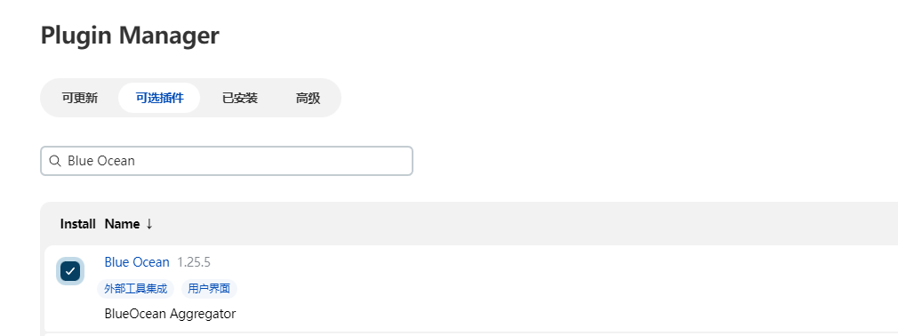

## Jenkins 流水线 pipeline 语法

所谓的 Jenkins 流水线 pipeline 语法其实就是 Groovy 语法。

每一个 Jenkins 流水线都必须存放在一个名为 jenkinsfile 的文件之中。其中只有一个顶级模块，名称为 pipeline ；在这个顶级模块之下，有诸多小模块。

并且，在 Jenkins 中如果要使用 pipeline 流水线的话，必须安装 pipeline 插件。


### Pipline 语法

#### 创建一个流水线项目

pipeline 只有在流水线项目中才能使用，所以在使用 pipeline 之前必须先创建一个流水线项目。


#### pipeline

pipeline 是流水线语法的根节点。

```groovy
pipeline {}
```

#### agent

agent 是指定流水线运行在那个环境之中。

- any：在任何环境中运行
- none：每一个步骤（stage）都需要设置自己的运行环境。
- node：指定运行在某个标签的节点之上
- docker：运行在 docker 之上
- Dockerfile：从某个 dockerfile 创建的 docker 容器中运行。
- k8s：运行在某一个 k8s 集群之中

案例：

```groovy
pipeline{
    agent none
    stages{
        stage("first stage"){
            agent any
            steps("first steps"){
                echo "this is first step"
            }
        }
    }
}
```

#### stages

stages 主要是用来定义某一个流水线阶段的。其中还包含 stage、steps、script。其中 stage 代表多个步骤；steps 代表的是具体执行的内容以及 script 代表具体执行的脚本。

```groovy
pipeline{
    agent any
    stages{
        stage("first stage"){
            steps("first steps"){
                echo "Hello World！"
                script {
                    def browsers = ['chrome', 'firefox']
                    for (int i = 0; i < browsers.size(); ++i) {
                        echo "Testing the ${browsers[i]} browser"
                    }
                }
            }
        }
    }
}
```


#### post

根据流水线的最终状态，匹配做一些操作。

状态：

- always：不管运行结果怎么样都运行
- success：只有当流水线运行结果成功时才运行
- failure：只有当流水线运行失败时才运行
- aborted：只有当流水线取消运行时才运行
- unstable：只有当流水线运行不稳定时才运行

```groovy
pipeline{
    agent any
    stages{
        stage("first stage"){
            steps("first steps"){
                echo "Hello World！"
                script {
                    def browsers = ['chrome', 'firefox']
                    for (int i = 0; i < browsers.size(); ++i) {
                        echo "Testing the ${browsers[i]} browser"
                    }
                }
            }
        }
    }
    post {
        always {
            echo "运行成功"
        }
    }
}
```


#### environment

设置流水线的环境变量。


```groovy
pipeline{
    agent any
    environment {
        VERSION = "1.0.0"
    }
    stages{
        stage("first stage"){
            steps("first steps"){
                echo "Hello World！"
                echo "${VERSION}"
                script {
                    def browsers = ['chrome', 'firefox']
                    for (int i = 0; i < browsers.size(); ++i) {
                        echo "Testing the ${browsers[i]} browser"
                    }
                }
            }
        }
    }
    post {
        always {
            echo "运行成功"
        }
    }
}
```

#### parameters

参数化构建，可以设置参数。

```groovy
pipeline {
    agent any
    parameters { string(name: 'DEPLOY_ENV', defaultValue: 'staging', description: '') }
    stages {
        stage('Example') {
            steps {
                echo "Hello ${DEPLOY_ENV}"
            }
        }
    }
}
```


#### triggers

triggers 指令定义了 Pipeline 自动化触发的方式。目前只有两个可用的触发器：cron 和 pollSCM。

##### cron

接受一个cron风格的字符串来定义Pipeline触发的常规间隔。

##### pollSCM

接受一个cron风格的字符串来定义Jenkins检查SCM源更改的常规间隔。如果存在新的更改，则Pipeline将被重新触发。

```groovy
# 每分钟运行一次
pipeline {
    agent any
    triggers {
        cron('* * * * *')
    }
    stages {
        stage('Example') {
            steps {
                echo 'Hello World'
            }
        }
    }
}
```

#### when

when 指令允许 Pipeline 根据给定的条件确定是否执行该阶段。该 when 指令必须至少包含一个条件。如果 when 指令包含多个条件，则所有子条件必须为 stage 执行返回 true。这与子条件嵌套在一个 allOf 条件中相同（见下面的例子）。

##### branch

当正在构建的分支与给出的分支模式匹配时执行，例如：when { branch 'master' }。请注意，这仅适用于多分支 Pipeline。

```groovy
pipeline {
    agent any
    stages {
        stage('Example Build') {
            steps {
                echo 'Hello World'
            }
        }
        stage('Example Deploy') {
            when {
                branch 'master'
            }
            steps {
                echo 'Deploying'
            }
        }
    }
}
```


##### environment

当指定的环境变量设置为给定值时执行，例如： when { environment name: 'DEPLOY_TO', value: 'production' }

```groovy
pipeline {
    agent any
    environment {
        DEPLOY_TO = "xxx"
    }
    stages {
        stage('Example Build') {
            steps {
                echo 'Hello World'
            }
        }
        stage('Example Deploy') {
            when {
                environment name: 'DEPLOY_TO', value: 'production'
            }
            steps {
                echo 'Deploying'
            }
        }
    }
}
```


##### not

当嵌套条件为false时执行。必须包含一个条件。例如：when { not { branch 'master' } }

```groovy
pipeline {
    agent any
    stages {
        stage('Example Build') {
            steps {
                echo 'Hello World'
            }
        }
        stage('Example Deploy') {
            when {
                not {
                    branch 'master'
                }
            }
            steps {
                echo 'Deploying'
            }
        }
    }
}
```

##### allOf

当所有嵌套条件都为真时执行。必须至少包含一个条件。例如：when { allOf { branch 'master'; environment name: 'DEPLOY_TO', value: 'production' } }

```groovy
pipeline {
    agent any
    environment {
        DEPLOY_TO = "production"
    }
    stages {
        stage('Example Build') {
            steps {
                echo 'Hello World'
            }
        }
        stage('Example Deploy') {
            when {
                allOf {
                    branch 'master';
                    environment name: 'DEPLOY_TO', value: 'production' 
                } 
            }
            steps {
                echo 'Deploying'
            }
        }
    }
}
```


##### anyOf

当至少一个嵌套条件为真时执行。必须至少包含一个条件。例如：when { anyOf { branch 'master'; branch 'staging' } }

```groovy
pipeline {
    agent any
    environment {
        DEPLOY_TO = "production"
    }
    stages {
        stage('Example Build') {
            steps {
                echo 'Hello World'
            }
        }
        stage('Example Deploy') {
            when {
                anyOf {
                    branch 'master';
                    environment name: 'DEPLOY_TO', value: 'production' 
                } 
            }
            steps {
                echo 'Deploying'
            }
        }
    }
}
```

#### parallel

通过将阶段设置为parallel来表明该stage为并行运行。

- 一个stage只能有一个steps或者parallel
- 嵌套的stages里不能使用parallel
- parallel不能包含agent或者tools
- 通过设置failFast 为true表示：并行的job中如果其中的一个失败，则终止其他并行的stage

```groovy
pipeline {
    agent any
    stages {
        stage('Non-Parallel Stage') {
            steps {
                echo 'Non-parallel'
            }
        }
        stage('Parallel Stage') {
            failFast true
            parallel {
                stage('parallel 1') {
                    steps {
                        echo "parallel 1"
                    }
                }
                stage('parallel 2') {
                    steps {
                        echo "parallel 2"
                    }
                }
            }
        }
    }
}
```

#### script

在声明式的pipeline中默认无法使用脚本语法，但是pipeline提供了一个脚本环境入口：script{},通过使用script来包裹脚本语句，即可使用脚本语法。

##### 判断处理

```groovy
pipeline {
    agent any
    stages {
        stage('stage 1') {
            steps {
                script{
                    if ( "1" == "1" ) {
                        echo "lalala"
                    }else {
                        echo "oooo"
                    }
                }
            }
        }
    }
}
```


##### 异常处理

> 注意：异常捕获只能捕获逻辑错误，代码错误将直接报错。

```groovy
pipeline {
    agent any
    stages {
        stage('stage 1') {
            steps {
                script{
                    try {
                        sh 'exit 1'
                    }
                    catch (exc) {
                        echo 'Something failed'
                    }
                }
            }
        }
    }
}
```


#### 流水线语法生成器

流水线常用的语法就讲到这里。但是流水线每一个插件都会有自己的 pipeline 语句，所以我们无论如何是学不完的，正是因为这一点 Jenkins 为我们提供了一个流水线步骤自动生成器。


下面我们用 pipeline 写一个动态获取 Git 分支和 tag 的功能。




```groovy
pipeline {
  agent any
  parameters {
    listGitBranches branchFilter: 'refs/heads/(.*)', 
                    credentialsId: 'bd34af1d-f1fb-4c19-a185-b746531a6930', 
                    defaultValue: '', 
                    listSize: '5', 
                    name: 'GIT_BRANCH', 
                    quickFilterEnabled: false, 
                    remoteURL: 'git@gitlab.abck8s.com:douyin-xiaoyangaijishu/html-test.git', 
                    selectedValue: 'NONE', 
                    sortMode: 'NONE', tagFilter: '*', type: 'PT_BRANCH'
  }

  stages {
    stage('拉去代码') {
      parallel {
        stage('拉取代码仓库中的代码') {
          steps {

            git(
              url: 'git@gitlab.abck8s.com:douyin-xiaoyangaijishu/html-test.git', 
              credentialsId: 'bd34af1d-f1fb-4c19-a185-b746531a6930'
            )


          }
        }

        stage('check os env') {
          steps {
            sleep 1
          }
        }
      }
    }

    stage('build code') {
      steps {
        sh """
        echo  ${GIT_BRANCH}
          git checkout ${GIT_BRANCH}

        """
      }
    }

    stage('deploy to os') {
      steps {
        sh 'echo \'deploy to os\''
      }
    }

  }
  environment {
    VERSION = 'v1.2.3'
  }
  post {
      always {
        emailext body: '内容', subject: '主题', to: 'chenyangqit@163.com'
      }
    }
}

```
