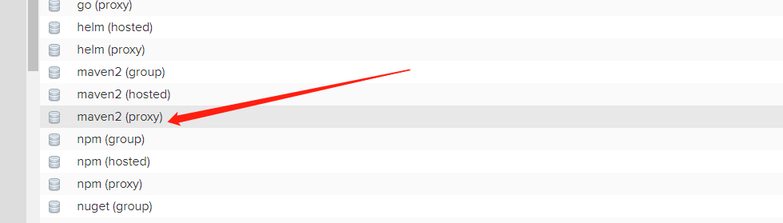
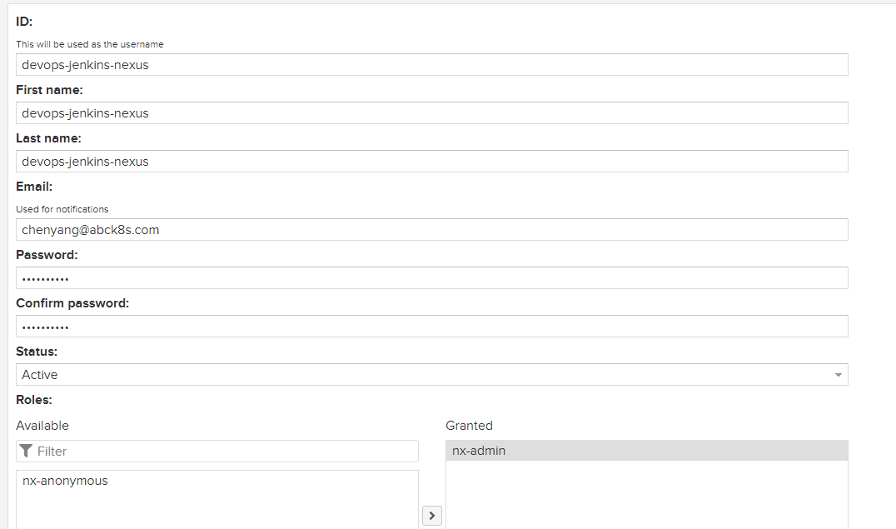

## Jenkins 集成各种工具

我们常用的工具有很多，例如编译java的、编译js以及禅道回调相关的工具都需要集成到Jenkins之中。

### Jenkins 集成 Maven

在 Jenkins 集成服务器上，我们需要安装 Maven 来编译和打包项目。

#### 安装Maven

部署 Maven 要求 JDK 必须是 1.7+。

> 下载链接：https://maven.apache.org/download.cgi

```bash
$ wget https://dlcdn.apache.org/maven/maven-3/3.8.6/binaries/apache-maven-3.8.6-bin.tar.gz

$ tar -xf apache-maven-3.8.6-bin.tar.gz -C /usr/local/
$ vim vim /etc/profile
export MAVEN_HOME=/usr/local/apache-maven-3.8.6
export PATH=$PATH:$MAVEN_HOME/bin
$ source /etc/profile
$ mvn --version
Apache Maven 3.8.6 (84538c9988a25aec085021c365c560670ad80f63)
Maven home: /usr/local/apache-maven-3.8.6
Java version: 1.8.0_332, vendor: Red Hat, Inc., runtime: /usr/lib/jvm/java-1.8.0-openjdk-1.8.0.332.b09-1.el7_9.x86_64/jre
Default locale: en_US, platform encoding: UTF-8
OS name: "linux", version: "3.10.0-1160.66.1.el7.x86_64", arch: "amd64", family: "unix"
```

#### Jenkins 集成 maven

jenkins --> 系统配置 --> 全局工具配置


#### 添加Jenkins全局变量

jenkins --> 全局工具配置 --> 全局工具配置


#### 优化Maven的settings.xml

```bash
$ mkdir -pv /data/software/repository
$ chown -R jenkins.jenkins /data/
```

修改详情

```xml
$ vim /usr/local/apache-maven-3.8.6/conf/settings.xml
<!--本地仓库-->          
<localRepository>/data/software/repository</localRepository>

<mirrors>
    <!--阿里云镜像-->
    <mirror>
        <id>aliyun-maven</id>
        <mirrorOf>central</mirrorOf>
        <name>aliyun maven mirror</name>
        <url>http://maven.aliyun.com/nexus/content/groups/public/</url>
    </mirror>
</mirrors>
```

测试

```groovy
pipeline{
    agent any
    stages{
        stage("first stage"){
            steps("first steps"){
                script {
                    sh """
                    mvn -v
                    """
                }
            }
        }
    }
    post {
        always {
            echo "运行成功"
        }
    }
}
```


### Jenkins 集成 Gradle

gradle 是一个 Java 构建自动化的工具,类似于maven,ant的功能。使用 gradle 可以给 java 项目编译,单元测试,打包,或者生成可执行的jar包等。

#### 安装 Gradle

Gradle 可在所有主要操作系统上运行，并且只需要安装Java JDK 8 或更高版本。

```bash
$ java -version
openjdk version "1.8.0_332"
OpenJDK Runtime Environment (build 1.8.0_332-b09)
OpenJDK 64-Bit Server VM (build 25.332-b09, mixed mode)
```

> 下载链接：https://gradle.org/install/


```bash
$ wget https://downloads.gradle-dn.com/distributions/gradle-7.4.2-bin.zip
$ unzip gradle-7.4.2-bin.zip -d /usr/local/
$ vim /etc/profile
export GRADLE_HOME=/usr/local/gradle-7.4.2
export PATH=$PATH:$GRADLE_HOME/bin
$ source /etc/profile
```

#### Jenkins 集成 gradle

Jenkins->Manage Jenkins->Manage Plugins，点击Advanced


jenkins --> 系统管理 --> 全局工具配置


jenkins --> 全局工具配置 --> 全局工具配置


测试

```groovy
pipeline{
    agent any
    stages{
        stage("first stage"){
            steps("first steps"){
                sh """
                    gradle -v
                """
            }
        }
    }
    post {
        always {
            echo "运行成功"
        }
    }
}
```


### Jenkins 集成 Ant

Ant是跨平台的构建工具，它可以实现项目的自动构建和部署等功能。

#### 安装 Ant

> 下载路径：https://ant.apache.org/bindownload.cgi

```bash
$ wget https://dlcdn.apache.org//ant/binaries/apache-ant-1.10.12-bin.tar.gz
```


```bash
$ tar -xf apache-ant-1.10.12-bin.tar.gz -C /usr/local/
$ vim /etc/profile
$ export ANT_HOME=/usr/local/apache-ant-1.10.12
$ export PATH=$PATH:$MAVEN_HOME/bin:$ANT_HOME/bin
$ source /etc/profile
```

#### Jenkins 集成 Ant

Jenkins->Manage Jenkins->Manage Plugins，点击Advanced


jenkins --> 系统管理 --> 全局工具配置


jenkins --> 全局工具配置 --> 全局工具配置


测试


### Jenkins 集成 Npm

前端项目的构建通常需要使用 npm。npm 首先需要安装 nodejs。

> 下载链接：https://nodejs.org/en/download/


#### Jenkins 集成 Npm

```shell
$ wget https://nodejs.org/dist/v16.15.1/node-v16.15.1-linux-x64.tar.xz
$ tar xf node-v16.15.1-linux-x64.tar.xz -C /usr/local/
$ vim /etc/profile
export NODE_HOME=/usr/local/node-v16.15.1-linux-x64
export PATH=$PATH:$NODE_HOME/bin
$ source /etc/profile
```


#### jenkins 集成 Npm

Jenkins->Manage Jenkins->Manage Plugins，点击Advanced


jenkins --> 系统管理 --> 全局工具配置


jenkins --> 全局工具配置 --> 全局工具配置


测试


### Jenkins 集成钉钉

钉钉是一个企业中常用的一个工具，Jenkins 通常会把构建的结果发送到钉钉群。


### Jenkins 集成企业微信

企业微信是企业中常用的一个工具，Jinkins通常会把构建结果发送到企业微信群中。


```groovy
    post {
      always {
        qyWechatNotification(
            mentionedId: 'ALL', 
            mentionedMobile: 'ALL', 
            webhookUrl: '回调连接'
        )
      }
    }

```

### Jenkins 集成飞书

飞书是企业中常用的一个工具，Jinkins通常会把构建结果发送到飞书群中。


#### python代码

```python
#!/usr/bin/env python
# -*- encoding:utf-8 -*-
import hashlib
import base64
import hmac
import sys
import requests
import time
import json

def get_time():
    timeArray = time.strptime(time.strftime("%Y-%m-%d %X", time.localtime()), "%Y-%m-%d %H:%M:%S")

    timeStamp = int(time.mktime(timeArray))

    return timeStamp

def request_post(JOB_URL, JOB_NAME, url, secret):
    """
    发送请求
    :param JOB_URL:
    :param JOB_NAME:
    :param url:
    :param secret:
    :return:
    """

    method = 'post'
    timestamp = get_time()
    sign = gen_sign(timestamp, secret)
    headers = {
        'Content-Type': 'application/json'
    }
    jsons = {
        "msg_type": "interactive",
        'sign': sign,
        'timestamp': str(timestamp),
        "card": {
            "config": {
                "wide_screen_mode": True,
                "enable_forward": True
            },
            "elements": [{
                "tag": "div",
                "text": {
                    "content": JOB_NAME + " 构建完成", # BUILD_TAG
                    "tag": "lark_md"
                }
            }, {
                "actions": [{
                    "tag": "button",
                    "text": {
                        "content": "构建报告",
                        "tag": "lark_md"
                    },
                    "url": JOB_URL, # BUILD_URL
                    "type": "default",
                    "value": {}
                }],
                "tag": "action"
            }],
            "header": {
                "title": {
                    "content": JOB_NAME + "构建结果",
                    "tag": "plain_text"
                }
            }
        }
    }

    res = requests.request(
        method=method,
        url=url,
        headers=headers,
        json=jsons)

def gen_sign(timestamp, secret):
    """
    生成飞书签名
    :param timestamp:
    :param secret:
    :return:
    """
    string_to_sign = '{}\n{}'.format(timestamp, secret)
    hmac_code = hmac.new(string_to_sign.encode("utf-8"), digestmod=hashlib.sha256).digest()

    # 对结果进行base64处理
    sign = base64.b64encode(hmac_code).decode('utf-8')

    return sign

if __name__ == '__main__':
    URL = "回调连接"
    SECRET = "签名密钥"

    JOB_URL = sys.argv[1]
    JOB_NAME = sys.argv[2]

    request_post(JOB_URL, JOB_NAME, URL, SECRET)
```

#### 流水线

```groovy
    post {
      always {
        script {
            sh """
            pip3 install requests
            python3 /opt/jenkins.py ${JOB_URL} ${JOB_NAME}
            """
        }
      }
    }
```


### Jenkins 集成禅道

禅道是我们在企业中经常用到的一个工具。

> 集成文档：https://www.zentao.net/book/zentaopmshelp/393.html

#### Jenkins 安装 插件

Jenkins->Manage Jenkins->Manage Plugins，点击Advanced


#### 安装禅道

```bash
$ docker run --name chandao -p 80:80 -v /opt/chandao:/www/zentaopms \
       -v /opt/chandao_mysql:/var/lib/mysql \
       -e MYSQL_ROOT_PASSWORD=123456 -d easysoft/zentao
```

#### 配置 Jenkins 


测试


### Jenkins 集成 SonarQube

SonarQube是一个用于管理代码质量的开放平台，可以快速的定位代码中潜在的或者明显的错误。目前 支持java,C#,C/C++,Python,PL/SQL,Cobol,JavaScrip,Groovy等二十几种编程语言的代码质量管理与检测。通过SonarQube 我们还可以检测出项目中重复代码， 潜在bug， 代码规范，安全性漏洞等问题， 并通过SonarQube web UI展示出来。 

#### 安装 SonarQube

> 官网：https://www.sonarqube.org/


#### 部署前提

运行 SonarQube 的唯一先决条件是在您的机器上安装 Java（Oracle JRE 11 或 OpenJDK 11）。同时还需要满足如下条件：

- `vm.max_map_count`大于或等于 524288
- `fs.file-max`大于或等于 131072

- 运行 SonarQube 的用户可以打开至少 131072 个文件描述符
- 运行 SonarQube 的用户至少可以打开 8192 个线程

```bash
$ sysctl -w vm.max_map_count=524288
$ sysctl -w fs.file-max=131072
$ ulimit -n 131072
$ ulimit -u 8192
```


```bash
$ yum install java-11-openjdk.x86_64 -y
$ yum install java-11-openjdk-devel -y
$ wget https://binaries.sonarsource.com/Distribution/sonarqube/sonarqube-8.9.8.54436.zip
$ unzip sonarqube-8.9.8.54436.zip 
$ mv sonarqube-8.9.8.54436 /usr/local/

# 创建用户
$ useradd sonar

# 授权
$ chown -R sonar /usr/local/sonarqube-8.9.8.54436
```

#### 部署 postgresql 数据库

为了方便，这里采用docker的方式部署，在企业生产环境中建议部署在虚拟机中。

```bash
$ docker run --name postgresql \
  -e POSTGRESQL_USERNAME=root \
  -e POSTGRESQL_PASSWORD=123456 \
  -e POSTGRESQL_DATABASE=sonar \
  -p 5432:5432 \
  bitnami/postgresql:latest
```

#### 部署 SonarQube

```bash
$ vim /usr/local/sonarqube-8.9.8.54436/conf/sonar.properties 
sonar.jdbc.url=jdbc:postgresql://172.16.0.30/sonar?currentSchema=public
sonar.jdbc.username=root
sonar.jdbc.password=123456
```

#### 启动 SonarQube

> 需要注意的是，SonarQube 默认不支持 root 用户启动，所以如果需要启动 SonarQube 需要用一个普通用户启动。

```bash
$ cat /usr/local/sonarqube-8.9.8.54436/
# 启动
$ su sonar ./bin/linux-x86-64/sonar.sh start 
Starting SonarQube...
Started SonarQube.
# 查看状态
$ su sonar ./bin/linux-x86-64/sonar.sh status
SonarQube is running (1528).
# 停止
$ su sonar ./bin/linux-x86-64/sonar.sh stop
```

这里需要注意的是，SonarQube 最长出现问题的地方是 ES，所以我们可以查看 ES 的日志，根据日志的具体报错信息逐一解决。

访问：http://192.168.15.21:9000

默认用户名密码均为：admin


#### 集成 Gitlab 单点登录

sonarqube 支持多种认证登录方式，如果使用自带的账号体系，需要管理员一个个添加账号，使用起来多有不便。不过一般公司都部署了私有化的 [Gitlab](https://so.csdn.net/so/search?q=Gitlab&spm=1001.2101.3001.7020)，我们可以利用私有的 gitlab 账号来登录 Sonarqube。

> 注意：如果 SonarQube 的 URL 不是 HTTPS 的话，则设置的 GitLab 单点登录会失败。


```bash
http://[sonarhost]:[port]/oauth2/callback/gitlab
```


#### 汉化 SonarQube


#### Jenkins 集成 SonarQube

上面我们已经成功安装了 SonarQube，这里我们使用 Jenkins 来调用 SonarQube。

##### 安装 sonarqube-Scanner 插件

Jenkins->Manage Jenkins->Manage Plugins，点击Advanced


##### 添加SonarQube凭证

SonarQube 凭证是 Jenkins 访问 SonarQube 凭证。

###### 创建令牌凭证


##### Jenkins进行SonarQube配置

Jenkins -> 系统配置 -> SonarQube servers


 Jenkins -> 全局工具配置


##### SonaQube关闭审查结果上传到SCM功能


##### 测试 Jenkins 链接 SonarQube

> 官方文档：https://docs.sonarqube.org/8.9/analysis/scan/sonarscanner-for-jenkins/

###### 在 Java 项目中增加配置文件


```bash
$ vim sonar-project.properties
# must be unique in a given SonarQube instance
sonar.projectKey=spring-cloud-eureka-master
# this is the name and version displayed in the SonarQube UI. Was mandatory prior to SonarQube 6.1.
sonar.projectName=spring-cloud-eureka-master
sonar.projectVersion=1.0
# Path is relative to the sonar-project.properties file. Replace "\" by "/" on Windows.
# This property is optional if sonar.modules is set.
sonar.sources=.
sonar.exclusions=**/test/**,**/target/**
sonar.java.source=1.8
sonar.java.target=1.8
# Encoding of the source code. Default is default system encoding
sonar.sourceEncoding=UTF-8
```


###### 测试 pipeline

```groovy
pipeline{
    agent any
    stages{
        stage("拉取代码"){
            steps {
                checkout([$class: 'GitSCM', branches: [[name: '*/main']], extensions: [], userRemoteConfigs: [[credentialsId: '68a87abf-6af7-4e60-94dd-cf45c280c247', url: 'git@gitlab.abck8s.com:xiaoyangaijishu/spring-cloud-eureka-master.git']]])
            }
        }
        stage("编译构建"){
            steps {
                sh """
                	mvn clean package
                """
            }
        }
        stage("SonarQube代码审查"){
            steps {
                script {
                    scannerHome = tool 'sonarqube-scanner'
                }
            	withSonarQubeEnv('sonarqube8.9.8') {
                	sh "${scannerHome}/bin/sonar-scanner"
            	}
            }
        }
    }
}
```


我们可以看到的是，Jenkins 已经成功调用 sonarscanner，并把该项目分析分析结果成功放在了 SonarQube 中。

#### SonarQube 质量阀

通常，我们扫描代码之后，如果出现了 BUG，那么此时我们应该停止部署，这个就是需要用到 SonarQube 质量阀。设置 SonarQube 质量阀需要两个步骤，分别是设置质量阀和 pipline 判断。

##### 设置 SonarQube 质量阀


```bash
https://jenkins.abck8s.com/sonarqube-webhook/
```

##### pipline 判断


###### 添加 pipeline 语法

```groovy
pipeline{
    agent any
    stages{
        stage("拉取代码"){
            steps {
                checkout([$class: 'GitSCM', branches: [[name: '*/main']], extensions: [], userRemoteConfigs: [[credentialsId: '68a87abf-6af7-4e60-94dd-cf45c280c247', url: 'git@gitlab.abck8s.com:xiaoyangaijishu/spring-cloud-eureka-master.git']]])
            }
        }
        stage("SonarQube代码审查"){
            steps {
                script {
                    scannerHome = tool 'sonarqube-scanner'
                }
            	withSonarQubeEnv('sonarqube8.9.8') {
                	sh "${scannerHome}/bin/sonar-scanner"
            	}
            }
        }
        stage("判断代码扫描状态"){
        	steps {
    			script {
    			    timeout(5) {
    				    qg = waitForQualityGate()
        				if (qg.status != 'OK') {
          					error "扫描失败，状态错误: ${qg.status}"
                        } else {
                            echo "扫描成功"
                        }
    				}
 			 	}
            }
        }
        stage("编译构建"){
            steps {
                sh """
                	mvn clean package
                """
            }
        }
    }
}
```


### Jenkins 集成Allure，自动生成测试报告


#### 安装 allure-commandline

allure-commandline 是一个测试报告打包工具。

```bash
$ wget https://repo1.maven.org/maven2/io/qameta/allure/allure-commandline/2.18.1/allure-commandline-2.18.1.zip
$ unzip allure-commandline-2.18.1.zip 
$ mv allure-2.18.1 /usr/local/
```

Jenkins --> 全局工具配置


#### 流水线语法

```groovy
pipeline{
    agent any
    stages{
        stage("拉取代码"){
            steps {
                checkout([$class: 'GitSCM', branches: [[
                    name: '*/master']], 
                    extensions: [], 
                    userRemoteConfigs: [[
                        credentialsId: '68a87abf-6af7-4e60-94dd-cf45c280c247', 
                        url: 'git@gitlab.abck8s.com:xiaoyangaijishu/allure-junit5-maven.git']]])
            }
        }
        stage("测试"){
            steps{
                script{
                    sh "mvn clean test"
                }
            }
        }
        stage("生成测试报告"){
            steps{
                allure(
                    includeProperties: false,
                    jdk: '',
                    results: [
                        [
                            path: 'target/allure-results'
                        ]
                    ]
                )
            }
        }
    }
}
```


### Jenkins 集成 Nexus3

Nexus 是一个强大的 Maven 仓库管理器，它极大地简化了自己内部仓库的维护和外部仓库的访问。利用 Nexus 你可以只在一个地方就能够完全控制访问 和部署在你所维护仓库中的每个 Artifact。Nexus 是一套 “开箱即用” 的系统不需要数据库，它使用文件系统加 Lucene 来组织数据。Nexus 使用 ExtJS 来开发界面，利用 Restlet 来提供完整的 REST APIs，通过 m2eclipse 与 Eclipse 集成使用。Nexus 支持 WebDAV 与 LDAP 安全身份认证。

#### 部署 Nexus3

部署 Nexus 3 通常用两种方式，分别是容器化安装和二进制安装。为了满足朋友们所有的需求，这里将分别将这两种方式都详细讲解一下。

##### 二进制部署

二进制部署时非常简单的，下面我们一起测试一下。

> 下载连接：https://help.sonatype.com/repomanager3/product-information/download/download-archives---repository-manager-3

###### 服务器配置

| 主机名 | IP            | 配置   |
| ------ | ------------- | ------ |
| nexus  | 192.168.15.31 | 2核3GB |

###### 安装 JDK

Nexus说由java开发的，所以在运行之前需要安装 JDK。

```bash
$ yum install -y java-1.8.0-openjdk.x86_64
```

###### 下载 Nexus 安装包

我们可以直接在官网上下载二进制安装包，需要注意的是，目前官网上只提供Mac、windows以及unix三个版本，如果你是Linux环境，可以选择使用unix版本。

```bash
$ wget https://sonatype-download.global.ssl.fastly.net/repository/downloads-prod-group/3/nexus-3.40.1-01-unix.tar.gz
$ mkdir /usr/local/nexus
$ tar -xf nexus-3.40.1-01-unix.tar.gz -C /usr/local/nexus/
```

###### 添加环境变量

```bash
$ vim /etc/profile
export NEXUS_HOME=/root/nexus/nexus-3.40.1-01
export PATH=$PATH:$NEXUS_HOME/bin
$ source /etc/profile
```

###### 启动 Nexus

```bash
$ nexus start 
Starting nexus
```

注意：上面的 WARNING 报警是因为默认情况下，nexus 不建议使用 root 用户启动，如果想修改这个问题，可以修改 nexus 启动文件。

```bash
$ vim /usr/local/nexus/nexus-3.40.1-01/bin/nexus
# user to execute as; optional but recommended to set
run_as_user='root'
```

##### 容器部署

容器化部署简单，但是我们通常建议部署到 k8s 中。

###### 安装 nfs

之所以需要安装 nfs，最主要的原因就是为了做持久化存储。

```bash
$ yum -y install nfs-utils rpcbind
```

###### 配置 nfs

```bash
$ mkdir -p /nfs/v1
$ chmod 777 -R /nfs/
$ chown nfsnobody.nfsnobody -R /nfs/
$ vim /etc/exports
/nfs/v1 172.16.0.0/16(rw, sync, all_squash)
$ systemctl enable --now nfs-server.service rpcbind
$ showmount -e
Export list for web02:
/nfs/v1 172.16.0.0/16
```

###### 部署 Nexus3

```yaml
apiVersion: apps/v1
kind: Deployment
metadata:
  name: nexus3
spec:
  selector:
    matchLabels:
      app: nexus3
  template:
    metadata:
      labels:
        app: nexus3
    spec:
      containers:
        - name: nexus3
          image: sonatype/nexus3
          securityContext:
            privileged: true
          volumeMounts:
            - mountPath: /nexus-data
              name: nexus3-data
      volumes:
        - name: nexus3-data
          nfs:
            path: /nfs/v1
            server: 172.16.0.11
---
kind: Service
apiVersion: v1
metadata:
  name: nexus3
spec:
  selector:
    app: nexus3
  ports:
    - port: 8081
      targetPort: 8081
      nodePort: 30081
  type: NodePort
```

#### Jenkins 集成 Nexus3

Jenkins 集成 Nexus3 是使用 Jenkins 打包数据上传至 Nexus3 中。

##### 创建一个 Nexus3 仓库

创建一个仓库用来保存编译之后的war包。

> 这里简单介绍下几种repository的类型:
>
> - hosted，本地仓库，通常我们会部署自己的构件到这一类型的仓库。比如公司的第二方库。
> - proxy，代理仓库，它们被用来代理远程的公共仓库，如maven中央仓库。
> - group，仓库组，用来合并多个hosted/proxy仓库，当你的项目希望在多个repository使用资源时就不需要多次引用了，只需要引用一个group即可。





##### 创建 Jenkins 连接 Nexus3 用户




##### maven 登录 Nexus3

```xml
$ vim /usr/local/apache-maven-3.8.6/conf/settings.xml
    <!-- 配置登录信息 -->
	<server>
        <id>xiaoyangaijishu-devops</id>
        <username>admin</username>
        <password>adminadmin</password>
    </server>

    <!-- 配置私有服务 -->
    <mirror>
        <id>maven-public</id>
        <mirrorOf>*</mirrorOf>
        <name>my maven resp</name>
        <url>http://192.168.15.11:30081/repository/maven-public/</url>
    </mirror>
```

##### Jenkins 上传制品至 Nexus

下载插件：Nexus Artifact Uploader


##### 创建制品库登录凭证


PS: `Repository`中的`xiaoyangaijishu-devops`这个是在`Maven`的配置文件`settings.xml`中配置的仓库信息,对应的`username`,`password`是登录私服的账号和密码。


```groovy
pipeline {
    agent any
    environment {
        NEXUS_VERSION = "nexus3"
        NEXUS_PROTOCOL = "http"
        NEXUS_URL = "192.168.15.11:30081"
        NEXUS_REPOSITORY = "xiaoyangaijishu-devops"
        NEXUS_CREDENTIAL_ID = "16352058-0ab1-4270-858b-3639919803ca"
    }
    stages {
        stage("Clone code from VCS") {
            steps {
                script {
                    git(
                        branch: 'main',
                        credentialsId: 'bd34af1d-f1fb-4c19-a185-b746531a6930',
                        url: 'git@gitlab.abck8s.com:xiaoyangaijishu/spring-cloud-eureka-master.git'
                    )
                }
            }
        }
        stage("Maven Build") {
            steps {
                script {
                    sh "mvn package -DskipTests=true"
                }
            }
        }
        stage("Publish to Nexus Repository Manager") {
            steps {
                script {
                    pom = readMavenPom file: "pom.xml";
                    filesByGlob = findFiles(glob: "target/*.${pom.packaging}");
                    echo "${filesByGlob[0].name} ${filesByGlob[0].path} ${filesByGlob[0].directory} ${filesByGlob[0].length} ${filesByGlob[0].lastModified}"
                    artifactPath = filesByGlob[0].path;
                    artifactExists = fileExists artifactPath;
                    if(artifactExists) {

                        echo "*** File: ${artifactPath}, group: ${pom.groupId}, packaging: ${pom.packaging}, version ${pom.version}";

                        nexusArtifactUploader(
                            nexusVersion: NEXUS_VERSION,
                            protocol: NEXUS_PROTOCOL,
                            nexusUrl: NEXUS_URL,
                            groupId: pom.groupId,
                            version: pom.version,
                            repository: NEXUS_REPOSITORY,
                            credentialsId: NEXUS_CREDENTIAL_ID,
                            artifacts: [
                                [
                                    artifactId: pom.artifactId,
                                    classifier: '',
                                    file: artifactPath,
                                    type: pom.packaging
                                ],
                                [
                                    artifactId: pom.artifactId,
                                    classifier: '',
                                    file: "pom.xml",
                                    type: "pom"
                                ]
                            ]
                        );
                    } else {
                        error "*** File: ${artifactPath}, could not be found";
                    }
                }
            }
        }
    }
}

```

- **NEXUS_VERSION**：在这里，我们必须提及Nexus的确切版本，可以是`nexus2`或`nexus3`。在我们的情况下，它是的最新版本`nexus3`。
- **NEXUS_PROTOCOL**：对于本指南，我们使用了HTTP协议，但是，在正式生产的情况下，您将必须使用HTTPS。
- **NEXUS_URL**：添加您的IP地址和端口号，以运行Nexus。确保您添加的Nexus实例详细信息没有提及协议，例如`https`或`http`。
- **NEXUS_CREDENTIAL_ID**：输入您先前在Jenkins中创建的用户ID，在本例中为 `16352058-0ab1-4270-858b-3639919803ca`。


Maven Artifact ChoiceListProvider (Nexus)


### Jenkins 集成 jmeter

```bash
$ wget https://dlcdn.apache.org//jmeter/binaries/apache-jmeter-5.5.tgz
```


