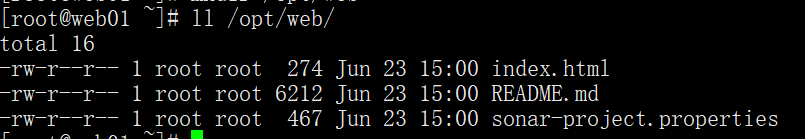
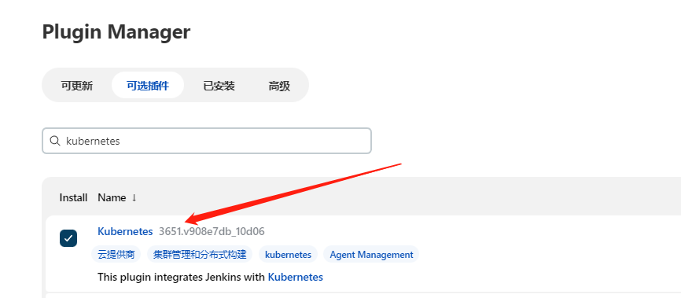
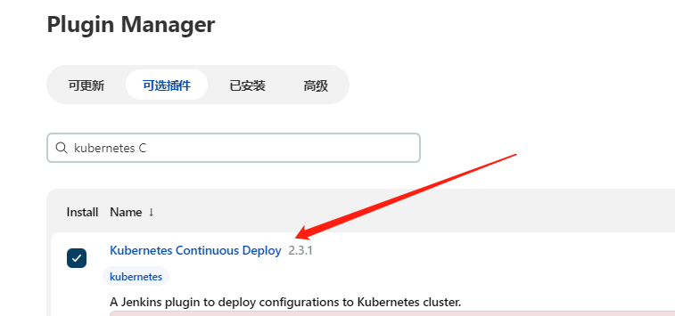
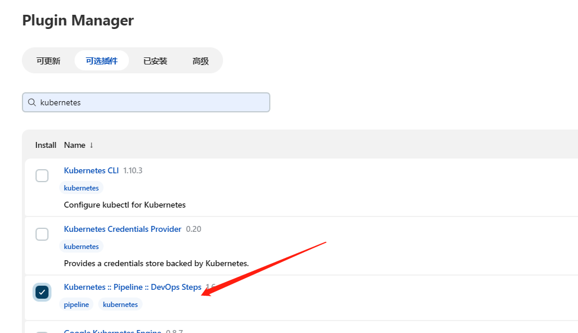

# 企业级流水线的两种部署场景

目前，在企业中部署应用一般就是普通虚拟机部署和k8s容器化部署两种方式。这篇文章主要用来介绍这两种场景下分别怎么部署。

## 普通虚拟机部署


### 安装 Jenkins 插件

普通机器部署一般是采用 `Publish Over SSH`插件。

Jenkins->Manage Jenkins->Manage Plugins，点击 Available


### 配置 `Publish Over SSH `插件连接远程机器

> 注意：Jenkins使用 `Publish Over SSH` 部署时，需要将部署服务器设置 SSH 免密登录。


#### 创建流水线


```groovy
pipeline{
    agent any
    stages{
        stage("拉取代码"){
            steps {
                checkout([$class: 'GitSCM', branches: [[name: '*/main']], extensions: [], userRemoteConfigs: [[credentialsId: '68a87abf-6af7-4e60-94dd-cf45c280c247', url: 'git@gitlab.abck8s.com:xiaoyangaijishu/html.git']]])
            }
        }
        stage("SonarQube代码审查"){
            steps {
                script {
                    scannerHome = tool 'sonarqube-scanner'
                }
            	withSonarQubeEnv('sonarqube8.9.8') {
                	sh "${scannerHome}/bin/sonar-scanner"
            	}
            }
        }
        stage("判断代码扫描状态"){
        	steps {
    			script {
    			    timeout(5) {
    				    qg = waitForQualityGate()
        				if (qg.status != 'OK') {
          					error "扫描失败，状态错误: ${qg.status}"
                        } else {
                            echo "扫描成功"
                        }
    				}
 			 	}
            }
        }
    }
}

```


```groovy
pipeline{
    agent any
    stages{
        stage("拉取代码"){
            steps {
                checkout([$class: 'GitSCM', branches: [[name: '*/main']], extensions: [], userRemoteConfigs: [[credentialsId: '68a87abf-6af7-4e60-94dd-cf45c280c247', url: 'git@gitlab.abck8s.com:xiaoyangaijishu/html.git']]])
            }
        }
        stage("SonarQube代码审查"){
            steps {
                script {
                    scannerHome = tool 'sonarqube-scanner'
                }
            	withSonarQubeEnv('sonarqube8.9.8') {
                	sh "${scannerHome}/bin/sonar-scanner"
            	}
            }
        }
        stage("判断代码扫描状态"){
        	steps {
    			script {
    			    timeout(5) {
    				    qg = waitForQualityGate()
        				if (qg.status != 'OK') {
          					error "扫描失败，状态错误: ${qg.status}"
                        } else {
                            echo "扫描成功"
                        }
    				}
 			 	}
            }
        }
        stage("部署代码"){
        	steps {
    			sshPublisher(
                    publishers: [
                        sshPublisherDesc(
                            configName: 'web01', 
                            transfers: [
                                sshTransfer(
                                    cleanRemote: false, 
                                    excludes: '', 
                                    execCommand: '''#!/bin/bash''', 
                                    execTimeout: 120000, 
                                    flatten: false, 
                                    makeEmptyDirs: false, 
                                    noDefaultExcludes: false, 
                                    patternSeparator: '[, ]+', 
                                    remoteDirectory: '', 
                                    remoteDirectorySDF: false, 
                                    removePrefix: '', 
                                    sourceFiles: '**/**'
                                )
                            ], 
                            usePromotionTimestamp: false, 
                            useWorkspaceInPromotion: false, 
                            verbose: false
                        ), 
                        sshPublisherDesc(
                            configName: 'web02', 
                            transfers: [
                                sshTransfer(
                                    cleanRemote: false, 
                                    excludes: '', 
                                    execCommand: '#!/bin/bash', 
                                    execTimeout: 120000, 
                                    flatten: false, 
                                    makeEmptyDirs: false, 
                                    noDefaultExcludes: false, 
                                    patternSeparator: '[, ]+', 
                                    remoteDirectory: '', 
                                    remoteDirectorySDF: false, 
                                    removePrefix: '', 
                                    sourceFiles: '**/**'
                                )
                            ], 
                            usePromotionTimestamp: false, 
                            useWorkspaceInPromotion: false, 
                            verbose: false
                        )
                    ]
                )
            }
        }
    }
}

```




部署成功。

### 部署结束发送邮件

```groovy

post {
  always {
    emailext (
    	body: """
    	<!DOCTYPE html><html><head><meta charset="UTF-8"><title>${PROJECT_NAME}-第${BUILD_NUMBER}次构建日志</title></head><body leftmargin="8" marginwidth="0" topmargin="8" marginheight="4"
      offset="0"><table width="95%" cellpadding="0" cellspacing="0" style="font-size: 11pt; font-family: Tahoma, Arial, Helvetica, sans-serif"><tr>(本邮件由系统自动发出，无需回复！)<br/>各位好，以下是${PROJECT_NAME}项目构建信息<br/><td><font color="#CC0000">构建结果 - ${BUILD_STATUS}</font></td></tr><tr><td><br/><b><font color="#0B610B">构建信息 - ${BUILD_STATUS}</font></b><hr size="2" width="100%" align="center" /></td></tr><tr><td><ul><li>项目名称：${PROJECT_NAME}</li><li>构建编号：第${BUILD_NUMBER}次构建</li><li>构建版本：2021.1.0.0</li><li>触发原因：${CAUSE}</li><li>构建状态：${BUILD_STATUS}</li><li>构建日志：<a href="${BUILD_URL}console">${BUILD_URL}console</a></li><li>构建地址：<a href="${BUILD_URL}">${BUILD_URL}</a></li><li>工作目录：<a href="${PROJECT_URL}ws">${PROJECT_URL}ws</a></li><li>项目地址：<a href="${PROJECT_URL}">${PROJECT_URL}</a></li><li><a href="http://1xx.1xx.3.xx:81xx/plateform-backend/report/interfaceReport/xxx/${BUILD_TIMESTAMP}/index.html" >查看测试报告</a></li></ul><h4><font color="#0B610B">测试结果</font></h4><hr size="2" width="100%" /><div><hr size="2" width="100%" />
$FAILED_TESTS<br/><h4><font color="#0B610B">变更记录</font></h4><hr size="2" width="100%" />变更明细：<a href="${PROJECT_URL}changes">${PROJECT_URL}changes</a><br/></td></tr></table></body></html>
""",
    	mimeType: 'text/html',
        subject: '自动化构建报告：$PROJECT_NAME - Build # $BUILD_NUMBER - $BUILD_STATUS!',
        to: 'chenyangqit@163.com'
    )
  }
}

```


## K8S容器化部署

K8S容器化部署就是说将应用部署到容器中。

### 安装 k8s 插件







### Jenkins 连接 K8S

> 最近我们构建和部署服务的方式与原来相比简直就是突飞猛进，像那种笨拙的、单一的、用于构建单体式应用程序的方式已经是过去式了。现在的应用为了提供更好的拓展性和可维护性，都会去拆解成各种相互依赖小、解耦性强的微服务，这些服务有各自的依赖和进度。这跟我们的Kubernetes不谋而合。
>
> 使用Jenkins链接K8S需要创建一些秘钥。

#### 第一步：创建admin-csr.json

```bash
cat > admin-csr.json << EOF
{
    "CN":"admin",
    "key":{
        "algo":"rsa",
        "size":2048
    },
    "names":[
        {
            "C":"CN",
            "L":"BeiJing",
            "ST":"BeiJing",
            "O":"system:masters",
            "OU":"System"
        }
    ]
}
EOF
```

#### 第二步：创建证书和私钥

```bash
cfssl gencert -ca=/etc/kubernetes/pki/ca.crt -ca-key=/etc/kubernetes/pki/ca.key --profile=kubernetes admin-csr.json | cfssljson -bare admin
```

#### 第三步：配置证书

```bash
openssl pkcs12 -export -out ./jenkins-admin.pfx -inkey ./admin-key.pem -in ./admin.pem -passout pass:123456
```

#### 第四步：将证书私钥填写至Jenkins

```bash
cat /etc/kubernetes/pki/ca.crt
```


#### 第五步：上传证书并输入密码


    

#### Jenkins 连接 k8s


### 测试部署

使用 Jenkins 打包镜像部署到 k8s。

> 注意：配置清单中的变量居多，小心配置。

```groovy
pipeline {
  agent {
    kubernetes {
      cloud "${KUBERNETES_NAME}"
      slaveConnectTimeout 1200
      yaml '''
apiVersion: v1
kind: Pod
spec:
  containers:
    - name: jnlp
      image: jenkins/inbound-agent:4.7-1-jdk11
      args: [\'$(JENKINS_SECRET)\', \'$(JENKINS_NAME)\']
      imagePullPolicy: IfNotPresent
      volumeMounts:
        - mountPath: "/etc/localtime"
          name: "volume-2"
          readOnly: false
    - name: docker
      image: docker:19.03.15-git
      imagePullPolicy: IfNotPresent
      tty: true
      volumeMounts:
        - mountPath: "/etc/localtime"
          name: "volume-2"
          readOnly: false
        - mountPath: "/var/run/docker.sock"
          name: "volume-docker"
          readOnly: false
        - mountPath: "/etc/hosts"
          name: "volume-hosts"
          readOnly: false
    - name: kubectl
      image: registry.cn-beijing.aliyuncs.com/citools/kubectl:1.17.4
      imagePullPolicy: IfNotPresent
      tty: true
      command:
        - "cat"
      volumeMounts:
        - mountPath: "/etc/localtime"
          name: "volume-2"
          readOnly: false
        - mountPath: "/var/run/docker.sock"
          name: "volume-docker"
          readOnly: false
        - mountPath: "/root/.kube"
          name: "kubeconfig"
          readOnly: false
        - mountPath: "/.kube"
          name: "kubeconfig"
          readOnly: false
    - name: maven
      image: maven:3.6.3-openjdk-8
      tty: true
      command:
        - "cat"
      volumeMounts:
        - mountPath: "/etc/localtime"
          name: "volume-2"
          readOnly: false
        - mountPath: "/root/.m2/repository"
          name: "volume-maven-repo"
          readOnly: false
      env:
        - name: "LANGUAGE"
          value: "en_US:en"
        - name: "LC_ALL"
          value: "en_US.UTF-8"
        - name: "LANG"
          value: "en_US.UTF-8"
    - name: sonarscanner
      image: emeraldsquad/sonar-scanner:2.2.0
      tty: true
      command:
        - "cat"
      volumeMounts:
        - mountPath: "/etc/localtime"
          name: "volume-2"
          readOnly: false
        - mountPath: "/root/.m2/repository"
          name: "volume-maven-repo"
          readOnly: false
        - mountPath: "/etc/hosts"
          name: "volume-hosts"
          readOnly: false
      env:
        - name: "LANGUAGE"
          value: "en_US:en"
        - name: "LC_ALL"
          value: "en_US.UTF-8"
        - name: "LANG"
          value: "en_US.UTF-8"
  volumes:
    - name: volume-maven-repo
      emptyDir: {}
    - name: volume-2
      hostPath:
        path: "/usr/share/zoneinfo/Asia/Shanghai"
    - name: kubeconfig
      secret:
        secretName: kubeconfig
        items:
          - key: config
            path: config
    - name: volume-docker
      hostPath:
        path: "/var/run/docker.sock"
    - name: volume-hosts
      hostPath:
        path: /etc/hosts

'''
    }
  }
  
  stages {


    stage('源代码管理') {
      parallel {
        stage('拉取代码') {
          steps {
                git(url: "${GIT_REPOSITORY_URL}", branch: "master", changelog: true, credentialsId: "${CREDENTIALS_ID}")
            }
        }

        stage('系统检查及初始化') {
          steps {
            sh """

            echo "Check Sysyem Env"

"""
          }
        }

      }
    }

    stage('代码处理') {
      steps {
        sh """
        
        git checkout $GIT_TAG

        """
      }
    }
      stage("SonarQube代码审查"){
          steps {
              container(name: 'sonarscanner') {
                script {
                    scannerHome = tool 'sonarqube-scanner'
                }
                withSonarQubeEnv('sonarqube8.9.8') {
                    sh "${scannerHome}/bin/sonar-scanner"
                }
            }
          }
      }
      stage("判断代码扫描状态"){
          steps {
              script {
                  timeout(5) {
                      qg = waitForQualityGate()
                      if (qg.status != 'OK') {
                          error "扫描失败，状态错误: ${qg.status}"
                      } else {
                          echo "扫描成功"
                      }
                  }
              }
          }
      }

    stage('编译及构建') {
      parallel {
        stage('初始化操作系统及kubernetes环境') {
          steps {
            script {
              CommitID = sh(returnStdout: true, script: "git log -n 1 --pretty=format:'%h'").trim()
              CommitMessage = sh(returnStdout: true, script: "git log -1 --pretty=format:'%h : %an  %s'").trim()
              def curDate = sh(script: "date '+%Y%m%d-%H%M%S'", returnStdout: true).trim()
              TAG = curDate[0..14] + "-" + CommitID + "-master"
            }
          }
        }

      }
    }

    stage('构建镜像及检查kubernetes环境') {
      parallel {
        stage('构建镜像') {
          steps {
            withCredentials([usernamePassword(credentialsId: "${DOCKER_REPOSITORY_CREDENTIAL_ID}", passwordVariable: "Password", usernameVariable: "Username")]) {
              container(name: 'docker') {
                sh """
                  docker build -t ${HARBOR_HOST}/${NAMESPACE_NAME}/${REPOSITORY_NAME}:${TAG} .
                  docker login ${HARBOR_HOST} --username=${Username} --password=${Password}
                  docker push ${HARBOR_HOST}/${NAMESPACE_NAME}/${REPOSITORY_NAME}:${TAG}
                """
              }
            }
          }
        }

        stage('检查kubernetes环境') {
          steps {
              withCredentials([usernamePassword(credentialsId: "${DOCKER_REPOSITORY_CREDENTIAL_ID}", passwordVariable: "Password", usernameVariable: "Username")]) {
                container(name: 'kubectl') {
                sh """
                    kubectl get nodes --kubeconfig=/root/.kube/config
                    kubectl delete secret aliyun-registry-key -n ${K8S_NAMESPACE_NAME}
                    kubectl create secret docker-registry aliyun-registry-key -n ${K8S_NAMESPACE_NAME} --docker-server=${HARBOR_HOST} --docker-username=${Username} --docker-password=${Password} --kubeconfig=/root/.kube/config
    """
                }
              }
          }
        }

      }
    }

    stage('部署容器到kubernetes') {
      steps {
        container(name: 'kubectl') {
              sh """
               kubectl set image ${CONTROLLER_TYPE} -l ${CONTROLLER_LABEL} -n ${K8S_NAMESPACE_NAME} ${CONTAINER_NAME}=${HARBOR_HOST}/${NAMESPACE_NAME}/${REPOSITORY_NAME}:${TAG} --kubeconfig=/root/.kube/config
"""
        }
      }
    }
  }
    post {
  always {
    emailext (
    	body: '测试邮件',
    	mimeType: 'text/html',
        subject: '自动化构建报告',
        to: 'cxxxxit@163.com'
    )
  }
}
}

```

#### k8s 部署清单

```yaml
apiVersion: apps/v1
kind: Deployment
metadata:
  name: python
  labels:
    app: python
spec:
  selector:
    matchLabels:
      app: python
  template:
    metadata:
      labels:
        app: python
    spec:
      containers:
        - name: python
          image: nginx
---
apiVersion: v1
kind: Service
metadata:
  name: python
  labels:
    app: python
spec:
  ports:
    - port: 80
      targetPort: 80
      nodePort: 30080
  selector:
    app: python
  type: NodePort
```


