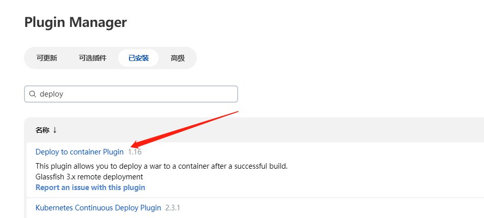

---
pageComponent:
  name: Catalogue
  data:
    path: 05.java企业级流水线
    imgUrl: /img/web.png
    description: Jenkins、Gitlab、SonarQube以及自动化等相关技术
title: java企业级流水线
date: 2022-06-22 15:15:47
permalink: /pages/7d05b5/
categories:
  - DevOps
  - 企业级流水线
sidebar: false
article: false
comment: false
editLink: false
author: 
  name: 小阳爱技术
  link: https://blog.abck8s.com
---

## linux版

### 部署Tomcat

```bash
wget https://dlcdn.apache.org/tomcat/tomcat-9/v9.0.64/bin/apache-tomcat-9.0.64.tar.gz

[root@nexus apache-tomcat-9.0.64]# vim conf/tomcat-users.xml 
	<role rolename="tomcat"/>
	<role rolename="role1"/>
	<role rolename="manager-script"/>
	<role rolename="manager-gui"/>
	<role rolename="manager-status"/>
	<role rolename="admin-gui"/>
	<role rolename="admin-script"/>
	<user username="tomcat" password="tomcat" roles="manager-gui,manager-script,tomcat,admin-gui,admin-script"/>


[root@nexus apache-tomcat-9.0.64]# vim webapps/manager/META-INF/context.xml
  <!--<Valve className="org.apache.catalina.valves.RemoteAddrValve"
         allow="127\.\d+\.\d+\.\d+|::1|0:0:0:0:0:0:0:1" />-->
```



```yaml
// Java项目
	// 1、拉取代码
	// 2、切换分支
	// 3、扫描代码
	// 4、获取代码状态
	// 5、编译代码
	// 6、上传到制品库
	// 6、部署
	// 7、发送部署邮件
pipeline {

	agent any

    environment {
        NEXUS_VERSION = "nexus3"
        NEXUS_MOTHEN = "http"
        NEXUS_URL = "nexus.abck8s.com"
        NEXUS_REPOSITORY = "xiaoyangaijishu-devops"
        NEXUS_CREDENTIAL_ID = "16352058-0ab1-4270-858b-3639919803ca"
    }

	parameters {
		listGitBranches branchFilter: '.*',
		credentialsId: 'bd34af1d-f1fb-4c19-a185-b746531a6930',
		defaultValue: '',
		listSize: '5',
		name: 'GIT_TAG',
		quickFilterEnabled: false,
		remoteURL: 'git@gitlab.abck8s.com:douyin-xiaoyangaijishu/springboot.git',
		selectedValue: 'NONE',
		sortMode: 'NONE',
		tagFilter: '*',
		type: 'PT_TAG'
	}

	stages {
		stage("拉取代码") {
			steps {
				checkout(
					[
						$class: 'GitSCM',
						branches: [[name: '*/master']],
						extensions: [],
						userRemoteConfigs: [[
							credentialsId: 'bd34af1d-f1fb-4c19-a185-b746531a6930',
							url: 'git@gitlab.abck8s.com:douyin-xiaoyangaijishu/springboot.git'
						]]
					]
				)
			}
		}
		stage("切换分支") {
			steps {

				script {

					sh """
						git checkout $GIT_TAG
					"""
				}

			}
		}

		stage("代码测试") {
			steps {
				script {
					sh """
						mvn test
					"""
				}
			}
		}

		stage("代码漏洞扫描") {
			steps {
				// 指定需要使用的Tools
				script {
					scannerTool = tool(
						name: 'sonarqube-scanner',
						type: 'hudson.plugins.sonar.SonarRunnerInstallation'
					)
				}

				// 使用Tool来进行代码扫描
				withSonarQubeEnv('sonarqube8.9.8') {
					sh "${scannerTool}/bin/sonar-scanner"
				}
			}
		}

		stage("代码漏洞扫描状态判断") {
			steps {
				script {
					timeout(1) {
						qg = waitForQualityGate()
						if (qg.status != 'OK') {
						  error "代码漏洞扫描失败，状态为: ${qg.status}"
						} else {
							echo "代码漏洞扫描通过"
						}
					}
				}
			}
		}
		stage("编译代码") {
			steps {
				script {
					sh """
						mvn package -DskipTests=true
					"""
				}
			}
		}
		stage("上传至制品库") {
			steps {
				script {
					// 获取pom.xml中的详细信息
					pom = readMavenPom file: 'pom.xml'
					// 通过 pom.xml 获取可能生成的文件相对路径
					filesbyGlob = findFiles(glob: "target/*.${pom.packaging}")
					// 判断该文件是否生成
					artifactPath = filesbyGlob[0].path
					artifactExists = fileExists artifactPath

					// 如果存在则开始上传至 Nexus 制品库
					if (artifactExists) {
						nexusArtifactUploader(
							artifacts: [
								[
									artifactId: pom.artifactId,
									classifier: '',
									file: artifactPath,
									type: pom.packaging
								], [
									artifactId: pom.artifactId,
									classifier: '',
									file: 'pom.xml',
									type: 'pom'
								]
							],
							credentialsId: NEXUS_CREDENTIAL_ID,
							groupId: pom.groupId,
							nexusUrl: NEXUS_URL,
							nexusVersion: NEXUS_VERSION,
							protocol: NEXUS_MOTHEN,
							repository: NEXUS_REPOSITORY,
							version: pom.version
						)
					} else {
						// 不存在则返回提示信息
						error "文件 ${artifactPath} 不存在"
					}
				}
			}
		}


		stage("部署到Tomcat") {
			steps {
			    deploy(
			        adapters: [
				        tomcat9(
				            credentialsId: '822eba73-92cf-424b-b381-80a2ca3e70ad',
				            path: '',
				            url: 'http://192.168.15.31:8080')],
				    contextPath: null,
				    war: 'target/*.war'
				)
			}
		}

	}

}
```


## k8s容器版

```yaml
```

